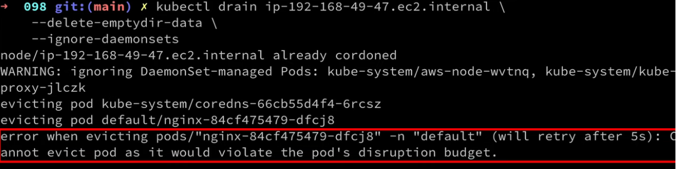

# Intro

A typical pdb looks like:
```
apiVersion: policy/v1
kind: PodDisruptionBudget
metadata:
  name: pdb
spec:
  minAvailable: 1
  selector:
    matchLabels:
      app: nginx
```

# Voluntary Disruption

You may notice that I’ve mentioned that pdb is only good for voluntary disruption.

Voluntary disruptions can take the form of:

A node group replacement, from an incompatible change or a cluster upgrade.
Scaling up/down nodes.
Oftentimes, the responsibility of managing an application workload is separated from the responsibility of managing the cluster, and usually picked up by separate teams such as a platform team and an application team.

There can be a conflict of interest between them:

An application team wants their apps running all the times, with 100% availability and the endpoints as responsive as possible.
A platform team needs to make changes to the cluster. Those changes will take down nodes, with the pods running on them as well.
A pdb is, in all fairness, a compromise between an application team and a platform team. Application team acknowledges the necessity of having scheduled/voluntary disruption, and provides a guideline to assist in completing the rollout, which is carried out by the platform team.

Of course, there are involuntary disruptions as well, such as electricity outage or node kernel crash. pdb won’t protect your workload from them, understandably.

# Example with node upgrade

Let’s consider a scenario, we need to upgrade version of node or update the spec often. 
Cluster down-scaling is also a normal condition. In these cases, the pods running on the to-be-deleted nodes needs to be drained.

`kubectl drain` is performed on one of the nodes for the upgrade. We need to remove node1 from the pool which we cannot 
do it by detaching instantly as that will lead to termination of all the pods running in there which can get services down.
First step before detaching node is to make the node unscheduled.

If you quickly check the pods with kubectl get pods , it will terminate all the running pods instantly which were scheduled on node1.
**This could lead a downtime!** If you are running few number of pods and all of them are scheduled on same node,
it will take some time for the pods to be scheduled on other node.

`PodDisruptionBudget` with `minAvailable` are useful in such scenarios to achieve zero downtime.
`Replicaset` will only ensure that the replicas number of pods will be created on other nodes during the process.

If you just have a `Replicaset` with one replica and no `PodDisruptionBudget` specified,
the pod will be terminated and a new pod will be created on other nodes.
This is where `PDBs` provide the added advantage over the `Replicaset`.

**If `PodDisruptionBudget` allows 0 disruptions then it will not be possible to drain the node. For example if we have deployment with 3 replicas each deployed on different node (we have 3 nodes) then we will not be able drain any node. Sample message:**




# Links
https://innablr.com.au/blog/what-is-pod-disruption-budget-in-k8s-and-why-to-use-it/
https://dwdraju.medium.com/poddisruptionbudget-a-key-for-zero-downtime-c478d056e373
https://stackoverflow.com/questions/66227319/kubernetes-replicaset-vs-poddisruptionbudget
https://www.youtube.com/watch?v=e2HjRrmXMDw GOOD!!!