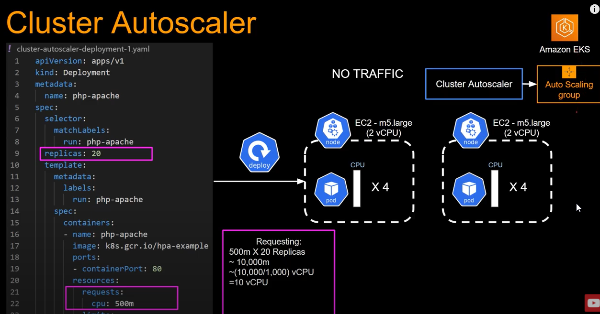

# Intro

Cluster Autoscaler monitors how much vCPU has been requested and how many vCPU a cluster has. If the pods requested CPU **(not current CPU usage)** goes above what is **currently available** then cluster autoscaler will tell EC2 auto scaling group to provision more nodes.

# Links
https://docs.aws.amazon.com/eks/latest/userguide/autoscaling.html
https://www.youtube.com/watch?v=lMb6wzy0PPA