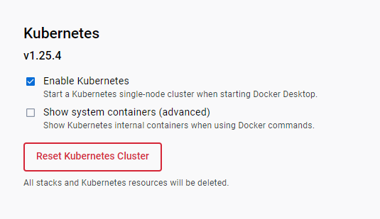

# Docker login

```
PS D:\GitHub\kicaj29\Kubernetes\Keda\FancyMicroservice> docker login
Login with your Docker ID to push and pull images from Docker Hub. If you don't have a Docker ID, head over to https://hub.docker.com to create one.
Username: kicaj29
Password:
Login Succeeded

Logging in with your password grants your terminal complete access to your account.
For better security, log in with a limited-privilege personal access token. Learn more at https://docs.docker.com/go/access-tokens/
```

# Build docker image and test it

* Because we do not need HTTPS in this scenario and enabling it for `docker run` is a bit difficult (more [here](https://medium.com/@woeterman_94/docker-in-visual-studio-unable-to-configure-https-endpoint-f95727187f5f)) I decided to disable HTTPS. If HTTPS is not disable during container running the exception is thrown:

  ```
  PS D:\GitHub\kicaj29\Kubernetes\Keda\FancyMicroservice\FancyMicroservice> docker run -e ASPNETCORE_URLS="https://+:443;http://+:80" -p 4031:443 -p 4032:80 kicaj29/fancymicroservice:v1
  Unhandled exception. System.InvalidOperationException: Unable to configure HTTPS endpoint. No server certificate was specified, and the default developer certificate could not be found or is out of date.
  To generate a developer certificate run 'dotnet dev-certs https'. To trust the certificate (Windows and macOS only) run 'dotnet dev-certs https --trust'.
  For more information on configuring HTTPS see https://go.microsoft.com/fwlink/?linkid=848054.
   at Microsoft.AspNetCore.Hosting.ListenOptionsHttpsExtensions.UseHttps(ListenOptions listenOptions, Action`1 configureOptions)
  ```
* To disable HTTPS
  * Change `launchSettings.json` `"useSSL": false`
  * In `Program.cs` comment out `app.UseHttpsRedirection();`

* Build the image
`PS D:\GitHub\kicaj29\Kubernetes\Keda\FancyMicroservice\FancyMicroservice> docker build -f Dockerfile -t kicaj29/fancymicroservice:v1 ..`
More about building docker images using dockerfile created by VS can be found [here](https://learn.microsoft.com/en-us/visualstudio/containers/container-build?view=vs-2022#docker-build) and [here](https://stackoverflow.com/questions/72718492/cannot-run-docker-build-when-using-docker-setup-from-visual-studio).

* Check if the image is on the list

```
PS D:\GitHub\kicaj29\Kubernetes\Keda\FancyMicroservice\FancyMicroservice> docker images kicaj29/fancymicroservice
REPOSITORY                  TAG       IMAGE ID       CREATED          SIZE
kicaj29/fancymicroservice   v1        0f0ce5e57ce5   26 minutes ago   212MB
```

* Run the image

Set environment variable `ASPNETCORE_ENVIRONMENT` on `Development` to enable swagger page.

```
PS D:\GitHub\kicaj29\Kubernetes\Keda\FancyMicroservice\FancyMicroservice> docker run -e ASPNETCORE_ENVIRONMENT=De
velopment -p 4200:80 kicaj29/fancymicroservice:v1                                                                
info: Microsoft.Hosting.Lifetime[14]                                                                             
      Now listening on: http://[::]:80                                                                           
info: Microsoft.Hosting.Lifetime[0]                                                                              
      Application started. Press Ctrl+C to shut down.                                                            
info: Microsoft.Hosting.Lifetime[0]                                                                              
      Hosting environment: Development                                                                           
info: Microsoft.Hosting.Lifetime[0]                                                                              
      Content root path: /app/                                                                                   
```

Next test if the web api is available

http://localhost:4200/weatherforecast   
http://localhost:4200/swagger


# Create and update helm package

`helm create FancyMicroserviceHelmPackage`

# Verify k8s connection settings

```
kubectl config get-contexts
kubectl config use-context docker-desktop
kubectl config current-context
```
```
PS D:\GitHub\kicaj29\Kubernetes\Keda\FancyMicroservice\FancyMicroservice> kubectl get nodes
NAME             STATUS   ROLES           AGE   VERSION
docker-desktop   Ready    control-plane   64s   v1.25.4
```

>NOTE: if the K8s is not available `PS D:\GitHub\kicaj29\Kubernetes\Keda\FancyMicroservice\FancyMicroservice> kubectl get nodes
Unable to connect to the server: EOF` try to use `Reset Kubernetes Cluster` option.


`helm` uses the same settings as `kubectl`.

# Verify helm package before deployment

```
PS D:\GitHub\kicaj29\Kubernetes\Keda> helm template FancyMicroserviceHelmPackage
PS D:\GitHub\kicaj29\Kubernetes\Keda> helm install fancy-ms FancyMicroserviceHelmPackage --debug --dry-run
```

