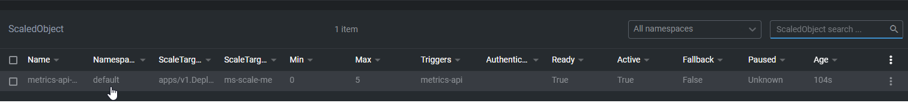
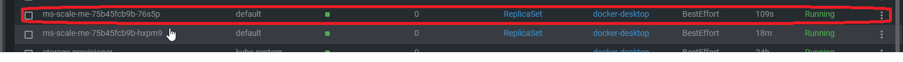
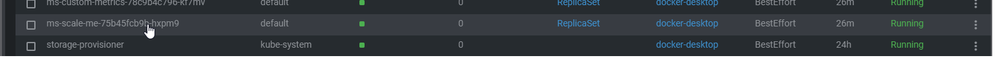

- [Docker login](#docker-login)
- [Build docker images and test it](#build-docker-images-and-test-it)
- [Create and update helm package](#create-and-update-helm-package)
- [Verify k8s connection settings](#verify-k8s-connection-settings)
- [Verify helm package before deployment](#verify-helm-package-before-deployment)
- [Install both charts](#install-both-charts)
- [Call both services](#call-both-services)
- [Deploy Keda](#deploy-keda)
- [Configure keda ScaledObject](#configure-keda-scaledobject)
- [Deploy keda.yaml](#deploy-kedayaml)
- [Review logs from keda-operator pod](#review-logs-from-keda-operator-pod)
- [Review ScaledObject status in Custom Resources section in OpenLens](#review-scaledobject-status-in-custom-resources-section-in-openlens)
- [Review logs from ms-custom-metrics in OpenLens](#review-logs-from-ms-custom-metrics-in-openlens)
- [Increase metric value to scale-out the ms-scale-me pod](#increase-metric-value-to-scale-out-the-ms-scale-me-pod)
- [Decrease metric value to scale-in the ms-scale-me pod](#decrease-metric-value-to-scale-in-the-ms-scale-me-pod)
- [Deep dive into the scaling](#deep-dive-into-the-scaling)
  - [Important HPA settings in kube-controller-manager](#important-hpa-settings-in-kube-controller-manager)
  - [Logs from scaling events](#logs-from-scaling-events)
  - [Verify kube-controller-manager parameters](#verify-kube-controller-manager-parameters)

# Docker login

```
PS D:\GitHub\kicaj29\Kubernetes\Keda\FancyMicroservice> docker login
Login with your Docker ID to push and pull images from Docker Hub. If you don't have a Docker ID, head over to https://hub.docker.com to create one.
Username: kicaj29
Password:
Login Succeeded

Logging in with your password grants your terminal complete access to your account.
For better security, log in with a limited-privilege personal access token. Learn more at https://docs.docker.com/go/access-tokens/
```

# Build docker images and test it

* Because we do not need HTTPS in this scenario and enabling it for `docker run` is a bit difficult (more [here](https://medium.com/@woeterman_94/docker-in-visual-studio-unable-to-configure-https-endpoint-f95727187f5f)) I decided to disable HTTPS. If HTTPS is not disable during container running the exception is thrown:

  ```
  PS D:\GitHub\kicaj29\Kubernetes\Keda\Scaling\ScaleMe> docker run -e ASPNETCORE_URLS="https://+:443;http://+:80" -p 4031:443 -p 4032:80 kicaj29/scale-me:v1
  Unhandled exception. System.InvalidOperationException: Unable to configure HTTPS endpoint. No server certificate was specified, and the default developer certificate could not be found or is out of date.
  To generate a developer certificate run 'dotnet dev-certs https'. To trust the certificate (Windows and macOS only) run 'dotnet dev-certs https --trust'.
  For more information on configuring HTTPS see https://go.microsoft.com/fwlink/?linkid=848054.
   at Microsoft.AspNetCore.Hosting.ListenOptionsHttpsExtensions.UseHttps(ListenOptions listenOptions, Action`1 configureOptions)
  ```
* To disable HTTPS
  * Change `launchSettings.json` `"useSSL": false`
  * In `Program.cs` comment out `app.UseHttpsRedirection();`

* Build the image
`PS D:\GitHub\kicaj29\Kubernetes\Keda\Scaling\ScaleMe> docker build -f Dockerfile -t kicaj29/scale-me:v1 ..`   
`PS D:\GitHub\kicaj29\Kubernetes\Keda\Scaling\CustomMetrics> docker build -f Dockerfile -t kicaj29/custom-metrics:v1 ..`

More about building docker images using dockerfile created by VS can be found [here](https://learn.microsoft.com/en-us/visualstudio/containers/container-build?view=vs-2022#docker-build) and [here](https://stackoverflow.com/questions/72718492/cannot-run-docker-build-when-using-docker-setup-from-visual-studio).

* Check if the image is on the list

```
PS D:\GitHub\kicaj29\Kubernetes\Keda\Scaling\CustomMetrics> docker images kicaj29/scale-me
REPOSITORY         TAG       IMAGE ID       CREATED         SIZE
kicaj29/scale-me   v1        56c6cb4fc415   2 minutes ago   212MB
PS D:\GitHub\kicaj29\Kubernetes\Keda\Scaling\CustomMetrics> docker images kicaj29/custom-metrics
REPOSITORY               TAG       IMAGE ID       CREATED          SIZE
kicaj29/custom-metrics   v1        179d50275d84   29 seconds ago   212MB
```

* Run the images

Set environment variable `ASPNETCORE_ENVIRONMENT` on `Development` to enable swagger page.

```
PS D:\GitHub\kicaj29\Kubernetes\Keda\Scaling\ScaleMe> docker run -e ASPNETCORE_ENVIRONMENT=Development -p 4200:80 kicaj29/scale-me:v1
info: Microsoft.Hosting.Lifetime[14]
      Now listening on: http://[::]:80
info: Microsoft.Hosting.Lifetime[0]
      Application started. Press Ctrl+C to shut down.
info: Microsoft.Hosting.Lifetime[0]
      Hosting environment: Development
info: Microsoft.Hosting.Lifetime[0]
      Content root path: /app/                                                                                
```

```
PS D:\GitHub\kicaj29\Kubernetes\Keda\Scaling\CustomMetrics> docker run -e ASPNETCORE_ENVIRONMENT=Development -p 4201:80 kicaj
29/custom-metrics:v1                                                                                                         
info: Microsoft.Hosting.Lifetime[14]                                                                                         
      Now listening on: http://[::]:80                                                                                       
info: Microsoft.Hosting.Lifetime[0]                                                                                          
      Application started. Press Ctrl+C to shut down.                                                                        
info: Microsoft.Hosting.Lifetime[0]                                                                                          
      Hosting environment: Development                                                                                       
info: Microsoft.Hosting.Lifetime[0]                                                                                          
      Content root path: /app/                                                                                               
```

Next we see that the web api is available

http://localhost:4200/weatherforecast    
http://localhost:4200/swagger    

http://localhost:4201/swagger   
http://localhost:4201/api/metrics/mongo-connections   

Stop and remove the containers.

# Create and update helm package

`PS D:\GitHub\kicaj29\Kubernetes\Keda\Charts> helm create custom-metrics`   
`PS D:\GitHub\kicaj29\Kubernetes\Keda\Charts> helm create scale-me`

* In `values.yaml` set proper docker images and also set service type on `NodePort`.
* Remove `livenessProbe` and `readinessProbe` from `deployment.yaml` because this is not mandatory.
* Set env. variable `ASPNETCORE_ENVIRONMENT` on value `Development` in file `deployment.yaml` to have working swagger page.

# Verify k8s connection settings

```
kubectl config get-contexts
kubectl config use-context docker-desktop
kubectl config current-context
```
```
PS D:\GitHub\kicaj29\Kubernetes\Keda\Charts> kubectl get nodes
NAME             STATUS   ROLES           AGE   VERSION
docker-desktop   Ready    control-plane   24h   v1.25.4
```

**If the K8s is not available**:
```
PS D:\GitHub\kicaj29\Kubernetes\Keda\Charts> kubectl get nodes Unable to connect to the server: EOF
``` 
try to use `Reset Kubernetes Cluster` option.


`helm` uses the same settings as `kubectl`.

# Verify helm package before deployment

```
PS D:\GitHub\kicaj29\Kubernetes\Keda\Charts> helm template scale-me
PS D:\GitHub\kicaj29\Kubernetes\Keda\Charts> helm install ms-scale-me scale-me --debug --dry-run
```

```
PS D:\GitHub\kicaj29\Kubernetes\Keda\Charts> helm template custom-metrics
PS D:\GitHub\kicaj29\Kubernetes\Keda\Charts> helm install ms-custom-metrics custom-metrics --debug --dry-run
```

If the charts already exist uninstall it:
```
PS D:\GitHub\kicaj29\Kubernetes\Keda\Charts> helm uninstall ms-custom-metrics
release "ms-custom-metrics" uninstalled
PS D:\GitHub\kicaj29\Kubernetes\Keda\Charts> helm uninstall ms-scale-me
release "ms-scale-me" uninstalled
PS D:\GitHub\kicaj29\Kubernetes\Keda\Charts>
```

# Install both charts

```
PS D:\GitHub\kicaj29\Kubernetes\Keda\Charts> helm install ms-scale-me scale-me
NAME: ms-scale-me
LAST DEPLOYED: Thu Jul 27 15:12:04 2023
NAMESPACE: default
STATUS: deployed
REVISION: 1
NOTES:
1. Get the application URL by running these commands:
  export NODE_PORT=$(kubectl get --namespace default -o jsonpath="{.spec.ports[0].nodePort}" services ms-scale-me)
  export NODE_IP=$(kubectl get nodes --namespace default -o jsonpath="{.items[0].status.addresses[0].address}")
  echo http://$NODE_IP:$NODE_PORT
```

```
PS D:\GitHub\kicaj29\Kubernetes\Keda\Charts> helm install ms-custom-metrics custom-metrics
NAME: ms-custom-metrics
LAST DEPLOYED: Thu Jul 27 15:12:28 2023
NAMESPACE: default
STATUS: deployed
REVISION: 1
NOTES:
1. Get the application URL by running these commands:
  export NODE_PORT=$(kubectl get --namespace default -o jsonpath="{.spec.ports[0].nodePort}" services ms-custom-metrics)
  export NODE_IP=$(kubectl get nodes --namespace default -o jsonpath="{.items[0].status.addresses[0].address}")
  echo http://$NODE_IP:$NODE_PORT
```

# Call both services

```
PS D:\GitHub\kicaj29\Kubernetes\Keda\Charts> kubectl get services
NAME                TYPE        CLUSTER-IP       EXTERNAL-IP   PORT(S)        AGE
kubernetes          ClusterIP   10.96.0.1        <none>        443/TCP        24h
ms-custom-metrics   NodePort    10.109.250.186   <none>        80:31513/TCP   8s
ms-scale-me         NodePort    10.110.209.73    <none>        80:32221/TCP   12s
```

http://localhost:32221/weatherforecast   
http://localhost:32221/swagger   

http://localhost:31513/swagger   
http://localhost:31513/api/metrics/mongo-connections   

# Deploy Keda

https://keda.sh/docs/2.11/deploy/#helm

```
PS D:\GitHub\kicaj29\Kubernetes\Keda> helm repo add kedacore https://kedacore.github.io/charts
"kedacore" has been added to your repositories
PS D:\GitHub\kicaj29\Kubernetes\Keda> helm repo update
Hang tight while we grab the latest from your chart repositories...
...Successfully got an update from the "kedacore" chart repository
...Successfully got an update from the "ingress-nginx" chart repository
...Successfully got an update from the "stable" chart repository
Update Complete. ⎈Happy Helming!⎈
PS D:\GitHub\kicaj29\Kubernetes\Keda> helm install keda kedacore/keda --namespace keda --create-namespace
NAME: keda
LAST DEPLOYED: Wed Jul 26 18:06:51 2023
NAMESPACE: keda
STATUS: deployed
REVISION: 1
TEST SUITE: None
```

# Configure keda ScaledObject

https://keda.sh/docs/2.11/scalers/metrics-api/
https://github.com/kedacore/keda-docs/blob/main/content/docs/2.0/scalers/metrics-api.md

Because keda controllers works in `keda` namespace in [keda.yaml](./keda.yaml) is used full DNS name which allow communication across different namespaces (micro-services are deployed into `default` namespace). More [here](https://stackoverflow.com/questions/37221483/service-located-in-another-namespace).

# Deploy keda.yaml

[keda.yaml](./keda.yaml) must be deployed as separate deployment. If it is part of helm chart `scale-me` then `keda` logs error
that target deployment does not exist, probably because `keda` starts before deployment `ms-scale-me`.

```
PS D:\GitHub\kicaj29\Kubernetes\Keda> kubectl apply -f keda.yaml
scaledobject.keda.sh/metrics-api-mongo-pool-size created
```


# Review logs from keda-operator pod

We can see that this operator created HPA "Creating a new HPA".

```
2023-07-27T13:26:26Z	INFO	Reconciling ScaledObject	{"controller": "scaledobject", "controllerGroup": "keda.sh", "controllerKind": "ScaledObject", "ScaledObject": {"name":"metrics-api-mongo-pool-size","namespace":"default"}, "namespace": "default", "name": "metrics-api-mongo-pool-size", "reconcileID": "32fb081e-27d6-4d57-8983-e90611e2878a"}
2023-07-27T13:26:26Z	INFO	Adding Finalizer for the ScaledObject	{"controller": "scaledobject", "controllerGroup": "keda.sh", "controllerKind": "ScaledObject", "ScaledObject": {"name":"metrics-api-mongo-pool-size","namespace":"default"}, "namespace": "default", "name": "metrics-api-mongo-pool-size", "reconcileID": "32fb081e-27d6-4d57-8983-e90611e2878a"}
2023-07-27T13:26:26Z	INFO	Detected resource targeted for scaling	{"controller": "scaledobject", "controllerGroup": "keda.sh", "controllerKind": "ScaledObject", "ScaledObject": {"name":"metrics-api-mongo-pool-size","namespace":"default"}, "namespace": "default", "name": "metrics-api-mongo-pool-size", "reconcileID": "32fb081e-27d6-4d57-8983-e90611e2878a", "resource": "apps/v1.Deployment", "name": "ms-scale-me"}
2023-07-27T13:26:26Z	INFO	Creating a new HPA	{"controller": "scaledobject", "controllerGroup": "keda.sh", "controllerKind": "ScaledObject", "ScaledObject": {"name":"metrics-api-mongo-pool-size","namespace":"default"}, "namespace": "default", "name": "metrics-api-mongo-pool-size", "reconcileID": "32fb081e-27d6-4d57-8983-e90611e2878a", "HPA.Namespace": "default", "HPA.Name": "keda-hpa-metrics-api-mongo-pool-size"}
2023-07-27T13:26:26Z	INFO	Initializing Scaling logic according to ScaledObject Specification	{"controller": "scaledobject", "controllerGroup": "keda.sh", "controllerKind": "ScaledObject", "ScaledObject": {"name":"metrics-api-mongo-pool-size","namespace":"default"}, "namespace": "default", "name": "metrics-api-mongo-pool-size", "reconcileID": "32fb081e-27d6-4d57-8983-e90611e2878a"}
2023-07-27T13:26:26Z	INFO	Reconciling ScaledObject	{"controller": "scaledobject", "controllerGroup": "keda.sh", "controllerKind": "ScaledObject", "ScaledObject": {"name":"metrics-api-mongo-pool-size","namespace":"default"}, "namespace": "default", "name": "metrics-api-mongo-pool-size", "reconcileID": "ad76c0e2-c8a6-4424-ab8a-0b0e9a83f88b"}
2023-07-27T13:26:26Z	INFO	Reconciling ScaledObject	{"controller": "scaledobject", "controllerGroup": "keda.sh", "controllerKind": "ScaledObject", "ScaledObject": {"name":"metrics-api-mongo-pool-size","namespace":"default"}, "namespace": "default", "name": "metrics-api-mongo-pool-size", "reconcileID": "4578e39c-0ef4-4a3d-b4f2-2e87e121c5a2"}
```

```
PS D:\GitHub\kicaj29\Kubernetes\Keda\Scaling\ScaleMe> kubectl get hpa
NAME                                   REFERENCE                TARGETS     MINPODS   MAXPODS   REPLICAS   AGE
keda-hpa-metrics-api-mongo-pool-size   Deployment/ms-scale-me   1/2 (avg)   1         5         1          16h
```

* By running command `PS D:\GitHub\kicaj29\Kubernetes\Keda\Scaling\CustomMetrics> kubectl get hpa keda-hpa-metrics-api-mongo-pool-size -o yaml` we can print yaml definition of the created HPA

```yaml
apiVersion: autoscaling/v2
kind: HorizontalPodAutoscaler
metadata:
  annotations:
    kubectl.kubernetes.io/last-applied-configuration: |
      {"apiVersion":"keda.sh/v1alpha1","kind":"ScaledObject","metadata":{"annotations":{},"labels":{"deploymentName":"metrics-api-mongo-pool-size"},"name":"metrics-api-mongo-pool-size","namespace":"default"},"spec":{"cooldownPeriod":10,"maxReplicaCount":5,"minReplicaCount":0,"pollingInterval":5,"scaleTargetRef":{"name":"ms-scale-me"},"triggers":[{"metadata":{"targetValue":"2","url":"http://ms-custom-metrics.default.svc.cluster.local:80/api/metrics/mongo-connections","valueLocation":"currentWaitingSize"},"type":"metrics-api"}]}}
  creationTimestamp: "2023-07-27T13:26:26Z"
  labels:
    app.kubernetes.io/managed-by: keda-operator
    app.kubernetes.io/name: keda-hpa-metrics-api-mongo-pool-size
    app.kubernetes.io/part-of: metrics-api-mongo-pool-size
    app.kubernetes.io/version: 2.11.1
    deploymentName: metrics-api-mongo-pool-size
    scaledobject.keda.sh/name: metrics-api-mongo-pool-size
  name: keda-hpa-metrics-api-mongo-pool-size
  namespace: default
  ownerReferences:
  - apiVersion: keda.sh/v1alpha1
    blockOwnerDeletion: true
    controller: true
    kind: ScaledObject
    name: metrics-api-mongo-pool-size
    uid: 225de180-41c1-40d9-bb6e-3d2f8d62c4b0
  resourceVersion: "103256"
  uid: 404f7edb-a0b1-474e-87bd-3e3a6a129261
spec:
  maxReplicas: 5
  metrics:
  - external:
      metric:
        name: s0-metric-api-currentWaitingSize
        selector:
          matchLabels:
            scaledobject.keda.sh/name: metrics-api-mongo-pool-size
      target:
        averageValue: "2"
        type: AverageValue
    type: External
  minReplicas: 1
  scaleTargetRef:
    apiVersion: apps/v1
    kind: Deployment
    name: ms-scale-me
status:
  conditions:
  - lastTransitionTime: "2023-07-28T06:06:08Z"
    message: recommended size matches current size
    reason: ReadyForNewScale
    status: "True"
    type: AbleToScale
  - lastTransitionTime: "2023-07-27T13:27:26Z"
    message: 'the HPA was able to successfully calculate a replica count from external
      metric s0-metric-api-currentWaitingSize(&LabelSelector{MatchLabels:map[string]string{scaledobject.keda.sh/name:
      metrics-api-mongo-pool-size,},MatchExpressions:[]LabelSelectorRequirement{},})'
    reason: ValidMetricFound
    status: "True"
    type: ScalingActive
  - lastTransitionTime: "2023-07-27T13:27:26Z"
    message: the desired count is within the acceptable range
    reason: DesiredWithinRange
    status: "False"
    type: ScalingLimited
  currentMetrics:
  - external:
      current:
        averageValue: "1"
        value: "0"
      metric:
        name: s0-metric-api-currentWaitingSize
        selector:
          matchLabels:
            scaledobject.keda.sh/name: metrics-api-mongo-pool-size
    type: External
  currentReplicas: 1
  desiredReplicas: 1
  lastScaleTime: "2023-07-27T13:43:27Z"
```

# Review ScaledObject status in Custom Resources section in OpenLens

It is active and ready to use.



# Review logs from ms-custom-metrics in OpenLens

We can see keda asks about metrics every 5 seconds:

```
...
info: CustomMetrics.Controllers.MetricsController[0]
      07/27/2023 13:29:41 Reporting metric mongo-connections: 2.
info: CustomMetrics.Controllers.MetricsController[0]
      07/27/2023 13:29:46 Reporting metric mongo-connections: 2.
info: CustomMetrics.Controllers.MetricsController[0]
      07/27/2023 13:29:51 Reporting metric mongo-connections: 2.
info: CustomMetrics.Controllers.MetricsController[0]
      07/27/2023 13:29:56 Reporting metric mongo-connections: 2.
info: CustomMetrics.Controllers.MetricsController[0]
      07/27/2023 13:30:01 Reporting metric mongo-connections: 2.
info: CustomMetrics.Controllers.MetricsController[0]
      07/27/2023 13:30:06 Reporting metric mongo-connections: 2.
info: CustomMetrics.Controllers.MetricsController[0]
      07/27/2023 13:30:11 Reporting metric mongo-connections: 2.
```

# Increase metric value to scale-out the ms-scale-me pod

Open swagger http://localhost:31513/swagger/index.html and change the value to 3.

In the logs from `ms-custom-metrics` we can see that keda started receiving the new value

```
...
info: CustomMetrics.Controllers.MetricsController[0]
      07/27/2023 13:33:36 Reporting metric mongo-connections: 2.
info: CustomMetrics.Controllers.MetricsController[0]
      07/27/2023 13:33:41 Reporting metric mongo-connections: 2.
info: CustomMetrics.Controllers.MetricsController[0]
      07/27/2023 13:33:44 Updating metric mongo-connections with value 3.
info: CustomMetrics.Controllers.MetricsController[0]
      07/27/2023 13:33:46 Reporting metric mongo-connections: 3.
info: CustomMetrics.Controllers.MetricsController[0]
      07/27/2023 13:33:51 Reporting metric mongo-connections: 3.
info: CustomMetrics.Controllers.MetricsController[0]
      07/27/2023 13:33:56 Reporting metric mongo-connections: 3.
```

Also we can see that a new pod has been started:


```
PS D:\GitHub\kicaj29\Kubernetes\Keda\Scaling\CustomMetrics> kubectl get pods
NAME                                 READY   STATUS    RESTARTS   AGE
ms-custom-metrics-78c9b4c796-kf7mv   1/1     Running   0          23m
ms-scale-me-75b45fcb9b-76s5p         1/1     Running   0          6m49s
ms-scale-me-75b45fcb9b-hxpm9         1/1     Running   0          23m
```

# Decrease metric value to scale-in the ms-scale-me pod

Open swagger http://localhost:31513/swagger/index.html and change the value to 1.

We can see that one pod has been removed



```
PS D:\GitHub\kicaj29\Kubernetes\Keda\Scaling\CustomMetrics> kubectl get pods
NAME                                 READY   STATUS    RESTARTS   AGE
ms-custom-metrics-78c9b4c796-kf7mv   1/1     Running   0          26m
ms-scale-me-75b45fcb9b-hxpm9         1/1     Running   0          26m
```

# Deep dive into the scaling

https://kubernetes.io/docs/tasks/run-application/horizontal-pod-autoscale-walkthrough/#autoscaling-on-metrics-not-related-to-kubernetes-objects   

*External metrics support both the Value and AverageValue target types, which function exactly the same as when you use the Object type.*

https://isitobservable.io/observability/kubernetes/how-to-autoscale-in-kubernetes-and-how-to-observe-scaling-decisions   

*averageValue: the target value of the average metric across all the relevant pods.*

https://kubernetes.io/docs/reference/generated/kubernetes-api/v1.26/#metrictarget-v2-autoscaling   

*averageValue is the target value of the average of the metric across all relevant pods (as a quantity)*

https://kubernetes.io/docs/tasks/run-application/horizontal-pod-autoscale/#algorithm-details   

*desiredReplicas = ceil[currentReplicas * ( currentMetricValue / desiredMetricValue )]*

For example, if the current metric value is 200m, and the desired value is 100m, the number of replicas will be doubled, since 200.0 / 100.0 == 2.0 If the current value is instead 50m, you'll halve the number of replicas, since 50.0 / 100.0 == 0.5. The control plane skips any scaling action if the ratio is sufficiently close to 1.0 (within a globally-configurable tolerance, 0.1 by default).

When a targetAverageValue or targetAverageUtilization is specified, the currentMetricValue is computed by taking the average of the given metric across all Pods in the HorizontalPodAutoscaler's scale target.

## Important HPA settings in kube-controller-manager

HPA settings used by kube-controller-manager can be found [here](https://kubernetes.io/docs/reference/command-line-tools-reference/kube-controller-manager/)

* `--horizontal-pod-autoscaler-cpu-initialization-period`, default: 5m0s. The period after pod start when CPU samples might be skipped.
* `--horizontal-pod-autoscaler-downscale-stabilization`, default: 5m0s. The period for which autoscaler will look backwards and not scale down below any recommendation it made during that period.
* `--horizontal-pod-autoscaler-initial-readiness-delay`, default: 30s. The period after pod start during which readiness changes will be treated as initial readiness.
* `--horizontal-pod-autoscaler-sync-period`, default: 15s. The period for syncing the number of pods in horizontal pod autoscaler.
* `--horizontal-pod-autoscaler-tolerance`, default: 0.1. The minimum change (from 1.0) in the desired-to-actual metrics ratio for the horizontal pod autoscaler to consider scaling.


## Logs from scaling events 

Scaling logs can found by running this command (this version work only for desktop-host): `kubectl logs -n kube-system kube-controller-manager-docker-desktop`.

Sample logs:
```
 11:49:18.209381       1 event.go:294] "Event occurred" object="default/ms-scale-me-75b45fcb9b" fieldPath="" kind="ReplicaSet" apiVersion="apps/v1" type="Normal" reason="SuccessfulCreate" message="Created pod: ms-scale-me-75b45fcb9b-97lj4"
I0728 11:50:18.199898       1 horizontal.go:691] Successful rescale of keda-hpa-metrics-api-mongo-pool-size, old size: 2, new size: 3, reason: external metric s0-metric-api-currentWaitingSize(&LabelSelector{MatchLabels:map[string]string{scaledobject.keda.sh/name: metrics-api-mongo-pool-size,},MatchExpressions:[]LabelSelectorRequirement{},}) above target
I0728 11:50:18.200103       1 event.go:294] "Event occurred" object="default/keda-hpa-metrics-api-mongo-pool-size" fieldPath="" kind="HorizontalPodAutoscaler" apiVersion="autoscaling/v2" type="Normal" reason="SuccessfulRescale" message="New size: 3; reason: external metric s0-metric-api-currentWaitingSize(&LabelSelector{MatchLabels:map[string]string{scaledobject.keda.sh/name: metrics-api-mongo-pool-size,},MatchExpressions:[]LabelSelectorRequirement{},}) above target"
I0728 11:50:18.214649       1 event.go:294] "Event occurred" object="default/ms-scale-me" fieldPath="" kind="Deployment" apiVersion="apps/v1" type="Normal" reason="ScalingReplicaSet" message="Scaled up replica set ms-scale-me-75b45fcb9b to 3 from 2"
I0728 11:50:18.246885       1 event.go:294] "Event occurred" object="default/ms-scale-me-75b45fcb9b" fieldPath="" kind="ReplicaSet" apiVersion="apps/v1" type="Normal" reason="SuccessfulCreate" message="Created pod: ms-scale-me-75b45fcb9b-wnvmr"
```

## Verify kube-controller-manager parameters

`PS D:\GitHub\kicaj29\Kubernetes\Keda\Scaling\CustomMetrics> kubectl get pod kube-controller-manager-docker-desktop -o yaml -n kube-system`

We can see that `--horizontal-pod-autoscaler-sync-period` has **value 60s** which is different than its default value.

<details>

<summary>kube-controller-manager-docker-desktop yaml</summary>

```yaml
apiVersion: v1
kind: Pod
metadata:
  annotations:
    kubernetes.io/config.hash: 211995fd65d7f9f21c930562c0757229
    kubernetes.io/config.mirror: 211995fd65d7f9f21c930562c0757229
    kubernetes.io/config.seen: "2023-07-26T12:55:40.832731700Z"
    kubernetes.io/config.source: file
  creationTimestamp: "2023-07-26T12:55:48Z"
  labels:
    component: kube-controller-manager
    tier: control-plane
  name: kube-controller-manager-docker-desktop
  namespace: kube-system
  ownerReferences:
  - apiVersion: v1
    controller: true
    kind: Node
    name: docker-desktop
    uid: dfb53b44-483d-480d-a17d-07f6e2f2ef54
  resourceVersion: "357"
  uid: 292f64fe-4351-4d18-8b25-2290019c5ec0
spec:
  containers:
  - command:
    - kube-controller-manager
    - --authentication-kubeconfig=/etc/kubernetes/controller-manager.conf
    - --authorization-kubeconfig=/etc/kubernetes/controller-manager.conf
    - --bind-address=127.0.0.1
    - --client-ca-file=/run/config/pki/ca.crt
    - --cluster-name=kubernetes
    - --cluster-signing-cert-file=/run/config/pki/ca.crt
    - --cluster-signing-key-file=/run/config/pki/ca.key
    - --controllers=*,bootstrapsigner,tokencleaner
    - --horizontal-pod-autoscaler-sync-period=60s
    - --kubeconfig=/etc/kubernetes/controller-manager.conf
    - --leader-elect=false
    - --node-monitor-grace-period=180s
    - --node-monitor-period=30s
    - --pvclaimbinder-sync-period=60s
    - --requestheader-client-ca-file=/run/config/pki/front-proxy-ca.crt
    - --root-ca-file=/run/config/pki/ca.crt
    - --service-account-private-key-file=/run/config/pki/sa.key
    - --use-service-account-credentials=true
    image: registry.k8s.io/kube-controller-manager:v1.25.4
    imagePullPolicy: IfNotPresent
    livenessProbe:
      failureThreshold: 8
      httpGet:
        host: 127.0.0.1
        path: /healthz
        port: 10257
        scheme: HTTPS
      initialDelaySeconds: 10
      periodSeconds: 10
      successThreshold: 1
      timeoutSeconds: 15
    name: kube-controller-manager
    resources:
      requests:
        cpu: 200m
    startupProbe:
      failureThreshold: 24
      httpGet:
        host: 127.0.0.1
        path: /healthz
        port: 10257
        scheme: HTTPS
      initialDelaySeconds: 10
      periodSeconds: 10
      successThreshold: 1
      timeoutSeconds: 15
    terminationMessagePath: /dev/termination-log
    terminationMessagePolicy: File
    volumeMounts:
    - mountPath: /etc/ssl/certs
      name: ca-certs
      readOnly: true
    - mountPath: /etc/ca-certificates
      name: etc-ca-certificates
      readOnly: true
    - mountPath: /usr/libexec/kubernetes/kubelet-plugins/volume/exec
      name: flexvolume-dir
    - mountPath: /run/config/pki
      name: k8s-certs
      readOnly: true
    - mountPath: /etc/kubernetes/controller-manager.conf
      name: kubeconfig
      readOnly: true
    - mountPath: /usr/local/share/ca-certificates
      name: usr-local-share-ca-certificates
      readOnly: true
    - mountPath: /usr/share/ca-certificates
      name: usr-share-ca-certificates
      readOnly: true
  dnsPolicy: ClusterFirst
  enableServiceLinks: true
  hostNetwork: true
  nodeName: docker-desktop
  preemptionPolicy: PreemptLowerPriority
  priority: 2000001000
  priorityClassName: system-node-critical
  restartPolicy: Always
  schedulerName: default-scheduler
  securityContext:
    seccompProfile:
      type: RuntimeDefault
  terminationGracePeriodSeconds: 30
  tolerations:
  - effect: NoExecute
    operator: Exists
  volumes:
  - hostPath:
      path: /etc/ssl/certs
      type: DirectoryOrCreate
    name: ca-certs
  - hostPath:
      path: /etc/ca-certificates
      type: DirectoryOrCreate
    name: etc-ca-certificates
  - hostPath:
      path: /usr/libexec/kubernetes/kubelet-plugins/volume/exec
      type: DirectoryOrCreate
    name: flexvolume-dir
  - hostPath:
      path: /run/config/pki
      type: DirectoryOrCreate
    name: k8s-certs
  - hostPath:
      path: /etc/kubernetes/controller-manager.conf
      type: FileOrCreate
    name: kubeconfig
  - hostPath:
      path: /usr/local/share/ca-certificates
      type: DirectoryOrCreate
    name: usr-local-share-ca-certificates
  - hostPath:
      path: /usr/share/ca-certificates
      type: DirectoryOrCreate
    name: usr-share-ca-certificates
status:
  conditions:
  - lastProbeTime: null
    lastTransitionTime: "2023-07-26T12:55:41Z"
    status: "True"
    type: Initialized
  - lastProbeTime: null
    lastTransitionTime: "2023-07-26T12:55:58Z"
    status: "True"
    type: Ready
  - lastProbeTime: null
    lastTransitionTime: "2023-07-26T12:55:58Z"
    status: "True"
    type: ContainersReady
  - lastProbeTime: null
    lastTransitionTime: "2023-07-26T12:55:41Z"
    status: "True"
    type: PodScheduled
  containerStatuses:
  - containerID: docker://376997b8bce8e7511e9721dba09c7f08249cec75129db9c4c6271560b39d9dad
    image: registry.k8s.io/kube-controller-manager:v1.25.4
    imageID: docker://sha256:8f59f6dfaed60b6613fdb2b50a9dd31584e52f56513b01ce4bb779da5ee0cbd1
    lastState: {}
    name: kube-controller-manager
    ready: true
    restartCount: 0
    started: true
    state:
      running:
        startedAt: "2023-07-26T12:55:43Z"
  hostIP: 192.168.65.4
  phase: Running
  podIP: 192.168.65.4
  podIPs:
  - ip: 192.168.65.4
  qosClass: Burstable
  startTime: "2023-07-26T12:55:41Z"
```

</details>