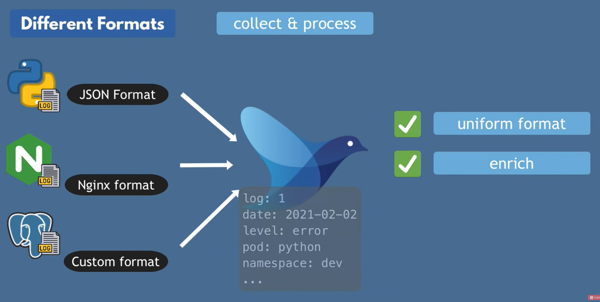

# Basic logging

```
kubectl logs [POD_NAME]
```

# Logging using fluentd

There are few options where we could store logs:

* write to files - the problem is that it is difficult to analyze
* log directly into DB - the problem is that it is each app must be configured to support for example ElasticSearch DB, also format has to be the same, also we want collect logs from 3rd parties like nginx-controller, system/infrastructure and this approach simple might not be possible for these 3rd parties because they might not support integration with our DB

fluentd handles logs reliably - if there is network outage or data spikes it will not mess up data collection.





# Links
https://www.youtube.com/watch?v=5ofsNyHZwWE