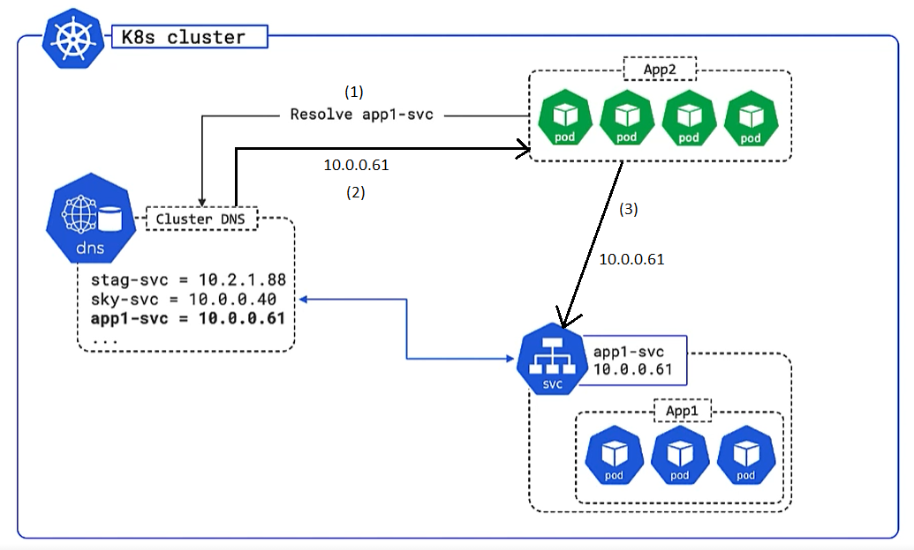
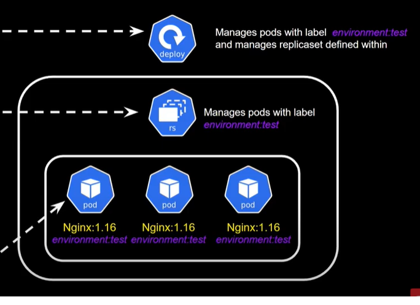

- [Masters](#masters)
  - [Amount of Masters Nodes](#amount-of-masters-nodes)
  - [Master elements.](#master-elements)
- [Nodes](#nodes)
  - [Kubelet - Kubernetes agent](#kubelet---kubernetes-agent)
  - [Container runtime](#container-runtime)
  - [Kube-proxy](#kube-proxy)
  - [Nodeless Kubernetes](#nodeless-kubernetes)
- [Pods](#pods)
- [ReplicaSet](#replicaset)
- [Services](#services)
  - [Access from inside of the cluster](#access-from-inside-of-the-cluster)
  - [Access from outside of the cluster - node port](#access-from-outside-of-the-cluster---node-port)
  - [Access from outside of the cluster - load balancer](#access-from-outside-of-the-cluster---load-balancer)
  - [Port types](#port-types)
- [Deployments](#deployments)
- [Persistent Volumes](#persistent-volumes)
- [Virtual Kubelet](#virtual-kubelet)
- [Installation](#installation)
  - [ways to run Kubernetes](#ways-to-run-kubernetes)
  - [kubectl](#kubectl)
    - [kubectl config](#kubectl-config)
  - [Minikube](#minikube)
    - [structure](#structure)
    - [Install Minikube on Ubuntu 18.04](#install-minikube-on-ubuntu-1804)
    - [installation on Win10](#installation-on-win10)
    - [running](#running)
  - [Google Container Engine (GKE)](#google-container-engine-gke)
  - [Azure Kubernetes Service (AKS)](#azure-kubernetes-service-aks)
  - [K8s from docker desktop](#k8s-from-docker-desktop)
- [kubectl apply vs create](#kubectl-apply-vs-create)
- [Examples](#examples)
  - [Example 01: deploy, update, and rollback](#example-01-deploy-update-and-rollback)
    - [build docker image](#build-docker-image)
    - [publish docker image to docker hub](#publish-docker-image-to-docker-hub)
    - [Pod object](#pod-object)
      - [create pod manifest (YAML) and apply it](#create-pod-manifest-yaml-and-apply-it)
      - [create multi container pod manifest (YAML) and apply it](#create-multi-container-pod-manifest-yaml-and-apply-it)
      - [Service object with type NodePort - imperative way](#service-object-with-type-nodeport---imperative-way)
      - [Service object with type NodePort - declarative way](#service-object-with-type-nodeport---declarative-way)
      - [Service object with type LoadBalancer](#service-object-with-type-loadbalancer)
    - [Deployment object](#deployment-object)
      - [Simple deployment](#simple-deployment)
      - [Rolling update](#rolling-update)
        - [Create and publish second version of the image](#create-and-publish-second-version-of-the-image)
        - [Execute update](#execute-update)
        - [Execute rollback - use previous replica set](#execute-rollback---use-previous-replica-set)
- [Kubernetes dashboard](#kubernetes-dashboard)
- [resources](#resources)

<small><i><a href='http://ecotrust-canada.github.io/markdown-toc/'>Table of contents generated with markdown-toc</a></i></small>


# Masters
Masters are Kubernates control plane.


In production environment masters always should be deployed as multi-master H/A control plane:


## Amount of Masters Nodes
Typically in HA configuration for Masters are 3 or 5 nodes.
This amount of nodes make easier to achieve cluster consensus and avoid [split brain](https://support.oneidentity.com/syslog-ng-store-box/kb/264445/recovering-from-split-brain-situation-in-high-availability-environment) and **deadlock**.

> NOTE: A split brain situation is caused by a temporary failure of the network link between the cluster nodes, resulting in both nodes switching to the active (primary) role while disconnected. This might cause new data (for example, log messages) to be created on both nodes without being replicated to the other node. Thus, it is likely in this situation that two diverging sets of data have been created, which cannot be trivially merged.

For example in case of 4 masters **deadlock** can occur because none of the nodes could not ping more then 2 nodes - if none of the nodes can be sure that can communicate with majority then all nodes (cluster) go to read-only mode. EKS will still work but we will not be able to do any change there, for example new deployment will not be possible.


**In case of K8s control plane (masters) only one master is active:**


Followers always proxy to the leader.

## Master elements.

[Elements](https://kubernetes.io/docs/concepts/overview/components/)

* kube-apiserver
  * front-end to the control plane
  * exposes the API (REST)
  * consumes JSON/YAML
* cluster store
  * the only persistent component in the whole control plane
  * persists cluster state and config
  * based on [etcd](https://etcd.io/)
  * have recovery plans in place
* kube-controller-manager
  * node controller
  * deployment controller
  * replica set controller (for amount of pods)
  * etc.
  * each such controller works in reconciliation loop: reconciles observed state with desired state 
* scheduler
  * watches for newly created Pods with no assigned node, and selects a node for them to run on

# Nodes
There are 3 main elements in a node: **Kubelet**, **container engine**, **kube-proxy**.

## Kubelet - Kubernetes agent

Node is component where **Kubelet** (Kubernetes agent) is installed. We can say that Kubelet is a node. It registers node with cluster and reports its status to master. Using port :10255 we can inspect the kubelet (/spec, /healthz, /pods).

## Container runtime
The container runtime is the software that is responsible for running containers. Usually it is Docker.

## Kube-proxy
It takes care that **pod** has IP address (all containers in a pod share single IP). To reach individual containers in a pod we have to use ports. It takes role also of basic load balancing.
It is part of the Kubernetes Service concept:

## Nodeless Kubernetes
[Nodeless Kubernetes](https://www.elotl.co/nodeless-kubernetes.html)


# Pods
Pod is atomic unit of scheduling. A Pod always runs on a Node. A Node can have multiple pods. It is like a sandbox that runs containers in itself.  
**All containers in pod share the pod environment, for example they share file system.** That`s why it is also called shared execution environment:


If there is uses case when 2 services have to be tight coupled then they should be placed in the same pod, if not then they should be placed in separated pods.

To scale up/down Kubernetes control amount of pods and not containers inside pod.


**Pods do not support resurrection. Every time new pod is set up it is completely new pod.** It means also that pods do not have fixed IP addresses - that`s why concept of services and labels was introduced.

# ReplicaSet

> "A ReplicaSet's purpose is to maintain a stable set of replica Pods running at any given time. As such, it is often used to guarantee the availability of a specified number of identical Pods."   

For example it takes care that in situation when a one pod crashed a new instance of pod is created.


# Services
Services offers **fixed** IP address, DNS name and load balancing. It is needed because new pods get different IP addresses every time.
Service can give access to pods for external and internal access.   
**Every container in every pod can resolve service name!**

**Pods are assigned to a service via labels.**


Other important points:

1. Service only send to healthy pods.
2. Service can be configured for session affinity.
3. Service can point to things outside the cluster.
4. Random load balancing.
5. Uses TCP by default but UDP is also supported.


Service types:
* Cluster IP: default service type. Gives you a service inside your cluster that other apps inside your cluster can access. There is no external access.
* NodePort:  NodePort, as the name implies, opens a specific port on all the Nodes (the VMs), and any traffic that is sent to this port is forwarded to the service.
* LoadBalancer: will give you a single IP address that will forward all traffic to your service.
* Ingress: is actually NOT a type of service. Instead, it sits in front of multiple services and act as a “smart router” or entry point into your cluster.

More can be found here: https://medium.com/google-cloud/kubernetes-nodeport-vs-loadbalancer-vs-ingress-when-should-i-use-what-922f010849e0

## Access from inside of the cluster



## Access from outside of the cluster - node port


## Access from outside of the cluster - load balancer


## Port types


# Deployments
Deployments are described via YAML or JSON manifest file. They are deployed via *apiserver* from master.

**Deployments are a newer and higher level concept than Replication Controllers.**

# Persistent Volumes
https://www.youtube.com/watch?v=x2sMWUkasoE
https://kubernetes.io/docs/concepts/storage/persistent-volumes/

# Virtual Kubelet
https://virtual-kubelet.io/

# Installation

## ways to run Kubernetes

* Cloud Machines (K8s in VMs)
  * Pay as you go
  * No upfront cost
  * Scale down as needed
* Managed K8s, all above plus:
  * no charge for Master on some providers
* Serverless Node Pool
  * pods given resources on demand
  * No VMs to managed
* Reserved Instances
  * reduced hourly rate for nodes

## kubectl
The Kubernetes command-line tool, **kubectl**, allows you to run commands against Kubernetes clusters.

>Docker Desktop for Windows adds its own version of kubectl to PATH. If you have installed Docker Desktop before, you may need to place your PATH entry before the one added by the Docker Desktop installer or remove the Docker Desktop’s kubectl.


### kubectl config
```
kubectl config get-contexts
```
```
kubectl config use-context CONTEXT_NAME
```

## Minikube

### structure


### Install Minikube on Ubuntu 18.04

> :warning: THIS CHAPTER IS NOT COMPLETE. It did not work on my machine probably because of conflict between hyper-v and virtual box (I was using laptop with Win10 and Ubuntu run using hyper-v).


https://www.youtube.com/watch?v=m6InGYXR4LI   

1. Prerequisite: VirtualBox

```sh
sudo su
apt-get install -y virtualbox
```

2. Prerequisite: curl

```sh
apt install curl
```

3. Prerequisite: kubectl

```sh
curl -Lo kubectl https://storage.googleapis.com/kubernetes-release/release/v1.5.1/bin/linux/amd64/kubectl
chmod +x kubectl
mv kubectl /usr/local/bin/kubectl
```

4. minikube

```sh
curl -Lo minikube https://storage.googleapis.com/minikube/releases/v1.9.2/minikube-linux-amd64
chmod +x minikube
mv minikube /usr/local/bin
minikube start --vm-driver virtualbox
```
NOTE: command *minikube start* should not be executed from root account. If *sudo su* was executed earlier close current and open new terminal.
https://github.com/kubernetes/minikube/issues/7659

### installation on Win10

> :warning: It looks that running Minikube and Docker Engine on the same machine is problematic. THIS CHAPTER IS NOT COMPLETE.
https://github.com/kubernetes/minikube/issues/5437

```
choco install minikube
```


### running

There is prerequist to create virtual swith in hyper-vthere is prerequisite to create virtual switch in hyper-v.
https://github.com/kubernetes/minikube/issues/2181#issuecomment-344183665


## Google Container Engine (GKE)
GKE is Kubernetes in Google Cloud.

## Azure Kubernetes Service (AKS)
AKS is Kubernetes in Azure.

## K8s from docker desktop

Works without problems on Win10!.


# kubectl apply vs create

[apply vs create](https://intellipaat.com/community/468/difference-between-kubectl-apply-and-kubectl-create)   
https://kubernetes.io/docs/tasks/manage-kubernetes-objects/imperative-config/   
https://kubernetes.io/docs/tasks/manage-kubernetes-objects/declarative-config/   


| Kubectl apply (declarative)       | Kubectl create (imperative)          | 
| ------------- |-------------|
| It directly updates in the current live source, only the attributes which are given in the file.      | It first deletes the resources and then creates it from the file provided.|
| The file used in apply can be an incomplete spec      | The file used in create should be complet      |
| Apply works only on some properties of the resources | Create works on every property of the resources      |
| You can apply a file that changes only an annotation, without specifying any other properties of the resource. | If you will use the same file with a replace command, the command would fail, due to the missing information. |

# Examples

## Example 01: deploy, update, and rollback

[example01-deploy-update-rollback](./example01-deploy-update-rollbacke)

### build docker image

```
docker image build -t kicaj29/another-app:1.0 .
```

### publish docker image to docker hub

```
PS D:\GitHub\kicaj29\Kubernetes\example01-deploy-update-rollback\App> docker image push kicaj29/another-app:1.0
The push refers to repository [docker.io/kicaj29/another-app]
493c8cfdf52f: Pushed
22d12f79ba67: Pushed
e41e234975c9: Mounted from library/node
d68967c78819: Mounted from library/node
7ef3fa57625c: Mounted from library/node
c447987a5233: Mounted from library/node
4d3dd4268d84: Mounted from library/node
1.0: digest: sha256:1fe46dc33b6442ebbe5700c94891b267c59de772709c62760db62d5a861d3668 size: 1787
```

### Pod object

It is possible to create pods directly but usually this approach is not used in real environments because then replica set is not created (so we cannot control amount of pods) and there is no deployment object. More [here](https://stackoverflow.com/questions/41325087/what-is-the-difference-between-a-pod-and-a-deployment). Typical in real system `Deployment` objects are used.

#### create pod manifest (YAML) and apply it

[pod.yaml](./example01-deploy-update-rollback/Pods/pod.yml)

We can see that pod is created but it is just a one pod, `ReplicaSet` object is not created and also there is no way to access the app because `Service` object is also not created.

```
PS D:\GitHub\kicaj29\Kubernetes\example01-deploy-update-rollback\Pods> kubectl apply -f pod.yml
pod/hello-pod created
PS D:\GitHub\kicaj29\Kubernetes\example01-deploy-update-rollback\Pods> kubectl get pod hello-pod -o wide
NAME        READY   STATUS    RESTARTS   AGE     IP           NODE             NOMINATED NODE   READINESS GATES
hello-pod   1/1     Running   0          2m10s   10.1.1.175   docker-desktop   <none>           <none>
```

To get full description for the pod run:
```
kubectl describe pods hello-pod
```

If we delete this pod then a new pod will not be created because there is no `ReplicaSet` object that controls amount of pods:

```
PS D:\GitHub\kicaj29\Kubernetes\example01-deploy-update-rollback\Pods> kubectl delete pod hello-pod
pod "hello-pod" deleted
PS D:\GitHub\kicaj29\Kubernetes\example01-deploy-update-rollback\Pods> kubectl get pods
No resources found in default namespace.
```

#### create multi container pod manifest (YAML) and apply it

[multi container pod manifest](./example01-deploy-update-rollback/Pods/multi-pod.yml)

```
PS D:\GitHub\kicaj29\Kubernetes\example01-deploy-update-rollback\Pods> kubectl apply -f multi-pod.yml
pod/multi-container-pod created
S D:\GitHub\kicaj29\Kubernetes\example01-deploy-update-rollback\Pods> kubectl get pod multi-container-pod -o wide
NAME                  READY   STATUS    RESTARTS   AGE   IP           NODE             NOMINATED NODE   READINESS GATES
multi-container-pod   2/2     Running   0          21s   10.1.1.176   docker-desktop   <none>           <none>
PS D:\GitHub\kicaj29\Kubernetes\example01-deploy-update-rollback\Pods> kubectl delete pod multi-container-pod
pod "multi-container-pod" deleted
```

#### Service object with type NodePort - imperative way

To have access to the hosted app we have to create `Service` object with `NodePort`.

First create a pod:

```
PS D:\GitHub\kicaj29\Kubernetes\example01-deploy-update-rollback\Pods> kubectl apply -f pod.yml
pod/hello-pod created
```

```
PS D:\GitHub\kicaj29\Kubernetes\example01-deploy-update-rollback\Pods> kubectl expose pod hello-pod --name=hello-svc --target-port=8080 --type=NodePort
service/hello-svc exposed
PS D:\GitHub\kicaj29\Kubernetes\example01-deploy-update-rollback\Pods> kubectl get svc
NAME         TYPE        CLUSTER-IP      EXTERNAL-IP   PORT(S)          AGE
hello-svc    NodePort    10.105.83.145   <none>        8080:32083/TCP   24s
kubernetes   ClusterIP   10.96.0.1       <none>        443/TCP          7d22h
```

Next we can see the app is available on port 32083 and can bo opened using url http://localhost:32083

Next we can delete the service and pod:

```
PS D:\GitHub\kicaj29\Kubernetes\example01-deploy-update-rollback\Pods> kubectl delete svc hello-svc
service "hello-svc" deleted
PS D:\GitHub\kicaj29\Kubernetes\example01-deploy-update-rollback\Pods> kubectl delete pod hello-pod
pod "hello-pod" deleted
```

#### Service object with type NodePort - declarative way

[svc-nodeport](./example01-deploy-update-rollback/Services/svc-nodeport.yml)

Create a pod and check if it is running:

```
PS D:\GitHub\kicaj29\Kubernetes\example01-deploy-update-rollback\Pods> kubectl apply -f pod.yml
pod/hello-pod created
PS D:\GitHub\kicaj29\Kubernetes\example01-deploy-update-rollback\Pods> kubectl get pod hello-pod --show-labels
NAME        READY   STATUS    RESTARTS   AGE   LABELS
hello-pod   1/1     Running   0          13s   app=web
```

Next create service and check if it is running:

```
PS D:\GitHub\kicaj29\Kubernetes\example01-deploy-update-rollback\Services> kubectl apply -f svc-nodeport.yml
service/ps-nodeport created
PS D:\GitHub\kicaj29\Kubernetes\example01-deploy-update-rollback\Services> kubectl describe svc ps-nodeport
Name:                     ps-nodeport
Namespace:                default
Labels:                   <none>
Annotations:              <none>
Selector:                 app=web
Type:                     NodePort
IP Family Policy:         SingleStack
IP Families:              IPv4
IP:                       10.110.74.12
IPs:                      10.110.74.12
LoadBalancer Ingress:     localhost
Port:                     <unset>  80/TCP
TargetPort:               8080/TCP
NodePort:                 <unset>  31111/TCP
Endpoints:                10.1.0.12:8080
Session Affinity:         None
External Traffic Policy:  Cluster
Events:                   <none>
PS D:\GitHub\kicaj29\Kubernetes\example01-deploy-update-rollback\Services> kubectl get svc
NAME          TYPE        CLUSTER-IP     EXTERNAL-IP   PORT(S)        AGE
kubernetes    ClusterIP   10.96.0.1      <none>        443/TCP        7d22h
ps-nodeport   NodePort    10.110.74.12   <none>        80:31111/TCP   78s
```

Next we can open the app in local cluster: http://localhost:31111/

Clean up:
```
PS D:\GitHub\kicaj29\Kubernetes\example01-deploy-update-rollback\Services> kubectl delete svc ps-nodeport
service "ps-nodeport" deleted
```

#### Service object with type LoadBalancer

[svc-lb](./example01-deploy-update-rollback/Services/svc-lb.yml)

This service type makes sense only when we have multiple nodes (typically in public cloud providers). Then user will get single IP and port to access hosted app.   

It is also possible to create this service type on local cluster with single node but then it works very similar to NodePort type.

```
PS D:\GitHub\kicaj29\Kubernetes\example01-deploy-update-rollback\Services> kubectl apply -f svc-lb.yml
service/ps-lb created
PS D:\GitHub\kicaj29\Kubernetes\example01-deploy-update-rollback\Services> kubectl describe svc ps-lb
Name:                     ps-lb
Namespace:                default
Labels:                   <none>
Annotations:              <none>
Selector:                 app=web
Type:                     LoadBalancer
IP Family Policy:         SingleStack
IP Families:              IPv4
IP:                       10.103.89.52
IPs:                      10.103.89.52
LoadBalancer Ingress:     localhost
Port:                     <unset>  82/TCP
TargetPort:               8080/TCP
NodePort:                 <unset>  30593/TCP
Endpoints:                10.1.0.12:8080
Session Affinity:         None
External Traffic Policy:  Cluster
Events:                   <none>
PS D:\GitHub\kicaj29\Kubernetes\example01-deploy-update-rollback\Services> kubectl get svc
NAME         TYPE           CLUSTER-IP     EXTERNAL-IP   PORT(S)        AGE
kubernetes   ClusterIP      10.96.0.1      <none>        443/TCP        7d23h
ps-lb        LoadBalancer   10.103.89.52   localhost     82:30593/TCP   3m44s
```

The app can be accessed using address http://localhost:82/.

NOTE: I would expect that the will be available also using node port value http://localhost:30593/ but it is not, maybe it is somehow blocked by created services.


Cleanup:
```
PS D:\GitHub\kicaj29\Kubernetes\example01-deploy-update-rollback\Services> kubectl delete svc ps-lb
service "ps-lb" deleted
PS D:\GitHub\kicaj29\Kubernetes\example01-deploy-update-rollback\Services> kubectl delete pod hello-pod
pod "hello-pod" deleted
```

### Deployment object

Deployment object combines `Pod`, `ReplicaSet`, and `Deployment` objects.   
Deployment object is in apps api subgroup.



#### Simple deployment
[deploy](./example01-deploy-update-rollback/Deployments/deploy.yml)   

Create deployment:
```
PS D:\GitHub\kicaj29\Kubernetes\example01-deploy-update-rollback\Deployments> kubectl apply -f deploy.yml
deployment.apps/web-deploy created
```
Check deployment status:
```
PS D:\GitHub\kicaj29\Kubernetes\example01-deploy-update-rollback\Deployments> kubectl get deploy --show-labels
NAME         READY   UP-TO-DATE   AVAILABLE   AGE    LABELS
web-deploy   5/5     5            5           111s   app=web
```
Check created pods:
```
PS D:\GitHub\kicaj29\Kubernetes\example01-deploy-update-rollback\Deployments> kubectl get pods --show-labels
NAME                          READY   STATUS    RESTARTS   AGE   LABELS
web-deploy-58d76756b7-5wmnd   1/1     Running   0          82s   app=web,pod-template-hash=58d76756b7
web-deploy-58d76756b7-6j7mt   1/1     Running   0          82s   app=web,pod-template-hash=58d76756b7
web-deploy-58d76756b7-826lp   1/1     Running   0          82s   app=web,pod-template-hash=58d76756b7
web-deploy-58d76756b7-gg7hx   1/1     Running   0          82s   app=web,pod-template-hash=58d76756b7
web-deploy-58d76756b7-wx4rs   1/1     Running   0          82s   app=web,pod-template-hash=58d76756b7
```
We can see also that `ReplicaSet` is created and has set label:
```
PS D:\GitHub\kicaj29\Kubernetes\example01-deploy-update-rollback\Deployments> kubectl get rs --show-labels
NAME                    DESIRED   CURRENT   READY   AGE     LABELS
web-deploy-58d76756b7   5         5         5       2m32s   app=web,pod-template-hash=58d76756b7
```

Now we can create `Service` object `NodePort` to have access to the app:
```
D:\GitHub\kicaj29\Kubernetes\example01-deploy-update-rollback\Services>kubectl apply -f svc-nodeport.yml
service/ps-nodeport created
D:\GitHub\kicaj29\Kubernetes\example01-deploy-update-rollback\Services>kubectl get svc --show-labels
NAME          TYPE        CLUSTER-IP      EXTERNAL-IP   PORT(S)        AGE     LABELS
kubernetes    ClusterIP   10.96.0.1       <none>        443/TCP        7d23h   component=apiserver,provider=kubernetes

ps-nodeport   NodePort    10.103.52.152   <none>        80:31111/TCP   29s     <none>
```

The app is available on address: http://localhost:31111/

Additionally by checking endpoints object we can see list of healthy pods which are available for the service:

```
D:\GitHub\kicaj29\Kubernetes\example01-deploy-update-rollback\Services>kubectl describe ep
Name:         kubernetes
Namespace:    default
Labels:       endpointslice.kubernetes.io/skip-mirror=true
Annotations:  <none>
Subsets:
  Addresses:          192.168.65.4
  NotReadyAddresses:  <none>
  Ports:
    Name   Port  Protocol
    ----   ----  --------
    https  6443  TCP

Events:  <none>


Name:         ps-nodeport
Namespace:    default
Labels:       <none>
Annotations:  endpoints.kubernetes.io/last-change-trigger-time: 2021-08-19T20:05:33Z
Subsets:
  Addresses:          10.1.0.13,10.1.0.14,10.1.0.15,10.1.0.16,10.1.0.17
  NotReadyAddresses:  <none>
  Ports:
    Name     Port  Protocol
    ----     ----  --------
    <unset>  8080  TCP

Events:  <none>
```
#### Rolling update 

[Rolling update](./another-nodejs-example/Deployments/rolling-update.yml)

First lest delete one of the pods:
```
PS D:\GitHub\kicaj29\Kubernetes> kubectl delete pod web-deploy-7fcb7dfd6b-486jq
pod "web-deploy-7fcb7dfd6b-486jq" deleted
```

We can see that new pod is startup automatically and again we have 5 pods:

```
PS D:\GitHub\kicaj29\Kubernetes> kubectl get pods
NAME                                                       READY   STATUS    RESTARTS   AGE
web-deploy-7fcb7dfd6b-7wgmb                                1/1     Running   0          16m
web-deploy-7fcb7dfd6b-b97c4                                1/1     Running   0          16m
web-deploy-7fcb7dfd6b-dj7jv                                1/1     Running   0          16m
web-deploy-7fcb7dfd6b-g8pkf                                1/1     Running   0          16m
web-deploy-7fcb7dfd6b-q9m87                                1/1     Running   0          32s
```


Explanation of **maxUnavailable**, **maxSurge**, **minReadySeconds** from the [manifest file](./another-nodejs-example/Deployments/rolling-update.yml):   
> Kubernetes will deploy one new pod on the new version taken us from 5 to 6 once that up and running for minReadySeconds (8). After that, it will terminate an old pod and takes back down to 5. Then it will fire up a new one taken us to 6 again. Wait for 8 seconds, delete an old one and it'll rinse and repeat that process until it cycles through all 5 pods.

##### Create and publish second version of the image

```
docker image build -t kicaj29/another-app:2.0 .
docker image push kicaj29/another-app:2.0
```

##### Execute update

* in one console watch pods
```
kubectl get pods --watch
```
* in next console run update
```
kubectl apply -f rolling-update.yml
```
* in next console run monitoring of rollout (in this case it is update)
```
kubectl rollout status deploy web-deploy
```
* in next console check current status of replica sets
```
kubectl get rs
```

We can see that new pod is created and pod from previous version is deleted, this is repeated 5 times.


After this we can see that new replica set was created where desired and current state are the same and equal 5.
```
PS D:\> kubectl get rs
NAME                    DESIRED   CURRENT   READY   AGE
web-deploy-7fcb7dfd6b   5         5         5       3h24m
PS D:\> kubectl get rs
NAME                    DESIRED   CURRENT   READY   AGE
web-deploy-7444c66bbf   5         5         5       5m37s
web-deploy-7fcb7dfd6b   0         0         0       3h31m
PS D:\>
```

##### Execute rollback - use previous replica set

Previous replica set can be used to do rollback. Frist we can check how looks previous replica set:

```
S D:\GitHub\kicaj29\Kubernetes> kubectl describe rs web-deploy-7fcb7dfd6b
Name:           web-deploy-7fcb7dfd6b
Namespace:      default
Selector:       app=web,pod-template-hash=7fcb7dfd6b
Labels:         app=web
                pod-template-hash=7fcb7dfd6b
Annotations:    deployment.kubernetes.io/desired-replicas: 5
                deployment.kubernetes.io/max-replicas: 6
                deployment.kubernetes.io/revision: 1
Controlled By:  Deployment/web-deploy
Replicas:       0 current / 0 desired
Pods Status:    0 Running / 0 Waiting / 0 Succeeded / 0 Failed
Pod Template:
  Labels:  app=web
           pod-template-hash=7fcb7dfd6b
  Containers:
   hello-pod:
    Image:        kicaj29/another-app:1.0
    Port:         8080/TCP
    Host Port:    0/TCP
    Environment:  <none>
    Mounts:       <none>
  Volumes:        <none>
Events:
  Type    Reason            Age    From                   Message
  ----    ------            ----   ----                   -------
  Normal  SuccessfulDelete  8m24s  replicaset-controller  Deleted pod: web-deploy-7fcb7dfd6b-q9m87
  Normal  SuccessfulDelete  8m13s  replicaset-controller  Deleted pod: web-deploy-7fcb7dfd6b-dj7jv
  Normal  SuccessfulDelete  8m1s   replicaset-controller  Deleted pod: web-deploy-7fcb7dfd6b-7wgmb
  Normal  SuccessfulDelete  7m50s  replicaset-controller  Deleted pod: web-deploy-7fcb7dfd6b-b97c4
  Normal  SuccessfulDelete  7m39s  replicaset-controller  Deleted pod: web-deploy-7fcb7dfd6b-g8pkf
```

Check also history of rollouts:

```
S D:\GitHub\kicaj29\Kubernetes> kubectl rollout history deploy web-deploy
deployment.apps/web-deploy
REVISION  CHANGE-CAUSE
1         <none>
2         <none>
```

Next we can do rollback:

```
kubectl rollout undo deploy web-deploy --to-revision=1
```

It will run similar proccess of creating and deleting pods like in case of update.


When it is done we can check status of the replica sets and rollout history. We can see that now again the first replica set ```web-deploy-7fcb7dfd6b``` is up and running.

```
PS D:\> kubectl rollout history deploy web-deploy
deployment.apps/web-deploy
REVISION  CHANGE-CAUSE
2         <none>
3         <none>

PS D:\> kubectl get rs
NAME                    DESIRED   CURRENT   READY   AGE
web-deploy-7444c66bbf   0         0         0       16m
web-deploy-7fcb7dfd6b   5         5         5       3h41m
```

# Kubernetes dashboard

```
kubectl apply -f https://raw.githubusercontent.com/kubernetes/dashboard/v2.0.0/aio/deploy/recommended.yaml
kubectl proxy
```

Next open in web browser http://localhost:8001/api/v1/namespaces/kubernetes-dashboard/services/https:kubernetes-dashboard:/proxy/

To find token execute:

```
kubectl -n kubernetes-dashboard get sa
kubectl -n kubernetes-dashboard describe sa kubernetes-dashboard
kubectl -n kubernetes-dashboard describe secret [TOKEN]
```


Next paste value from red rectangle to input for from the dashboard web UI.

# resources
https://app.pluralsight.com/library/courses/getting-started-kubernetes    
https://app.pluralsight.com/library/courses/azure-container-service-big-picture/table-of-contents    
https://github.com/ManojNair/letskube   
https://www.youtube.com/watch?v=5lzUpDtmWgM   
https://codefresh.io/kubernetes-tutorial/local-kubernetes-windows-minikube-vs-docker-desktop/   
https://helm.sh/  
https://www.youtube.com/watch?v=GhZi4DxaxxE   (Kubernetes Ingress Explained Completely For Beginners - Updated)
https://app.pluralsight.com/library/courses/kubernetes-developers-moving-cloud/table-of-contents (aws, azure, google)   
https://app.pluralsight.com/library/courses/kubernetes-getting-started/table-of-contents   

Another good example is in my repo with helm: https://github.com/kicaj29/helm
