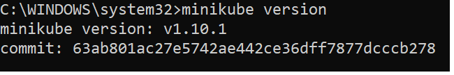
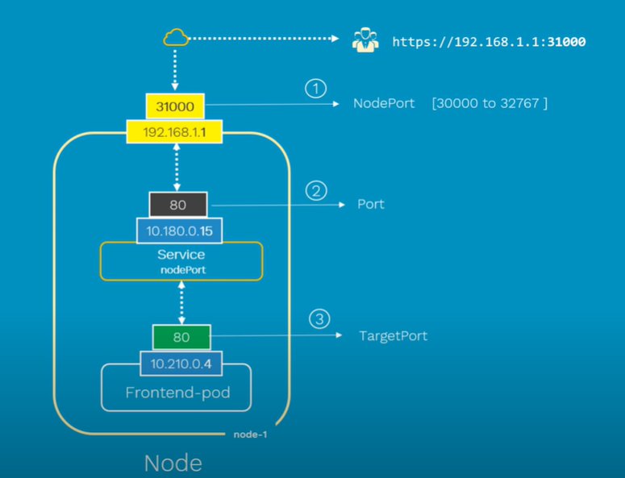

# Masters
Is Kubernates control plane.


# Nodes
There are 3 main elements in a node: **Kubelet**, **container engine**, **kube-proxy**.

Node is component where **Kubelet** (Kubernetes agent) is installed. We can say that Kubelet is a node. It registers node with cluster and reports its status to master. Using port :10255 we can inspect the kubelet (/spec, /healthz, /pods).   
Other 2 main elements are **container engine** and **kube-proxy** e.g. it takes care that node has IP address (all containers in a pod share single IP).

# Pods
Pod is atomic unit of scheduling. A Pod always runs on a Node. A Node can have multiple pods. It is like a sandbox that runs containers in itself.  
**All containers in pod share the pod environment.** If there is uses case when 2 services have to be tight coupled then they should be placed in the same pod, if not then they should be placed in separated pods.

To scale up/down Kubernetes control ammount of pods and not containers inside pod.


**Pods do not support resurrection. Every time new pod is set up it is completely new pod.**

# Services
Services offers fixed IP address, DNS name and load balancing. It is needed becasue new pods get different IP addresses every time.

**Pods are assigned to a service via labels.**


Other important points:

1. Service only send to healhy pods.
2. Service can be configured for session affinity.
3. Service can point to things outside the cluster.
4. Random load balancing.
5. Uses TCP by default.


# Deployments
Deployments are described via YAML or JSON manifest file. They are deployed via *apiserver* from master.

**Deployments are a newer and higher level concept than Replication Controllers.**

# Installation

## kubectl
The Kubernetes command-line tool, **kubectl**, allows you to run commands against Kubernetes clusters.

>Docker Desktop for Windows adds its own version of kubectl to PATH. If you have installed Docker Desktop before, you may need to place your PATH entry before the one added by the Docker Desktop installer or remove the Docker Desktop’s kubectl.


## Minikube

> :warning: It looks that running Minikube and Docker Engine on the same machine is problematic. THIS CHAPTER IS NOT COMPLETE.
https://github.com/kubernetes/minikube/issues/5437

### structure


### installation

```
choco install minikube
```




### running

There is prerequist to create virtual swith in hyper-vthere is prerequisite to create virtual switch in hyper-v.
https://github.com/kubernetes/minikube/issues/2181#issuecomment-344183665


## Google Container Engine (GKE)
GKE is Kubernetes.

## Azure Kubernetes Service (AKS)

### Building docker image

1. Enable single node Kubernetes cluster in docker


2. Clone repo https://github.com/ManojNair/letskube

3. Run it

Open localhost:5000 to see the page.

4. Create an image from docker file

```
# ---------------STAGE 1---------------------------
# Stage 1 is used only to build the app
FROM microsoft/aspnetcore-build AS build-env
WORKDIR /app

# copy csproj
COPY *.csproj ./
# restore all dependencies of the csproj file
RUN dotnet restore

# copy everything else to working directory
COPY . ./
# build it and publish it to the folder called output
RUN dotnet publish -c Release -o output

# ---------------STAGE 2---------------------------
# Stage 2 refers to stage 1 and takes only files which are needed in runtime!
# Stage 2 containes also files not needed in runtime that`s why we take only what is needed for runtime.

# build runtime image
FROM microsoft/aspnetcore
WORKDIR /app
COPY --from=build-env /app/output .
ENTRYPOINT ["dotnet", "LetsKube.dll"]
```


5. Run created image


6. Remove created container

```
docker rm -f {container ID}
```
### Deploying application to a local Kubernetes cluster

1. Make sure that docker and kubernetes are up and running


2. Check kubernetes version


3. Create alias for command kubectl to have less typing (execute in PowerShell and not cmd) and test basic kubectl commands.


4. Deployment

* Interactively (via kubectl)
```
kubectl run letskube-deployment --image=letskube:local --port=80 --replicas=3
```


Next we have to create a kubernetes service that will make possible connecting to the deployed app. There are couple service types.


Because we are in local (single node) kubernetes cluster we cannot use **LoadBalancer** type and we have to use **NodePort**.

Port types:


```
kubectl expose deployment letskube-deployment --type=NodePort
```
>The above command will create a service with name *letskube-deployment* and this name has to be the same as the name used in command **kubectl run**.


Next we can open in web browser **http://localhost:31669/** to see the app.

We can do clean up using:
```
kubectl delete deployment letskube-deployment
kubectl delete service letskube-deployment
```

* Declaratively (via YAML/JSON)

[letskubedeploy-my.yml](letskube/letskubedeploy-my.yml)

```
kubectl create -f letskubedeploy-my.yml
```


## AWS Provider

TODO

## Manual install

TODO

# links
https://app.pluralsight.com/library/courses/getting-started-kubernetes   

https://app.pluralsight.com/library/courses/azure-container-service-big-picture/table-of-contents
https://github.com/ManojNair/letskube
https://www.youtube.com/watch?v=5lzUpDtmWgM
https://codefresh.io/kubernetes-tutorial/local-kubernetes-windows-minikube-vs-docker-desktop/

# other 
az account set --subscription "RSW Continuous Delivery" 
az aks get-credentials --resource-group rsw.deployment.common --name rsw-kubernetes
kubectl config get-contexts 
