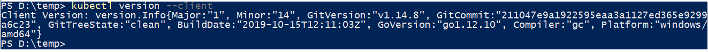
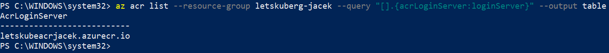

- [Masters](#masters)
  - [Amount of Masters Nodes](#amount-of-masters-nodes)
  - [Master elements.](#master-elements)
- [Nodes](#nodes)
  - [Kubelet - Kubernetes agent](#kubelet---kubernetes-agent)
  - [Container runtime](#container-runtime)
  - [Kube-proxy](#kube-proxy)
  - [Nodeless Kubernetes](#nodeless-kubernetes)
- [Pods](#pods)
- [Services](#services)
  - [Access from inside of the cluster](#access-from-inside-of-the-cluster)
  - [Access from outside of the cluster - node port](#access-from-outside-of-the-cluster---node-port)
  - [Access from outside of the cluster - load balancer](#access-from-outside-of-the-cluster---load-balancer)
  - [Port types](#port-types)
- [Deployments](#deployments)
- [Persistent Volumes](#persistent-volumes)
- [Virtual Kubelet](#virtual-kubelet)
- [Installation](#installation)
  - [ways to run Kubernetes](#ways-to-run-kubernetes)
  - [kubectl](#kubectl)
  - [Minikube](#minikube)
    - [structure](#structure)
    - [Install Minikube on Ubuntu 18.04](#install-minikube-on-ubuntu-1804)
    - [installation on Win10](#installation-on-win10)
    - [running](#running)
  - [Google Container Engine (GKE)](#google-container-engine-gke)
  - [Azure Kubernetes Service (AKS)](#azure-kubernetes-service-aks)
  - [K8s from docker desktop](#k8s-from-docker-desktop)
- [kubectl apply vs create](#kubectl-apply-vs-create)
- [Examples](#examples)
  - [lestkube](#lestkube)
    - [Building docker image](#building-docker-image)
    - [Deploying application to a local Kubernetes cluster](#deploying-application-to-a-local-kubernetes-cluster)
    - [Pushing the Image to Azure Container Registry (ACR)](#pushing-the-image-to-azure-container-registry-acr)
    - [Deploy Azure Kubernetes Service](#deploy-azure-kubernetes-service)
    - [Deploy app to AKS](#deploy-app-to-aks)
    - [Scale nodes manually](#scale-nodes-manually)
    - [Scale pods manually](#scale-pods-manually)
    - [Update application in AKS cluster](#update-application-in-aks-cluster)
    - [Kubernetes dashboard AKS](#kubernetes-dashboard-aks)
  - [another-app nodejs example](#another-app-nodejs-example)
    - [build another-app image](#build-another-app-image)
    - [publish another-app image to docker hub](#publish-another-app-image-to-docker-hub)
    - [create pod manifest (YAML) and apply it](#create-pod-manifest-yaml-and-apply-it)
    - [create multi container pod manifest (YAML) and apply it](#create-multi-container-pod-manifest-yaml-and-apply-it)
    - [create service node port - imperative way](#create-service-node-port---imperative-way)
    - [create service node port - declarative way](#create-service-node-port---declarative-way)
    - [create Internet LoadBalancer service](#create-internet-loadbalancer-service)
    - [Deployments](#deployments-1)
- [Kubernetes dashboard](#kubernetes-dashboard)
- [resources](#resources)
- [other](#other)

<small><i><a href='http://ecotrust-canada.github.io/markdown-toc/'>Table of contents generated with markdown-toc</a></i></small>


# Masters
Masters are Kubernates control plane.


In production environment masters always should be deployed as multi-master H/A control plane:


## Amount of Masters Nodes
Typically in HA configuration for Masters are 3 or 5 nodes.
This amount of nodes make easier to achieve cluster consensus and avoid [split brain](https://support.oneidentity.com/syslog-ng-store-box/kb/264445/recovering-from-split-brain-situation-in-high-availability-environment) and **deadlock**.

> NOTE: A split brain situation is caused by a temporary failure of the network link between the cluster nodes, resulting in both nodes switching to the active (primary) role while disconnected. This might cause new data (for example, log messages) to be created on both nodes without being replicated to the other node. Thus, it is likely in this situation that two diverging sets of data have been created, which cannot be trivially merged.

For example in case of 4 masters **deadlock** can occur because none of the nodes could not ping more then 2 nodes - if none of the nodes can be sure that can communicate with majority then all nodes (cluster) go to read-only mode. EKS will still work but we will not be able to do any change there, for example new deployment will not be possible.


**In case of K8s control plane (masters) only one master is active:**


Followers always proxy to the leader.

## Master elements.

[Elements](https://kubernetes.io/docs/concepts/overview/components/)

* kube-apiserver
  * front-end to the control plane
  * exposes the API (REST)
  * consumes JSON/YAML
* cluster store
  * the only persistent component in the whole control plane
  * persists cluster state and config
  * based on [etcd](https://etcd.io/)
  * have recovery plans in place
* kube-controller-manager
  * node controller
  * deployment controller
  * replica set controller (for amount of pods)
  * etc.
  * each such controller works in reconciliation loop: reconciles observed state with desired state 
* scheduler
  * watches for newly created Pods with no assigned node, and selects a node for them to run on

# Nodes
There are 3 main elements in a node: **Kubelet**, **container engine**, **kube-proxy**.

## Kubelet - Kubernetes agent

Node is component where **Kubelet** (Kubernetes agent) is installed. We can say that Kubelet is a node. It registers node with cluster and reports its status to master. Using port :10255 we can inspect the kubelet (/spec, /healthz, /pods).

## Container runtime
The container runtime is the software that is responsible for running containers. Usually it is Docker.

## Kube-proxy
It takes care that **pod** has IP address (all containers in a pod share single IP). To reach individual containers in a pod we have to use ports. It takes role also of basic load balancing.
It is part of the Kubernetes Service concept:

## Nodeless Kubernetes
[Nodeless Kubernetes](https://www.elotl.co/nodeless-kubernetes.html)


# Pods
Pod is atomic unit of scheduling. A Pod always runs on a Node. A Node can have multiple pods. It is like a sandbox that runs containers in itself.  
**All containers in pod share the pod environment, for example they share file system.** That`s why it is also called shared execution environment:


If there is uses case when 2 services have to be tight coupled then they should be placed in the same pod, if not then they should be placed in separated pods.

To scale up/down Kubernetes control amount of pods and not containers inside pod.


**Pods do not support resurrection. Every time new pod is set up it is completely new pod.** It means also that pods do not have fixed IP addresses - that`s why concept of services and labels was introduced.

# Services
Services offers **fixed** IP address, DNS name and load balancing. It is needed because new pods get different IP addresses every time.
Service can give access to pods for external and internal access.   
**Every container in every pod can resolve service name!**

**Pods are assigned to a service via labels.**


Other important points:

1. Service only send to healthy pods.
2. Service can be configured for session affinity.
3. Service can point to things outside the cluster.
4. Random load balancing.
5. Uses TCP by default but UDP is also supported.


Service types:
* Cluster IP: default service type. Gives you a service inside your cluster that other apps inside your cluster can access. There is no external access.
* NodePort:  NodePort, as the name implies, opens a specific port on all the Nodes (the VMs), and any traffic that is sent to this port is forwarded to the service.
* LoadBalancer: will give you a single IP address that will forward all traffic to your service.
* Ingress: is actually NOT a type of service. Instead, it sits in front of multiple services and act as a “smart router” or entry point into your cluster.

More can be found here: https://medium.com/google-cloud/kubernetes-nodeport-vs-loadbalancer-vs-ingress-when-should-i-use-what-922f010849e0

## Access from inside of the cluster


## Access from outside of the cluster - node port


## Access from outside of the cluster - load balancer


## Port types


# Deployments
Deployments are described via YAML or JSON manifest file. They are deployed via *apiserver* from master.

**Deployments are a newer and higher level concept than Replication Controllers.**

# Persistent Volumes
https://www.youtube.com/watch?v=x2sMWUkasoE
https://kubernetes.io/docs/concepts/storage/persistent-volumes/

# Virtual Kubelet
https://virtual-kubelet.io/

# Installation

## ways to run Kubernetes

* Cloud Machines (K8s in VMs)
  * Pay as you go
  * No upfront cost
  * Scale down as needed
* Managed K8s, all above plus:
  * no charge for Master on some providers
* Serverless Node Pool
  * pods given resources on demand
  * No VMs to managed
* Reserved Instances
  * reduced hourly rate for nodes

## kubectl
The Kubernetes command-line tool, **kubectl**, allows you to run commands against Kubernetes clusters.

>Docker Desktop for Windows adds its own version of kubectl to PATH. If you have installed Docker Desktop before, you may need to place your PATH entry before the one added by the Docker Desktop installer or remove the Docker Desktop’s kubectl.



## Minikube

### structure


### Install Minikube on Ubuntu 18.04

> :warning: THIS CHAPTER IS NOT COMPLETE. It did not work on my machine probably because of conflict between hyper-v and virtual box (I was using laptop with Win10 and Ubuntu run using hyper-v).


https://www.youtube.com/watch?v=m6InGYXR4LI   

1. Prerequisite: VirtualBox

```sh
sudo su
apt-get install -y virtualbox
```

2. Prerequisite: curl

```sh
apt install curl
```

3. Prerequisite: kubectl

```sh
curl -Lo kubectl https://storage.googleapis.com/kubernetes-release/release/v1.5.1/bin/linux/amd64/kubectl
chmod +x kubectl
mv kubectl /usr/local/bin/kubectl
```

4. minikube

```sh
curl -Lo minikube https://storage.googleapis.com/minikube/releases/v1.9.2/minikube-linux-amd64
chmod +x minikube
mv minikube /usr/local/bin
minikube start --vm-driver virtualbox
```
NOTE: command *minikube start* should not be executed from root account. If *sudo su* was executed earlier close current and open new terminal.
https://github.com/kubernetes/minikube/issues/7659

### installation on Win10

> :warning: It looks that running Minikube and Docker Engine on the same machine is problematic. THIS CHAPTER IS NOT COMPLETE.
https://github.com/kubernetes/minikube/issues/5437

```
choco install minikube
```


### running

There is prerequist to create virtual swith in hyper-vthere is prerequisite to create virtual switch in hyper-v.
https://github.com/kubernetes/minikube/issues/2181#issuecomment-344183665


## Google Container Engine (GKE)
GKE is Kubernetes in Google Cloud.

## Azure Kubernetes Service (AKS)
AKS is Kubernetes in Azure.

## K8s from docker desktop

Works without problems on Win10!.


# kubectl apply vs create

[apply vs create](https://intellipaat.com/community/468/difference-between-kubectl-apply-and-kubectl-create)   
https://kubernetes.io/docs/tasks/manage-kubernetes-objects/imperative-config/   
https://kubernetes.io/docs/tasks/manage-kubernetes-objects/declarative-config/   


| Kubectl apply (declarative)       | Kubectl create (imperative)          | 
| ------------- |-------------|
| It directly updates in the current live source, only the attributes which are given in the file.      | It first deletes the resources and then creates it from the file provided.|
| The file used in apply can be an incomplete spec      | The file used in create should be complet      |
| Apply works only on some properties of the resources | Create works on every property of the resources      |
| You can apply a file that changes only an annotation, without specifying any other properties of the resource. | If you will use the same file with a replace command, the command would fail, due to the missing information. |

# Examples

## lestkube

### Building docker image

1. Enable single node Kubernetes cluster in docker


2. Clone repo https://github.com/ManojNair/letskube

3. Run it

Open localhost:5000 to see the page.

4. Create an image from docker file

```
# ---------------STAGE 1---------------------------
# Stage 1 is used only to build the app
FROM microsoft/aspnetcore-build AS build-env
WORKDIR /app

# copy csproj
COPY *.csproj ./
# restore all dependencies of the csproj file
RUN dotnet restore

# copy everything else to working directory
COPY . ./
# build it and publish it to the folder called output
RUN dotnet publish -c Release -o output

# ---------------STAGE 2---------------------------
# Stage 2 refers to stage 1 and takes only files which are needed in runtime!
# Stage 2 containes also files not needed in runtime that`s why we take only what is needed for runtime.

# build runtime image
FROM microsoft/aspnetcore
WORKDIR /app
COPY --from=build-env /app/output .
ENTRYPOINT ["dotnet", "LetsKube.dll"]
```


>NOTE: make sure that before running command ```docker build``` in local file system does not exits folder ```obj```. Folder with such name is also created by ```docker restore``` command so if such folder exist locally then it will overwrite ```obj``` created by ```dotnet restore```!. 

5. Run created image


6. Remove created container

```
docker rm -f {container ID}
```
### Deploying application to a local Kubernetes cluster

1. Make sure that docker and kubernetes are up and running


2. Check kubernetes version


3. Create alias for command kubectl to have less typing (execute in PowerShell and not cmd) and test basic kubectl commands.
 
   >NOTE: Config file for kubectl is here %USERPROFILE%.kube\config

4. Deployment

* Interactively (via kubectl)
```ps
PS D:\> kubectl run letskube-deployment --image=letskube:local --port=80 --replicas=3
kubectl run --generator=deployment/apps.v1 is DEPRECATED and will be removed in a future version. Use kubectl run --generator=run-pod/v1 or kubectl create instead.
deployment.apps/letskube-deployment created
PS D:\> kubectl get deployments
NAME                  READY   UP-TO-DATE   AVAILABLE   AGE
letskube-deployment   3/3     3            3           12s
PS D:\> kubectl get rs
NAME                             DESIRED   CURRENT   READY   AGE
letskube-deployment-76b4b98b78   3         3         3       17s
PS D:\> kubectl get pods
NAME                                   READY   STATUS    RESTARTS   AGE
letskube-deployment-76b4b98b78-4nm6w   1/1     Running   0          23s
letskube-deployment-76b4b98b78-j7rv9   1/1     Running   0          23s
letskube-deployment-76b4b98b78-vr677   1/1     Running   0          23s
```

Next we have to create a kubernetes service that will make possible connecting to the deployed app. There are couple service types.


Because we are in local (single node) kubernetes cluster we cannot use **LoadBalancer** type and we have to use **NodePort**.

```
kubectl expose deployment letskube-deployment --type=NodePort
```
>The above command will create a service with name *letskube-deployment* and this name has to be the same as the name used in command **kubectl run**.


Next we can open in web browser **http://localhost:31669/** to see the app.

We can do clean up using:
```
kubectl delete deployment letskube-deployment
kubectl delete service letskube-deployment
```

* Declaratively (via YAML/JSON)

[letskubedeploy-my.yml](letskube/letskubedeploy-my.yml)

```
kubectl create -f letskubedeploy-my.yml
```


### Pushing the Image to Azure Container Registry (ACR)

> Prerequisite is to instal Azure CLI https://docs.microsoft.com/en-us/cli/azure/install-azure-cli-windows?view=azure-cli-latest

```powershell
# sign in to azure
az login --tenant [tenantID]
# check if there is selected
az account show --output table
# if different then default subscription should be set point it explicitly
az account set --subscription [subscriptionID]

# create resource group
az group create -n letskuberg-jacek -l westeurope
# create container registry
az acr create -n letskubeacrjacek -g letskuberg-jacek -l westeurope --sku standard
# we can print all container registries using the following command
az acr list -o table
# login to created ACR
az acr login -n letskubeacrjacek
# find login service name, it will be needed to push the image
az acr list -o table
# tag local image with login server name and tag
docker tag letskube:local letskubeacrjacek.azurecr.io/letskube:v1
# push the image letskubeacrjacek.azurecr.io/letskube:v1 (this command will create repository if it does not exists yet)
docker push letskubeacrjacek.azurecr.io/letskube:v1
# print all images from the created repository
az acr repository list -n letskubeacrjacek -o table
```

### Deploy Azure Kubernetes Service

1. Create Service Principal.
```powershell
# For applications it is recommended to register an application in Azure AD and create identity for the application (i.e. Service Principal).
# To allow AKS interact with other Azure services or resources and Azure AD principle is used. For example if AKS needs to pull an image for Azure Container Registry it needs permissions to do so. We grant AKS these permissions by using Service Principal.
az ad sp create-for-rbac --skip-assignment
```


In case you forgot password to the service principal you can reset it using 

```
az ad sp credential reset --name c9b0bd8f-8273-42fe-bfc0-6125522c29a8
```

2. Grant created SP permission for reading images for the selected ACR.
```powershell
# Grant permissions for pulling images for ACR.
$acrId = az acr show --name letskubeacrjacek --resource-group letskuberg-jacek --query "id" --output tsv
az role assignment create --assignee [ServicePrincipalID] --role Reader --scope $acrId
```


3. Create AKS cluster.

The following command will create AKS cluster:
* with one node (VM)
* with file where public and private keys are stored
* assign it to the created principal

```powershell
az aks create `
    --name letskubeaksclusterjacek `
    --resource-group letskuberg-jacek `
    --node-count 1 `
    --generate-ssh-keys `
    --service-principal "c9b0bd8f-8273-42fe-bfc0-6125522c29a8" `
    --client-secret "{password}" `
    --location westeurope
```
> :warning: First 4 runs of this command failed. 5th run was successful. Ticket: https://github.com/Azure/azure-cli/issues/9585

> It takes ~4 minutes to create the cluster.

> The above command will create also resoruce group **MC_letskuberg-jacek_letskubeaksclusterjacek_westeurope** with some resoruces mandatory to run the cluster.

> :warning: From some reason created AKS had different service principal then pointed in create command! This can be checked using ```az aks list --resource-group letskuberg-jacek```. I had to assign proper permissions to this service principal using once again ```az role assignment create```. It was blocker because wihout fixing it pods where not able pull image (ImagePullBackOff error) from ACR!


4. Connect kubectl with created AKS

* Verify what are configured clusters and to which kubectl is connected


> Config file for kubectl is here %USERPROFILE%\.kube\config
* Extend the config file by adding credentials to the created AKS

```
az aks get-credentials --name letskubeaksclusterjacek --resource-group letskuberg-jacek
```


On the screen we can see that we are connected to the created AKS and there is 1 working node.

### Deploy app to AKS

To deploy the app we have to modify yml file.

1. Image has to point created ACR (Azure Container Registry). To do this we need to know login server.   
```
az acr list --resource-group letskuberg-jacek --query "[].{acrLoginServer:loginServer}" --output table
```



2. Set service type from NodePort to LoadBalancer

[letskubedeploy-my-azure.yml](letskube/letskubedeploy-my-azure.yml)

When the file is ready next we can execute deployment:


Finally we can open http://51.105.119.193/ in web browser and see working app:


### Scale nodes manually

```
az aks scale --resource-group letskuberg-jacek --name=letskubeaksclusterjacek --node-count 3
```


### Scale pods manually

First we can check current pods:


Next we can scale pods:

```
kubectl scale --replicas=5 deployment/letskube-deployment
```


### Update application in AKS cluster

1. Change soruce code of the app and rebuild it.

2. Create new image and tag it.

```
docker build . -t letskubeacrjacek.azurecr.io/letskube:v2
```

3. Login to ACR

```
az acr login -n letskubeacrjacek
```

4. Push the image.

```
docker push letskubeacrjacek.azurecr.io/letskube:v2
```

5. Check in Azure portal that v2 is in the registry


6. Pull new version of the image

```
kubectl set image deployment letskube-deployment letskube=letskubeacrjacek.azurecr.io/letskube:v2
```
**This command will terminate all existing pods and will create new pods!**

> NOTE: this can be done also via letskubedeploy-my-azure.yml by change "image: letskubeacrjacek.azurecr.io/letskube:v1" -> image: "letskubeacrjacek.azurecr.io/letskube:v2" and executing new deployment.

7. Open the app and check its version.


### Kubernetes dashboard AKS

```
az aks browse -g letskuberg-jacek -n letskubeaksclusterjacek
```

## another-app nodejs example

[another nodejs example](./another-nodejs-example)

### build another-app image

```
docker image build -t kicaj29/another-app:1.0 .
```

### publish another-app image to docker hub

```
PS D:\GitHub\kicaj29\Kubernetes\another-nodejs-example\App> docker image push kicaj29/another-app:1.0
The push refers to repository [docker.io/kicaj29/another-app]
493c8cfdf52f: Pushed
22d12f79ba67: Pushed
e41e234975c9: Mounted from library/node
d68967c78819: Mounted from library/node
7ef3fa57625c: Mounted from library/node
c447987a5233: Mounted from library/node
4d3dd4268d84: Mounted from library/node
1.0: digest: sha256:1fe46dc33b6442ebbe5700c94891b267c59de772709c62760db62d5a861d3668 size: 1787
```

### create pod manifest (YAML) and apply it

[pod manifest](./another-nodejs-example/Pods/pod.yml)

```
PS D:\GitHub\kicaj29\Kubernetes\another-nodejs-example\Pods> kubectl apply -f pod.yml
pod/hello-pod created
PS D:\GitHub\kicaj29\Kubernetes\another-nodejs-example\Pods> kubectl get pod hello-pod -o wide
NAME        READY   STATUS    RESTARTS   AGE     IP           NODE             NOMINATED NODE   READINESS GATES
hello-pod   1/1     Running   0          2m10s   10.1.1.175   docker-desktop   <none>           <none>
```

To get full description for the pod run:
```
kubectl describe pods hello-pod
```

### create multi container pod manifest (YAML) and apply it

[multi container pod manifest](./another-nodejs-example/Pods/multi-pod.yml)

```
PS D:\GitHub\kicaj29\Kubernetes\another-nodejs-example\Pods> kubectl apply -f multi-pod.yml
pod/multi-container-pod created
S D:\GitHub\kicaj29\Kubernetes\another-nodejs-example\Pods> kubectl get pod multi-container-pod -o wide
NAME                  READY   STATUS    RESTARTS   AGE   IP           NODE             NOMINATED NODE   READINESS GATES
multi-container-pod   2/2     Running   0          21s   10.1.1.176   docker-desktop   <none>           <none>
PS D:\GitHub\kicaj29\Kubernetes\another-nodejs-example\Pods> kubectl delete pod multi-container-pod
pod "multi-container-pod" deleted
```

### create service node port - imperative way

```
PS D:\GitHub\kicaj29\Kubernetes> kubectl expose pod hello-pod --name=hello-svc --target-port=8080 --type=NodePort
service/hello-svc exposed
PS D:\GitHub\kicaj29\Kubernetes> kubectl get svc
NAME                                                 TYPE           CLUSTER-IP       EXTERNAL-IP   PORT(S)                      AGE
hello-svc                                            NodePort       10.98.145.38     <none>        8080:30630/TCP               107s
```

Next we can see the app working in local cluster by opening http://localhost:30630   

Next we can delete the service:

```
PS D:\GitHub\kicaj29\Kubernetes> kubectl delete svc hello-svc
service "hello-svc" deleted
```

### create service node port - declarative way

[svc-nodeport](./another-nodejs-example/Services/svc-nodeport.yml)

```
PS D:\GitHub\kicaj29\Kubernetes> kubectl get pod hello-pod --show-labels
NAME        READY   STATUS    RESTARTS   AGE   LABELS
hello-pod   1/1     Running   0          16h   app=web
PS D:\GitHub\kicaj29\Kubernetes> cd .\another-nodejs-example\Services\
PS D:\GitHub\kicaj29\Kubernetes\another-nodejs-example\Services> kubectl apply -f svc-nodeport.yml
service/ps-nodeport created
PS D:\GitHub\kicaj29\Kubernetes\another-nodejs-example\Services> kubectl describe svc ps-nodeport
Name:                     ps-nodeport
Namespace:                default
Labels:                   <none>
Annotations:              kubectl.kubernetes.io/last-applied-configuration:
                            {"apiVersion":"v1","kind":"Service","metadata":{"annotations":{},"name":"ps-nodeport","namespace":"default"},"spec":{"ports":[{"nodePort":...
Selector:                 app=web
Type:                     NodePort
IP:                       10.105.44.160
LoadBalancer Ingress:     localhost
Port:                     <unset>  80/TCP
TargetPort:               8080/TCP
NodePort:                 <unset>  31111/TCP
Endpoints:                10.1.1.194:8080
Session Affinity:         None
External Traffic Policy:  Cluster
Events:                   <none>
```

Next we can open the app in local cluster: http://localhost:31111/

### create Internet LoadBalancer service

[svc-lb](./another-nodejs-example/Services/svc-lb.yml)

> **Only works on supported platforms and supported load balancers. Not available for docker desktop or minikube.**

???Probably LB creates implicitelly also NodePort service types to have possiblity to communicate with nodes/pods.???

### Deployments

[deploy](./another-nodejs-example/Deployments/deploy.yml)   
[deploy-complete](./another-nodejs-example/Deployments/deploy-complete.yml)

Deployment object is in apps api subgroup.   

Delete pod from previous chapters:
```
PS D:\GitHub\kicaj29\Kubernetes> kubectl delete pod hello-pod
pod "hello-pod" deleted
```

Next steps:

```
PS D:\GitHub\kicaj29\Kubernetes\another-nodejs-example\Deployments> kubectl apply -f deploy.yml
deployment.apps/web-deploy created
NAME                                                       READY   STATUS    RESTARTS   AGE   IP           NODE             NOMINATED NODE   READINESS GATES
web-deploy-7fcb7dfd6b-486jq                                1/1     Running   0          24s   10.1.1.196   docker-desktop   <none>           <none>
web-deploy-7fcb7dfd6b-7wgmb                                1/1     Running   0          24s   10.1.1.197   docker-desktop   <none>           <none>
web-deploy-7fcb7dfd6b-b97c4                                1/1     Running   0          24s   10.1.1.198   docker-desktop   <none>           <none>
web-deploy-7fcb7dfd6b-dj7jv                                1/1     Running   0          24s   10.1.1.199   docker-desktop   <none>           <none>
web-deploy-7fcb7dfd6b-g8pkf                                1/1     Running   0          24s   10.1.1.195   docker-desktop   <none>           <none>
PS D:\GitHub\kicaj29\Kubernetes\another-nodejs-example\Deployments> kubectl get deploy
NAME                                       READY   UP-TO-DATE   AVAILABLE   AGE
web-deploy                                 5/5     5            5           67s
```

# Kubernetes dashboard

```
kubectl apply -f https://raw.githubusercontent.com/kubernetes/dashboard/v2.0.0/aio/deploy/recommended.yaml
kubectl proxy
```

Next open in web browser http://localhost:8001/api/v1/namespaces/kubernetes-dashboard/services/https:kubernetes-dashboard:/proxy/

To find token execute:

```
kubectl -n kubernetes-dashboard get sa
kubectl -n kubernetes-dashboard describe sa kubernetes-dashboard
kubectl -n kubernetes-dashboard describe secret [TOKEN]
```


Next paste value from red rectangle to input for from the dashboard web UI.

# resources
https://app.pluralsight.com/library/courses/getting-started-kubernetes    
https://app.pluralsight.com/library/courses/azure-container-service-big-picture/table-of-contents    
https://github.com/ManojNair/letskube   
https://www.youtube.com/watch?v=5lzUpDtmWgM   
https://codefresh.io/kubernetes-tutorial/local-kubernetes-windows-minikube-vs-docker-desktop/   
https://helm.sh/  
https://www.youtube.com/watch?v=GhZi4DxaxxE   (Kubernetes Ingress Explained Completely For Beginners - Updated)
https://app.pluralsight.com/library/courses/kubernetes-developers-moving-cloud/table-of-contents (aws, azure, google)   
https://app.pluralsight.com/library/courses/kubernetes-getting-started/table-of-contents   

Another good example is in my repo with helm: https://github.com/kicaj29/helm

# other 
az account set --subscription "RSW Continuous Delivery" 
az aks get-credentials --resource-group rsw.deployment.common --name rsw-kubernetes
kubectl config get-contexts 
