- [Building docker image](#building-docker-image)
- [Deploying application to a local Kubernetes cluster](#deploying-application-to-a-local-kubernetes-cluster)
- [Pushing the Image to Azure Container Registry (ACR)](#pushing-the-image-to-azure-container-registry-acr)
- [Deploy Azure Kubernetes Service](#deploy-azure-kubernetes-service)
- [Deploy app to AKS](#deploy-app-to-aks)
- [Scale nodes manually](#scale-nodes-manually)
- [Scale pods manually](#scale-pods-manually)
- [Update application in AKS cluster](#update-application-in-aks-cluster)
- [Kubernetes dashboard AKS](#kubernetes-dashboard-aks)


# Building docker image

1. Enable single node Kubernetes cluster in docker
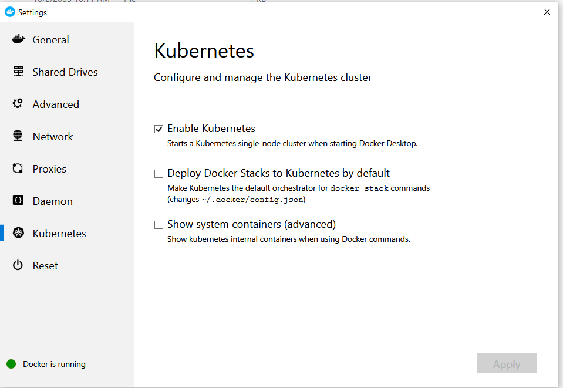

2. Clone repo https://github.com/ManojNair/letskube

3. Run it
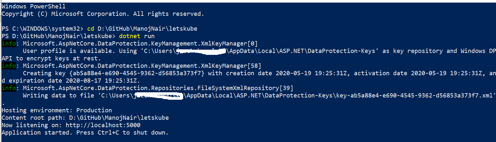
Open localhost:5000 to see the page.

4. Create an image from docker file

```
# ---------------STAGE 1---------------------------
# Stage 1 is used only to build the app
FROM microsoft/aspnetcore-build AS build-env
WORKDIR /app

# copy csproj
COPY *.csproj ./
# restore all dependencies of the csproj file
RUN dotnet restore

# copy everything else to working directory
COPY . ./
# build it and publish it to the folder called output
RUN dotnet publish -c Release -o output

# ---------------STAGE 2---------------------------
# Stage 2 refers to stage 1 and takes only files which are needed in runtime!
# Stage 2 containes also files not needed in runtime that`s why we take only what is needed for runtime.

# build runtime image
FROM microsoft/aspnetcore
WORKDIR /app
COPY --from=build-env /app/output .
ENTRYPOINT ["dotnet", "LetsKube.dll"]
```
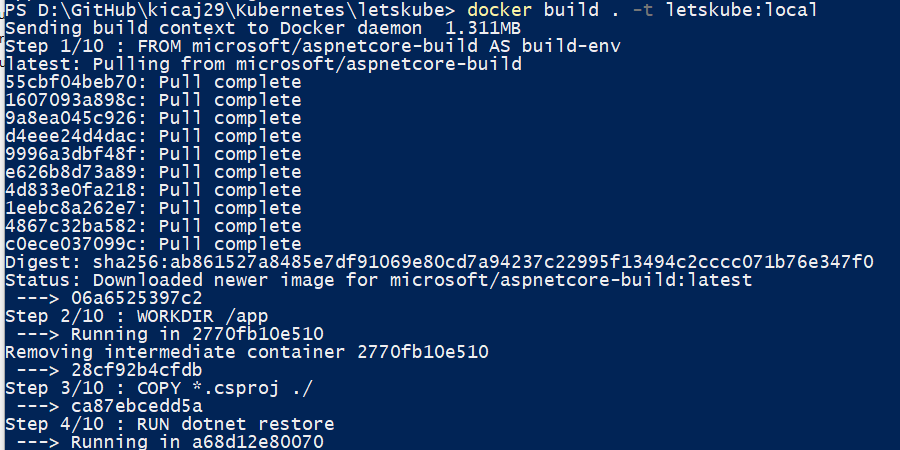

>NOTE: make sure that before running command ```docker build``` in local file system does not exits folder ```obj```. Folder with such name is also created by ```docker restore``` command so if such folder exist locally then it will overwrite ```obj``` created by ```dotnet restore```!. 

5. Run created image


6. Remove created container

```
docker rm -f {container ID}
```
# Deploying application to a local Kubernetes cluster

1. Make sure that docker and kubernetes are up and running
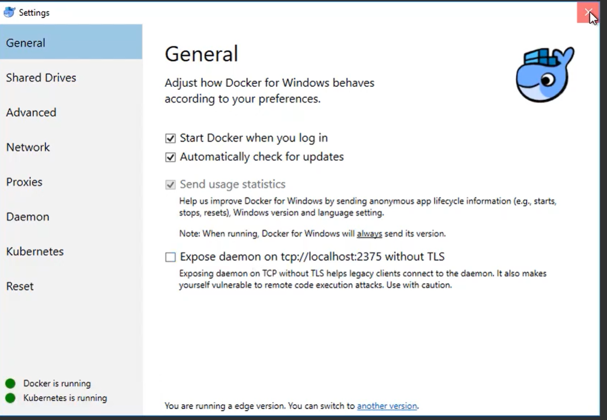

2. Check kubernetes version
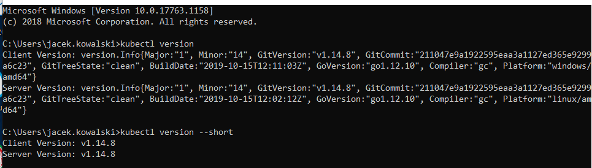

3. Create alias for command kubectl to have less typing (execute in PowerShell and not cmd) and test basic kubectl commands.
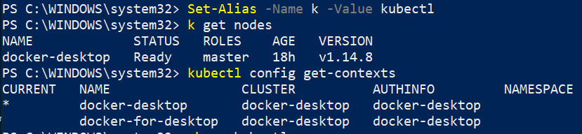 
   >NOTE: Config file for kubectl is here %USERPROFILE%.kube\config

4. Deployment

* Interactively (via kubectl)
```ps
PS D:\> kubectl run letskube-deployment --image=letskube:local --port=80 --replicas=3
kubectl run --generator=deployment/apps.v1 is DEPRECATED and will be removed in a future version. Use kubectl run --generator=run-pod/v1 or kubectl create instead.
deployment.apps/letskube-deployment created
PS D:\> kubectl get deployments
NAME                  READY   UP-TO-DATE   AVAILABLE   AGE
letskube-deployment   3/3     3            3           12s
PS D:\> kubectl get rs
NAME                             DESIRED   CURRENT   READY   AGE
letskube-deployment-76b4b98b78   3         3         3       17s
PS D:\> kubectl get pods
NAME                                   READY   STATUS    RESTARTS   AGE
letskube-deployment-76b4b98b78-4nm6w   1/1     Running   0          23s
letskube-deployment-76b4b98b78-j7rv9   1/1     Running   0          23s
letskube-deployment-76b4b98b78-vr677   1/1     Running   0          23s
```

Next we have to create a kubernetes service that will make possible connecting to the deployed app. There are couple service types.

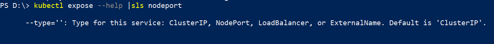

Because we are in local (single node) kubernetes cluster we cannot use **LoadBalancer** type and we have to use **NodePort**.

```
kubectl expose deployment letskube-deployment --type=NodePort
```
>The above command will create a service with name *letskube-deployment* and this name has to be the same as the name used in command **kubectl run**.

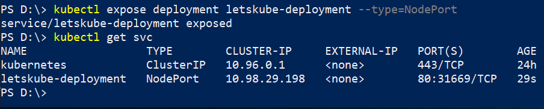

Next we can open in web browser **http://localhost:31669/** to see the app.

We can do clean up using:
```
kubectl delete deployment letskube-deployment
kubectl delete service letskube-deployment
```

* Declaratively (via YAML/JSON)

[letskubedeploy-my.yml](./letskubedeploy-my.yml)

```
kubectl create -f letskubedeploy-my.yml
```

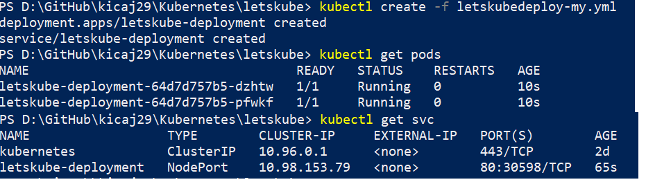

# Pushing the Image to Azure Container Registry (ACR)

> Prerequisite is to instal Azure CLI https://docs.microsoft.com/en-us/cli/azure/install-azure-cli-windows?view=azure-cli-latest

```powershell
# sign in to azure
az login --tenant [tenantID]
# check if there is selected
az account show --output table
# if different then default subscription should be set point it explicitly
az account set --subscription [subscriptionID]

# create resource group
az group create -n letskuberg-jacek -l westeurope
# create container registry
az acr create -n letskubeacrjacek -g letskuberg-jacek -l westeurope --sku standard
# we can print all container registries using the following command
az acr list -o table
# login to created ACR
az acr login -n letskubeacrjacek
# find login service name, it will be needed to push the image
az acr list -o table
# tag local image with login server name and tag
docker tag letskube:local letskubeacrjacek.azurecr.io/letskube:v1
# push the image letskubeacrjacek.azurecr.io/letskube:v1 (this command will create repository if it does not exists yet)
docker push letskubeacrjacek.azurecr.io/letskube:v1
# print all images from the created repository
az acr repository list -n letskubeacrjacek -o table
```

# Deploy Azure Kubernetes Service

1. Create Service Principal.
```powershell
# For applications it is recommended to register an application in Azure AD and create identity for the application (i.e. Service Principal).
# To allow AKS interact with other Azure services or resources and Azure AD principle is used. For example if AKS needs to pull an image for Azure Container Registry it needs permissions to do so. We grant AKS these permissions by using Service Principal.
az ad sp create-for-rbac --skip-assignment
```
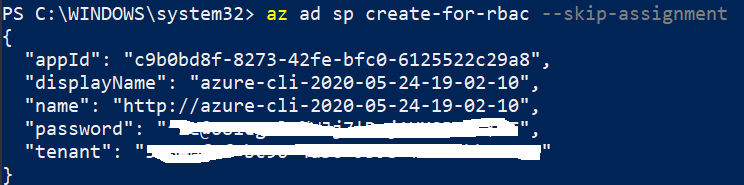

In case you forgot password to the service principal you can reset it using 

```
az ad sp credential reset --name c9b0bd8f-8273-42fe-bfc0-6125522c29a8
```

2. Grant created SP permission for reading images for the selected ACR.
```powershell
# Grant permissions for pulling images for ACR.
$acrId = az acr show --name letskubeacrjacek --resource-group letskuberg-jacek --query "id" --output tsv
az role assignment create --assignee [ServicePrincipalID] --role Reader --scope $acrId
```
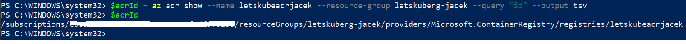
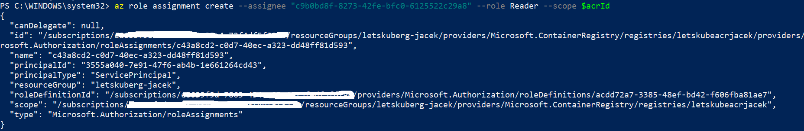

3. Create AKS cluster.

The following command will create AKS cluster:
* with one node (VM)
* with file where public and private keys are stored
* assign it to the created principal

```powershell
az aks create `
    --name letskubeaksclusterjacek `
    --resource-group letskuberg-jacek `
    --node-count 1 `
    --generate-ssh-keys `
    --service-principal "c9b0bd8f-8273-42fe-bfc0-6125522c29a8" `
    --client-secret "{password}" `
    --location westeurope
```
> :warning: First 4 runs of this command failed. 5th run was successful. Ticket: https://github.com/Azure/azure-cli/issues/9585

> It takes ~4 minutes to create the cluster.

> The above command will create also resoruce group **MC_letskuberg-jacek_letskubeaksclusterjacek_westeurope** with some resoruces mandatory to run the cluster.

> :warning: From some reason created AKS had different service principal then pointed in create command! This can be checked using ```az aks list --resource-group letskuberg-jacek```. I had to assign proper permissions to this service principal using once again ```az role assignment create```. It was blocker because wihout fixing it pods where not able pull image (ImagePullBackOff error) from ACR!

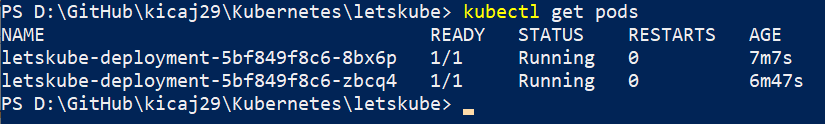


4. Connect kubectl with created AKS

* Verify what are configured clusters and to which kubectl is connected

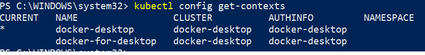

> Config file for kubectl is here %USERPROFILE%\.kube\config
* Extend the config file by adding credentials to the created AKS

```
az aks get-credentials --name letskubeaksclusterjacek --resource-group letskuberg-jacek
```

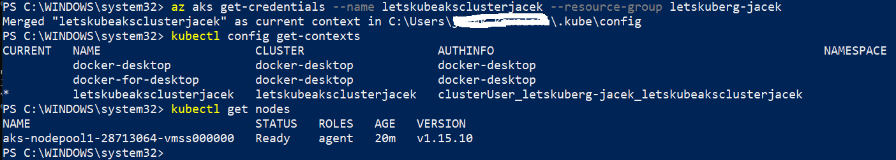

On the screen we can see that we are connected to the created AKS and there is 1 working node.

# Deploy app to AKS

To deploy the app we have to modify yml file.

1. Image has to point created ACR (Azure Container Registry). To do this we need to know login server.   
```
az acr list --resource-group letskuberg-jacek --query "[].{acrLoginServer:loginServer}" --output table
```

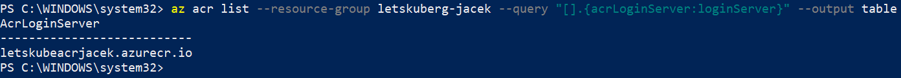

2. Set service type from NodePort to LoadBalancer

[letskubedeploy-my-azure.yml](./letskubedeploy-my-azure.yml)

When the file is ready next we can execute deployment:

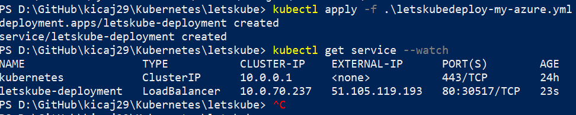

Finally we can open http://51.105.119.193/ in web browser and see working app:

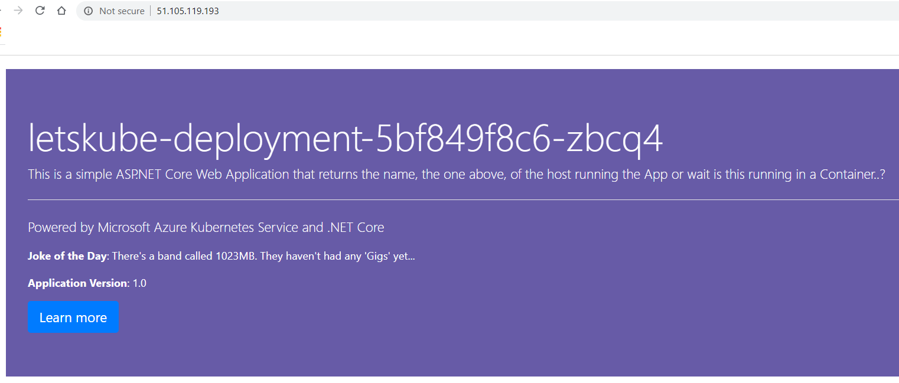

# Scale nodes manually

```
az aks scale --resource-group letskuberg-jacek --name=letskubeaksclusterjacek --node-count 3
```
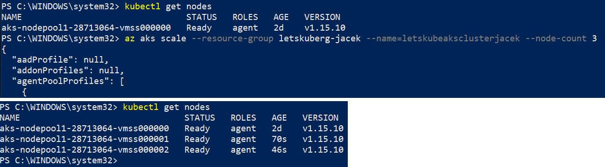

# Scale pods manually

First we can check current pods:

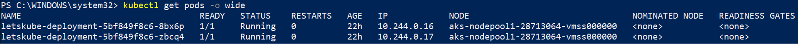

Next we can scale pods:

```
kubectl scale --replicas=5 deployment/letskube-deployment
```

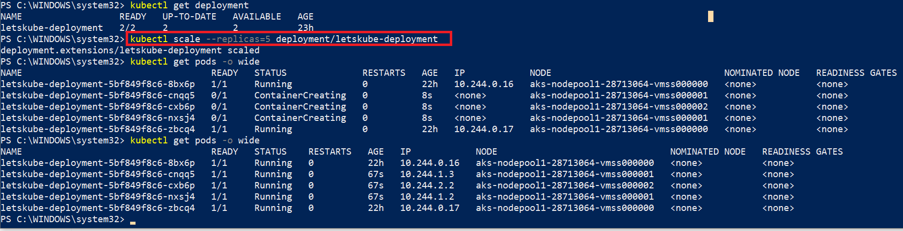

# Update application in AKS cluster

1. Change soruce code of the app and rebuild it.

2. Create new image and tag it.

```
docker build . -t letskubeacrjacek.azurecr.io/letskube:v2
```

3. Login to ACR

```
az acr login -n letskubeacrjacek
```

4. Push the image.

```
docker push letskubeacrjacek.azurecr.io/letskube:v2
```

5. Check in Azure portal that v2 is in the registry

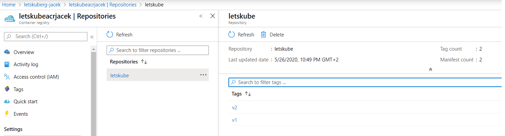

6. Pull new version of the image

```
kubectl set image deployment letskube-deployment letskube=letskubeacrjacek.azurecr.io/letskube:v2
```
**This command will terminate all existing pods and will create new pods!**

> NOTE: this can be done also via letskubedeploy-my-azure.yml by change "image: letskubeacrjacek.azurecr.io/letskube:v1" -> image: "letskubeacrjacek.azurecr.io/letskube:v2" and executing new deployment.

7. Open the app and check its version.

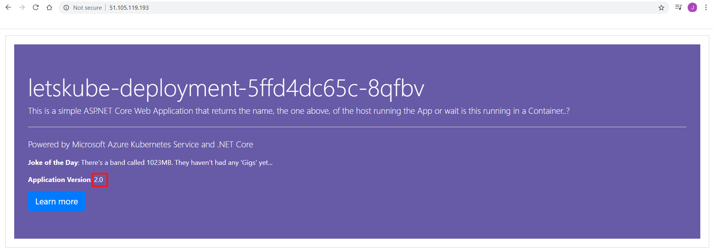

# Kubernetes dashboard AKS

```
az aks browse -g letskuberg-jacek -n letskubeaksclusterjacek
```
