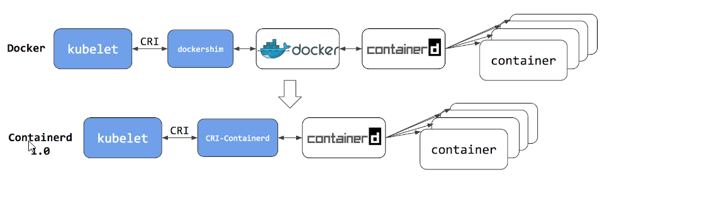
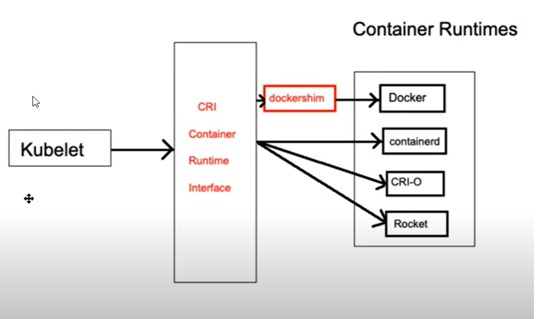

# Intro

https://kubernetes.io/blog/2020/12/02/dont-panic-kubernetes-and-docker/
https://kubernetes.io/docs/tasks/administer-cluster/migrating-from-dockershim/check-if-dockershim-removal-affects-you/

Dockershim was the container runtime for the kubernetes, but it has been superseded by the better CRI pluggable system.

# CRI

* You need to install a container runtime into each node in the cluster so that pods can run there.
* CRI is a plugin interface which enables kubelet to use a wide variety of container runtimes, without the need to recompile.
* CRI for docker **was** a dockershim which **was** a built-in container runtime in kubelet code base.
* **Kubernetes 1.24 requires** that you use a runtime that conforms with the Container Runtime Interface (CRI).
* Available CRI
  * Containerd
  * CRI-O
  * Docker Enging
  * Mirantis Container Runtime
  * Rocket

# What is a dockershim and why is it deprecated

* Dockershim is CRI compliant layer between the kubelet and the docker deamon.
* Maintaining dockershim has become a heavy burden on the K8s maintainers. The CRI standard was created to reduce this burden and allow smooth interoperability of different container runtimes. Docker itself does not currently implement CRI, thus the problem.
* Dockershim was always intended to be a temporary solution (hence the name: shim).
* Additionally, features that were largely incompatible with the dockershim, such as cgroups v2 and user namespaces are being implemented in these new CRI runtimes. Removing support for the dockershim will allow further development in those areas.
* Mirantis and Docker have committed to maintaining the dockershim after it is removed from the Kubernetes.

# Motivation behind removing the dockershim

* In Kubernetes, the CRI interface if used to talk to a container runtime. The design of CRI is to be able to run a CRI implementation as a separate binary.** However the CRI of docker (a.k.a dockershim) is part of kubelet code, runs as part of kubelet and is tightly coupled with kubelet`s lifecycle.**
* This is not ideal as kubelet then has dependency on specific container runtime which leads to maintenance burden for not only developers in sig-node, but also cluster admins when critical issues (e.g. CVE) happen to container runtimes.

# Advantages of removing dockershim

* Docker is not special and should be just a CRI implementation just like every other CRI implementation.
* Currently, dockershim "enjoys" some inconsistent integrations for various reasons. Removing these "features" should eliminate maintenance burden of kubelet.
* A CRI-dockerd can be maintained independently by folks who are interested in keeping this functionality.
* Over time we can remove vendored docker dependencies in kubelet.

# Disadvantages of removing dockershim

* Deployment pain with a new binary in addition to kubelet: additional component may aggravate the complexity. It maybe be relieved with docker version evolutions.
* The number of affected users may be large.
* CRI-dockerd will vendor kubernetes/kubernetes, that may be tough.
* CRI-dockerd as an independent software running on node should be allocated enough resources to guarantee its availability.