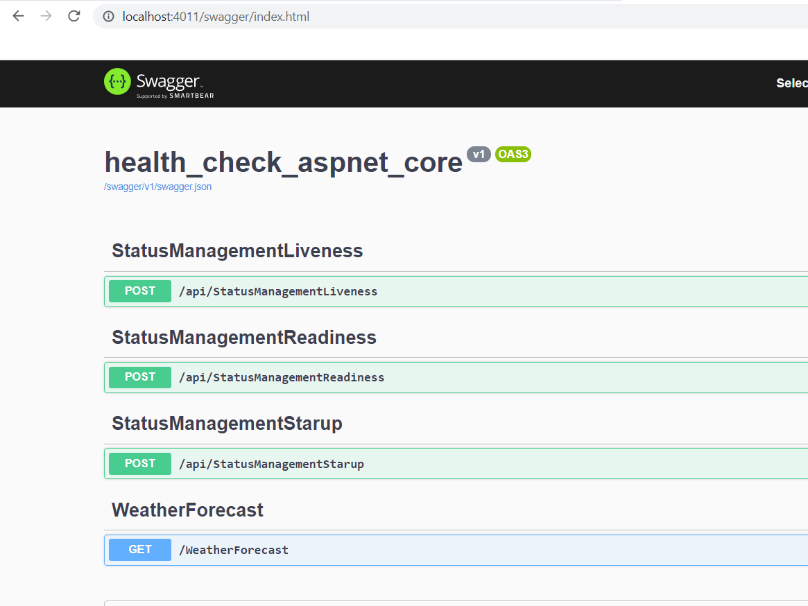
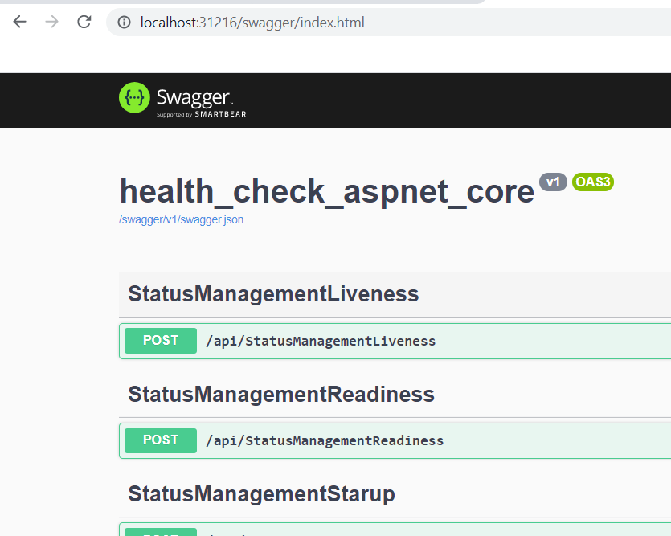
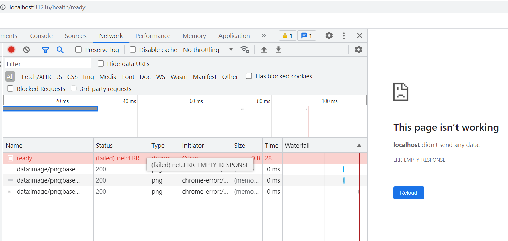

- [Kubernetes probes vs asp.net core healt checks](#kubernetes-probes-vs-aspnet-core-healt-checks)
- [hands-on](#hands-on)
  * [Docker image](#docker-image)
    + [Create docker image](#create-docker-image)
    + [Run the image](#run-the-image)
  * [Helm chart](#helm-chart)
    + [Test static template](#test-static-template)
    + [Dynamic template test](#dynamic-template-test)
    + [Install helm chart](#install-helm-chart)
    + [Check status of installed pods](#check-status-of-installed-pods)
    + [Correct probes in the deployment file](#correct-probes-in-the-deployment-file)
    + [Upgrade helm package](#upgrade-helm-package)
    + [Check pod status](#check-pod-status)
    + [Probes skip a service](#probes-skip-a-service)
    + [Simulating unready status](#simulating-unready-status)
    + [Simulating liveness fail](#simulating-liveness-fail)
- [resources](#resources)

# Kubernetes probes vs asp.net core healt checks

- "degraded" health check maps to the "readiness" probe. The application is OK but not yet ready to serve traffic.   
For example: simple database query did succeed but took more than a second. Moving traffic to another instance is probably a good idea until the problem has resolved. It means that we should give "catch a breath" for this particular instance.   

- "unhealthy" check maps to the "liveness" probe. The application has crashed. You should shut it down and restart.

# hands-on

## Docker image

### Create docker image

Because Dockerfile is created by VisualStudio we have to point path to Dockerfile to be able build the image, more [here](https://stackoverflow.com/questions/66933949/failed-to-compute-cache-key-csproj-not-found).

```
/d/GitHub/kicaj29/Kubernetes/health-check-aspnet-core (master)
$ docker image build -t kicaj29/health-check-aspnet-core:1.0.0 -f health-check-aspnet-core/Dockerfile .
[+] Building 34.6s (18/18) FINISHED
 => [internal] load build definition from Dockerfile                                                                                        0.0s
 => => transferring dockerfile: 32B                                                                                                         0.0s
 => [internal] load .dockerignore                                                                                                           0.0s
 => => transferring context: 35B                                                                                                            0.0s
 => [internal] load metadata for mcr.microsoft.com/dotnet/sdk:5.0                                                                           0.3s
 => [internal] load metadata for mcr.microsoft.com/dotnet/aspnet:5.0                                                                        0.0s
 => [build 1/7] FROM mcr.microsoft.com/dotnet/sdk:5.0@sha256:d66207f54a4c1b6c8c4ff522237a00345a06d14154d9c143c6aa8b3e4f0e51bd              24.1s
 => => resolve mcr.microsoft.com/dotnet/sdk:5.0@sha256:d66207f54a4c1b6c8c4ff522237a00345a06d14154d9c143c6aa8b3e4f0e51bd                     0.0s
 => => sha256:b924cc93f8720793ed4d328fb0bcbf66c635f684d50731d04648e8fa5e9f8eee 2.01kB / 2.01kB                                              0.0s
 => => sha256:a330b6cecb98cd2425fd25fce36669073f593b3176b4ee14731e48c05d678cdd 27.15MB / 27.15MB                                            3.5s
 => => sha256:d66207f54a4c1b6c8c4ff522237a00345a06d14154d9c143c6aa8b3e4f0e51bd 2.53kB / 2.53kB                                              0.0s
 => => sha256:29a199b539f9d15b1b2c6d5eac51be280f8594431f0a4b6281eef7c13fe89ae7 7.10kB / 7.10kB                                              0.0s
 => => sha256:5116a93f798978d5b460297e7ec81278fd2b0b36baae019e36f8a8ac4811ba98 17.07MB / 17.07MB                                            2.4s
 => => sha256:9099039c5b6ed755f248b05df911c9a6d5de6a3194fe6f16719bb436a4e8d4b4 31.77MB / 31.77MB                                            6.3s
 => => sha256:3800cf5cf2534518b679158e2012be98d16be72fe681da8a2f8a59e0d95bf82d 155B / 155B                                                  2.5s
 => => sha256:98c4caca5598309368efe6070d261909bcdcf2bee5f0e709836deaa8dd578d3c 8.65MB / 8.65MB                                              3.6s
 => => sha256:7a0c5bbb8beceac9a00041e4c99870083ab7e2eae65917da26a65795d2d22487 27.56MB / 27.56MB                                            6.7s
 => => sha256:3aa88b7267aeb34d2d9bad2961b631e670691399fba932eb3c9ccd3f62240044 105.66MB / 105.66MB                                         19.3s
 => => extracting sha256:a330b6cecb98cd2425fd25fce36669073f593b3176b4ee14731e48c05d678cdd                                                   1.6s
 => => extracting sha256:5116a93f798978d5b460297e7ec81278fd2b0b36baae019e36f8a8ac4811ba98                                                   0.7s
 => => sha256:95b36d92c26324182a51a499034741ceebee23c4e0c6940f35bb0945220e5478 12.69MB / 12.69MB                                            8.2s
 => => extracting sha256:9099039c5b6ed755f248b05df911c9a6d5de6a3194fe6f16719bb436a4e8d4b4                                                   1.1s
 => => extracting sha256:3800cf5cf2534518b679158e2012be98d16be72fe681da8a2f8a59e0d95bf82d                                                   0.0s
 => => extracting sha256:98c4caca5598309368efe6070d261909bcdcf2bee5f0e709836deaa8dd578d3c                                                   0.3s
 => => extracting sha256:7a0c5bbb8beceac9a00041e4c99870083ab7e2eae65917da26a65795d2d22487                                                   1.2s
$
```

Next we can check that the image is available in the local repo:
```
$ docker images kicaj29/health-check-aspnet-core
REPOSITORY                         TAG       IMAGE ID       CREATED         SIZE
kicaj29/health-check-aspnet-core   1.0.0     eda7e2482eae   2 minutes ago   209MB
```

### Run the image

To test if the built image is ok let`s run it:

```
48506@DESKTOP-6MTVGMJ C:\GitHub\kicaj29\Kubernetes\health-check-aspnet-core
$ docker run -p 4011:80 kicaj29/health-check-aspnet-core:1.0.0
info: Microsoft.Hosting.Lifetime[0]
      Now listening on: http://[::]:80
info: Microsoft.Hosting.Lifetime[0]
      Application started. Press Ctrl+C to shut down.
info: Microsoft.Hosting.Lifetime[0]
      Hosting environment: Development
info: Microsoft.Hosting.Lifetime[0]
      Content root path: /app
```

Next we can see it in the web browser:



Next we can remove this container (but do not delete the image):

```
48506@DESKTOP-6MTVGMJ C:\
$ docker rm -f b0b
b0b
```

## Helm chart

Helm chart was created using command `helm create chart-health-check` and contains stuff like ingress which are disabled by default in
[values.yaml](./chart-health-check/values.yaml).

### Test static template
```
/d/GitHub/kicaj29/Kubernetes/health-check-aspnet-core (master)
$ helm template chart-health-check
---
# Source: chart-health-check/templates/service.yaml
apiVersion: v1
kind: Service
metadata:
  name: RELEASE-NAME-chart-health-check
  labels:
    helm.sh/chart: chart-health-check-0.1.0
    app.kubernetes.io/name: chart-health-check
    app.kubernetes.io/instance: RELEASE-NAME
    app.kubernetes.io/version: "1.0.0"
    app.kubernetes.io/managed-by: Helm
spec:
  type: NodePort
  ports:
    - port: 80
      targetPort: http
      protocol: TCP
      name: http
  selector:
    app.kubernetes.io/name: chart-health-check
    app.kubernetes.io/instance: RELEASE-NAME
---
# Source: chart-health-check/templates/deployment.yaml
apiVersion: apps/v1
kind: Deployment
metadata:
  name: RELEASE-NAME-chart-health-check
  labels:
    helm.sh/chart: chart-health-check-0.1.0
    app.kubernetes.io/name: chart-health-check
    app.kubernetes.io/instance: RELEASE-NAME
    app.kubernetes.io/version: "1.0.0"
    app.kubernetes.io/managed-by: Helm
spec:
  replicas: 1
  selector:
    matchLabels:
      app.kubernetes.io/name: chart-health-check
      app.kubernetes.io/instance: RELEASE-NAME
  template:
    metadata:
      labels:
        app.kubernetes.io/name: chart-health-check
        app.kubernetes.io/instance: RELEASE-NAME
    spec:
      serviceAccountName: default
      securityContext:
        {}
      containers:
        - name: chart-health-check
          securityContext:
            {}
          image: "kicaj29/health-check-aspnet-core:1.0.0"
          imagePullPolicy: IfNotPresent
          ports:
            - name: http
              containerPort: 80
              protocol: TCP
          livenessProbe:
            httpGet:
              path: /
              port: http
          readinessProbe:
            httpGet:
              path: /
              port: http
          resources:
            {}
---
# Source: chart-health-check/templates/tests/test-connection.yaml
apiVersion: v1
kind: Pod
metadata:
  name: "RELEASE-NAME-chart-health-check-test-connection"
  labels:
    helm.sh/chart: chart-health-check-0.1.0
    app.kubernetes.io/name: chart-health-check
    app.kubernetes.io/instance: RELEASE-NAME
    app.kubernetes.io/version: "1.0.0"
    app.kubernetes.io/managed-by: Helm
  annotations:
    "helm.sh/hook": test-success
spec:
  containers:
    - name: wget
      image: busybox
      command: ['wget']
      args: ['RELEASE-NAME-chart-health-check:80']
  restartPolicy: Never
```

### Dynamic template test

```
/d/GitHub/kicaj29/Kubernetes/health-check-aspnet-core (master)
$ helm install demo-health-checks chart-health-check --debug --dry-run
install.go:172: [debug] Original chart version: ""
install.go:189: [debug] CHART PATH: D:\GitHub\kicaj29\Kubernetes\health-check-aspnet-core\chart-health-check

NAME: demo-health-checks
LAST DEPLOYED: Fri Sep  3 16:49:48 2021
NAMESPACE: default
STATUS: pending-install
REVISION: 1
USER-SUPPLIED VALUES:
{}

COMPUTED VALUES:
affinity: {}
autoscaling:
  enabled: false
  maxReplicas: 100
  minReplicas: 1
  targetCPUUtilizationPercentage: 80
fullnameOverride: ""
image:
  pullPolicy: IfNotPresent
  repository: kicaj29/health-check-aspnet-core
  tag: 1.0.0
imagePullSecrets: []
ingress:
  annotations: {}
  enabled: false
  hosts:
  - host: chart-example.local
    paths: []
  tls: []
nameOverride: ""
nodeSelector: {}
podAnnotations: {}
podSecurityContext: {}
replicaCount: 1
resources: {}
securityContext: {}
service:
  port: 80
  type: NodePort
serviceAccount:
  annotations: {}
  create: false
  name: ""
tolerations: []

HOOKS:
---
# Source: chart-health-check/templates/tests/test-connection.yaml
apiVersion: v1
kind: Pod
metadata:
  name: "demo-health-checks-chart-health-check-test-connection"
  labels:
    helm.sh/chart: chart-health-check-0.1.0
    app.kubernetes.io/name: chart-health-check
    app.kubernetes.io/instance: demo-health-checks
    app.kubernetes.io/version: "1.0.0"
    app.kubernetes.io/managed-by: Helm
  annotations:
    "helm.sh/hook": test-success
spec:
  containers:
    - name: wget
      image: busybox
      command: ['wget']
      args: ['demo-health-checks-chart-health-check:80']
  restartPolicy: Never
MANIFEST:
---
# Source: chart-health-check/templates/service.yaml
apiVersion: v1
kind: Service
metadata:
  name: demo-health-checks-chart-health-check
  labels:
    helm.sh/chart: chart-health-check-0.1.0
    app.kubernetes.io/name: chart-health-check
    app.kubernetes.io/instance: demo-health-checks
    app.kubernetes.io/version: "1.0.0"
    app.kubernetes.io/managed-by: Helm
spec:
  type: NodePort
  ports:
    - port: 80
      targetPort: http
      protocol: TCP
      name: http
  selector:
    app.kubernetes.io/name: chart-health-check
    app.kubernetes.io/instance: demo-health-checks
---
# Source: chart-health-check/templates/deployment.yaml
apiVersion: apps/v1
kind: Deployment
metadata:
  name: demo-health-checks-chart-health-check
  labels:
    helm.sh/chart: chart-health-check-0.1.0
    app.kubernetes.io/name: chart-health-check
    app.kubernetes.io/instance: demo-health-checks
    app.kubernetes.io/version: "1.0.0"
    app.kubernetes.io/managed-by: Helm
spec:
  replicas: 1
  selector:
    matchLabels:
      app.kubernetes.io/name: chart-health-check
      app.kubernetes.io/instance: demo-health-checks
  template:
    metadata:
      labels:
        app.kubernetes.io/name: chart-health-check
        app.kubernetes.io/instance: demo-health-checks
    spec:
      serviceAccountName: default
      securityContext:
        {}
      containers:
        - name: chart-health-check
          securityContext:
            {}
          image: "kicaj29/health-check-aspnet-core:1.0.0"
          imagePullPolicy: IfNotPresent
          ports:
            - name: http
              containerPort: 80
              protocol: TCP
          livenessProbe:
            httpGet:
              path: /
              port: http
          readinessProbe:
            httpGet:
              path: /
              port: http
          resources:
            {}

NOTES:
1. Get the application URL by running these commands:
  export NODE_PORT=$(kubectl get --namespace default -o jsonpath="{.spec.ports[0].nodePort}" services demo-health-checks-chart-health-check)
  export NODE_IP=$(kubectl get nodes --namespace default -o jsonpath="{.items[0].status.addresses[0].address}")
  echo http://$NODE_IP:$NODE_PORT
```

### Install helm chart

```
48506@DESKTOP-6MTVGMJ C:\GitHub\kicaj29\Kubernetes\health-check-aspnet-core                    
$ helm install demo-chart-health-check chart-health-check                                      
NAME: demo-chart-health-check                                                                  
LAST DEPLOYED: Tue Sep  7 10:05:55 2021                                                        
NAMESPACE: default                                                                             
STATUS: deployed                                                                               
REVISION: 1                                                                                    
NOTES:                                                                                         
1. Get the application URL by running these commands:                                          
  export NODE_PORT=$(kubectl get --namespace default -o jsonpath="{.spec.ports[0].nodePort}" se
rvices demo-chart-health-check)                                                                
  export NODE_IP=$(kubectl get nodes --namespace default -o jsonpath="{.items[0].status.address
es[0].address}")                                                                               
  echo http://$NODE_IP:$NODE_PORT                                                              
```

### Check status of installed pods

```
48506@DESKTOP-6MTVGMJ C:\GitHub\kicaj29\Kubernetes\health-check-aspnet-core
$ kubectl get pods
NAME                                       READY   STATUS    RESTARTS   AGE
demo-chart-health-check-5d598956db-5lg7z   0/1     Running   3          95s
```

Pod is all the time restarted because probes in deployment file are incorrectly configured:

```
48506@DESKTOP-6MTVGMJ C:\GitHub\kicaj29\Kubernetes\health-check-aspnet-core
$ kubectl describe pod demo-chart-health-check-5d598956db-5lg7z
Name:         demo-chart-health-check-5d598956db-5lg7z
Namespace:    default
Priority:     0
Node:         docker-desktop/192.168.65.4
Start Time:   Tue, 07 Sep 2021 10:05:55 +0200
Labels:       app.kubernetes.io/instance=demo-chart-health-check
              app.kubernetes.io/name=chart-health-check
              pod-template-hash=5d598956db
Annotations:  <none>
Status:       Running
IP:           10.1.0.20
IPs:
  IP:           10.1.0.20
Controlled By:  ReplicaSet/demo-chart-health-check-5d598956db
Containers:
  chart-health-check:
    Container ID:   docker://f8908afd9acbd6a7ba6e88addf609305a1fe47266fedac6e58b39e2340986a37
    Image:          kicaj29/health-check-aspnet-core:1.0.0
    Image ID:       docker://sha256:a71c6ae170fb6a6577ebc8643c84487f0ca54d6b77a45f9f5bae31b6547348ad
    Port:           80/TCP
    Host Port:      0/TCP
    State:          Running
      Started:      Tue, 07 Sep 2021 10:07:56 +0200
    Last State:     Terminated
      Reason:       Completed
      Exit Code:    0
      Started:      Tue, 07 Sep 2021 10:07:26 +0200
      Finished:     Tue, 07 Sep 2021 10:07:56 +0200
    Ready:          False
    Restart Count:  4
    Liveness:       http-get http://:http/ delay=0s timeout=1s period=10s #success=1 #failure=3

    Readiness:      http-get http://:http/ delay=0s timeout=1s period=10s #success=1 #failure=3

    Environment:    <none>
    Mounts:
      /var/run/secrets/kubernetes.io/serviceaccount from kube-api-access-jqc5d (ro)
Conditions:
  Type              Status
  Initialized       True
  Ready             False
  ContainersReady   False
  PodScheduled      True
Volumes:
  kube-api-access-jqc5d:
    Type:                    Projected (a volume that contains injected data from multiple sources)
    TokenExpirationSeconds:  3607
    ConfigMapName:           kube-root-ca.crt
    ConfigMapOptional:       <nil>
    DownwardAPI:             true
QoS Class:                   BestEffort
Node-Selectors:              <none>
Tolerations:                 node.kubernetes.io/not-ready:NoExecute op=Exists for 300s
                             node.kubernetes.io/unreachable:NoExecute op=Exists for 300s
Events:
  Type     Reason     Age                   From               Message
  ----     ------     ----                  ----               -------
  Normal   Scheduled  2m29s                 default-scheduler  Successfully assigned default/demo-chart-health-check-5d598956db-5lg7z to docker-desktop
  Normal   Started    119s (x2 over 2m28s)  kubelet            Started container chart-health-check
  Warning  Unhealthy  119s (x3 over 2m28s)  kubelet            Readiness probe failed: Get "http://10.1.0.20:80/": dial tcp 10.1.0.20:80: connect: connection refused
  Warning  Unhealthy  90s (x6 over 2m19s)   kubelet            Readiness probe failed: HTTP probe failed with statuscode: 404
  Normal   Killing    90s (x2 over 2m)      kubelet            Container chart-health-check failed liveness probe, will be restarted
  Normal   Pulled     89s (x3 over 2m28s)   kubelet            Container image "kicaj29/health-check-aspnet-core:1.0.0" already present on machine
  Normal   Created    89s (x3 over 2m28s)   kubelet            Created container chart-health-check
```

### Correct probes in the deployment file

Detailed infomration about probes parameters can be found in [docs](https://kubernetes.io/docs/tasks/configure-pod-container/configure-liveness-readiness-startup-probes/#configure-probes).

* initialDelaySeconds: Number of seconds after the container has started before liveness or readiness probes are initiated. Defaults to 0 seconds. Minimum value is 0.
* periodSeconds: How often (in seconds) to perform the probe. Default to 10 seconds. Minimum value is 1.
* timeoutSeconds: Number of seconds after which the probe times out. Defaults to 1 second. Minimum value is 1.
* successThreshold: Minimum consecutive successes for the probe to be considered successful after having failed. Defaults to 1. Must be 1 for liveness and startup Probes. Minimum value is 1.
* failureThreshold: When a probe fails, Kubernetes will try failureThreshold times before giving up. Giving up in case of liveness probe means restarting the container. In case of readiness probe the Pod will be marked Unready. Defaults to 3. Minimum value is 1.


### Upgrade helm package

```
48506@DESKTOP-6MTVGMJ C:\GitHub\kicaj29\Kubernetes\health-check-aspnet-core
$ helm upgrade demo-chart-health-check chart-health-check
Release "demo-chart-health-check" has been upgraded. Happy Helming!
NAME: demo-chart-health-check
LAST DEPLOYED: Tue Sep  7 10:45:43 2021
NAMESPACE: default
STATUS: deployed
REVISION: 2
NOTES:
1. Get the application URL by running these commands:
  export NODE_PORT=$(kubectl get --namespace default -o jsonpath="{.spec.ports[0].nodePort}" services demo-chart-health-check)
  export NODE_IP=$(kubectl get nodes --namespace default -o jsonpath="{.items[0].status.addresses[0].address}")
  echo http://$NODE_IP:$NODE_PORT
```

### Check pod status

Now we can see that the pod is working and we can access also swagger UI:

```
48506@DESKTOP-6MTVGMJ C:\GitHub\kicaj29\Kubernetes\health-check-aspnet-core
$ kubectl get pods
NAME                                       READY   STATUS    RESTARTS   AGE
demo-chart-health-check-6458c87dff-p84xq   1/1     Running   0          61s
```

```
48506@DESKTOP-6MTVGMJ C:\GitHub\kicaj29\Kubernetes\health-check-aspnet-core
$ kubectl describe pod demo-chart-health-check-6458c87dff-p84xq
Name:         demo-chart-health-check-6458c87dff-p84xq
Namespace:    default
Priority:     0
Node:         docker-desktop/192.168.65.4
Start Time:   Tue, 07 Sep 2021 10:45:43 +0200
Labels:       app.kubernetes.io/instance=demo-chart-health-check
              app.kubernetes.io/name=chart-health-check
              pod-template-hash=6458c87dff
Annotations:  <none>
Status:       Running
IP:           10.1.0.21
IPs:
  IP:           10.1.0.21
Controlled By:  ReplicaSet/demo-chart-health-check-6458c87dff
Containers:
  chart-health-check:
    Container ID:   docker://0d8af372e5eeaa479576aca5611480b4ac280d0bc524e5c6a2d70712cfbe6b1f
    Image:          kicaj29/health-check-aspnet-core:1.0.0
    Image ID:       docker://sha256:a71c6ae170fb6a6577ebc8643c84487f0ca54d6b77a45f9f5bae31b6547348ad
    Port:           80/TCP
    Host Port:      0/TCP
    State:          Running
      Started:      Tue, 07 Sep 2021 10:45:45 +0200
    Ready:          True
    Restart Count:  0
    Liveness:       http-get http://:80/health/live delay=3s timeout=1s period=8s #success=1 #failure=1
    Readiness:      http-get http://:80/health/ready delay=3s timeout=1s period=8s #success=1 #failure=1
    Startup:        http-get http://:80/health/startup delay=0s timeout=1s period=8s #success=1 #failure=1
    Environment:    <none>
    Mounts:
      /var/run/secrets/kubernetes.io/serviceaccount from kube-api-access-txc8x (ro)
Conditions:
  Type              Status
  Initialized       True
  Ready             True
  ContainersReady   True
  PodScheduled      True
Volumes:
  kube-api-access-txc8x:
    Type:                    Projected (a volume that contains injected data from multiple sources)
    TokenExpirationSeconds:  3607
    ConfigMapName:           kube-root-ca.crt
    ConfigMapOptional:       <nil>
    DownwardAPI:             true
QoS Class:                   BestEffort
Node-Selectors:              <none>
Tolerations:                 node.kubernetes.io/not-ready:NoExecute op=Exists for 300s
                             node.kubernetes.io/unreachable:NoExecute op=Exists for 300s
Events:
  Type    Reason     Age    From               Message
  ----    ------     ----   ----               -------
  Normal  Scheduled  3m57s  default-scheduler  Successfully assigned default/demo-chart-health-check-6458c87dff-p84xq to docker-desktop
  Normal  Pulled     3m55s  kubelet            Container image "kicaj29/health-check-aspnet-core:1.0.0" already present on machine
  Normal  Created    3m55s  kubelet            Created container chart-health-check
  Normal  Started    3m55s  kubelet            Started container chart-health-check
```


```
48506@DESKTOP-6MTVGMJ C:\GitHub\kicaj29\Kubernetes\health-check-aspnet-core
$ kubectl get services
NAME                      TYPE        CLUSTER-IP      EXTERNAL-IP   PORT(S)        AGE
demo-chart-health-check   NodePort    10.100.195.88   <none>        80:31216/TCP   47m
kubernetes                ClusterIP   10.96.0.1       <none>        443/TCP        18h
```



### Probes skip a service

Kubernetes directly probes individual pods with skipping a service. Only in this way it is known what it the status of particular pods.


### Simulating unready status

Using swagger UI we can now easily simulate unready status. This status usually means that a pod is very busy and should not get any more new requests as long as he will report unready status.
To simulate this call `POST /api/StatusManagementReadiness` with value 0 (Unhealthy enum value). Then `/health/ready` will start reporting to Kubernetes 503 code with response body `Unhealthy`. If we will try communicate with this pod via K8s service/node port then we will see that the page does not exist error:



```
48506@DESKTOP-6MTVGMJ C:\GitHub\kicaj29\Kubernetes\health-check-aspnet-core
$ kubectl get pods
NAME                                       READY   STATUS    RESTARTS   AGE
demo-chart-health-check-6458c87dff-p84xq   0/1     Running   0          27m
```

503 is returned only internally to K8s and all requests that come from outside of the cluster are canceled on a service level because the pod is marked as unready.

```
48506@DESKTOP-6MTVGMJ C:\GitHub\kicaj29\Kubernetes\health-check-aspnet-core
$ kubectl get pods
NAME                                       READY   STATUS    RESTARTS   AGE
demo-chart-health-check-6458c87dff-p84xq   0/1     Running   0          27m
```

To to move to `ready` status call `POST /api/StatusManagementReadiness` with value 2 (healthy enum value) and after this the pod will be again ready to handle the requests.

>NOTE: and here we are stuck!. Because we cannot now call any endpoint from rest api we cannot simulate going back to ready status.
It is good example that shows that all state machine has to be manage only internally!

To workaround I will just remove this pod and a new pod will be created automatically by the replica set object:

```
48506@DESKTOP-6MTVGMJ C:\GitHub\kicaj29\Kubernetes\health-check-aspnet-core
$ kubectl delete pod demo-chart-health-check-6458c87dff-p84xq
pod "demo-chart-health-check-6458c87dff-p84xq" deleted

48506@DESKTOP-6MTVGMJ C:\GitHub\kicaj29\Kubernetes\health-check-aspnet-core
$ kubectl get pods
NAME                                       READY   STATUS    RESTARTS   AGE
demo-chart-health-check-6458c87dff-f4xv7   1/1     Running   0          18s
```

Now again rest api is available from the outside of the cluster.

### Simulating liveness fail

Call `POST /api/StatusManagementLiveness` with value 0 (Unhealthy enum value). Then the microservice will restarted but it will be run in the same pod instance! Also we can see that the age of the microservice is increased. It means that the age measures age of the microservice and not age of the pod!!!

```
48506@DESKTOP-6MTVGMJ C:\GitHub\kicaj29\Kubernetes\health-check-aspnet-core
$ kubectl get pods
NAME                                       READY   STATUS    RESTARTS   AGE
demo-chart-health-check-6458c87dff-f4xv7   1/1     Running   0          9m2s
48506@DESKTOP-6MTVGMJ C:\GitHub\kicaj29\Kubernetes\health-check-aspnet-core
$ kubectl get pods
NAME                                       READY   STATUS    RESTARTS   AGE
demo-chart-health-check-6458c87dff-f4xv7   1/1     Running   1          9m36s
```

# resources

https://docs.microsoft.com/en-us/aspnet/core/host-and-deploy/health-checks?view=aspnetcore-5.0   
https://kubernetes.io/docs/tasks/configure-pod-container/configure-liveness-readiness-startup-probes/   