- [why helm (v3)](#why-helm-v3)
- [chart](#chart)
- [persistency](#persistency)
- [three-way merge patches update](#three-way-merge-patches-update)
- [namespaces](#namespaces)
- [helm installation on win10](#helm-installation-on-win10)
  - [install helm chart](#install-helm-chart)
  - [uninstall helm chart](#uninstall-helm-chart)
  - [helm variables](#helm-variables)
- [building helm charts](#building-helm-charts)
- [helm release and release revision.](#helm-release-and-release-revision)
- [basic commands](#basic-commands)
- [install, upgrade, rollback](#install-upgrade-rollback)
  - [chart1](#chart1)
  - [chart2](#chart2)
  - [chart 3](#chart-3)
  - [chart 4 - INGRESS controller](#chart-4---ingress-controller)
- [Customizing charts with helm templates](#customizing-charts-with-helm-templates)
  - [Testing custom templates](#testing-custom-templates)
    - [Static](#static)
    - [Dynamic](#dynamic)
  - [Data sources for values](#data-sources-for-values)
  - [Functions and pipelines](#functions-and-pipelines)
  - [Modifying scope using with](#modifying-scope-using-with)
  - [Controlling carriage returns, whitespaces, indent.](#controlling-carriage-returns-whitespaces-indent)
  - [Logical operators and functions](#logical-operators-and-functions)
  - [Flow control](#flow-control)
  - [Variables](#variables)
  - [Helper functions (sub-templates)](#helper-functions-sub-templates)
    - [Abstract charts - library](#abstract-charts---library)
  - [chart 5 - custom values](#chart-5---custom-values)
  - [chart 6 - logic with building connection string to mongodb](#chart-6---logic-with-building-connection-string-to-mongodb)
  - [chart 7 - installing DEV and TEST environment](#chart-7---installing-dev-and-test-environment)
- [Managing dependencies](#managing-dependencies)
  - [Packaging charts](#packaging-charts)
  - [Publishing charts in helm repository](#publishing-charts-in-helm-repository)
  - [Pulling charts from helm repository](#pulling-charts-from-helm-repository)
    - [Example how to package charts](#example-how-to-package-charts)
    - [Example how to publish charts](#example-how-to-publish-charts)
  - [Configuring helm client to work with repositories](#configuring-helm-client-to-work-with-repositories)
- [Tips and tricks](#tips-and-tricks)
- [links](#links)

# why helm (v3)

**Packaging**

> With kubectl you do not install application as atomic set of kubernetes objects. Rather you deploy each object (yaml) separately. Also these objects might have dependencies between each other and order of installation might be important. Helm allows to group all kuberentes objects (yaml files) in one package and install the whole package. kubectl does not support rollbacks but helm supports it. Additionally to this helm supports out of the box replacing placeholders like: build number, env. prefix.

**Versioning**

> kubectl does not support versioning of kubernets objects

# chart
With helm you install your application as an entity defined by your **chart** and not a set of independent kubernetes objects. Chart is definition of your application.

# persistency

Helm stores release manifests (application versions) inside Kubernetes as secrets.

# three-way merge patches update

What if I modify Kubernetes objects with a tools other then Helm like kubectl. Helm tree compares the three manifests: old chart, new chart, live state. Based on this it creates a patch that merges the updates in best possible way. For example if something has been changed via kubectl and now we want apply a new chart then the change that was done via kubectl will stay as long as there is no conflict with new chart. The same is relvant also for rollbacks!

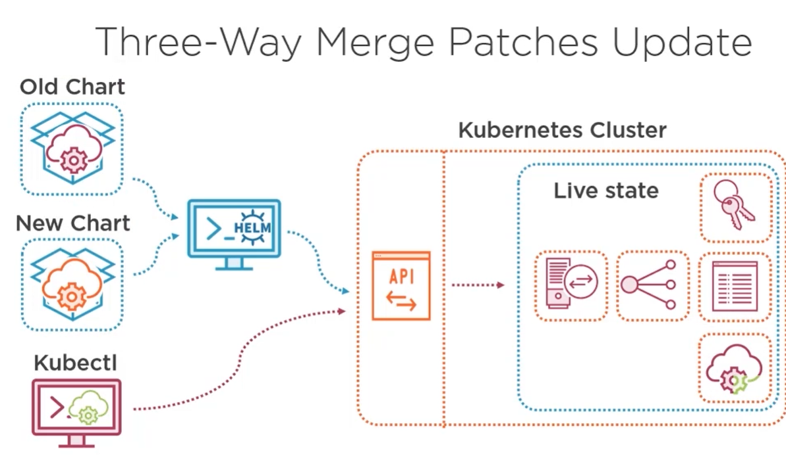

# namespaces

Helm supports namespaces like kubectl.

# helm installation on win10

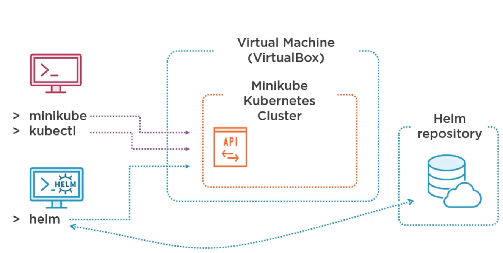
>NOTE: in next steps I used K8s cluster installed together with docker. I did not used VirtualBox.

Run PowerShell as admin and execute:
```
choco install kubernetes-helm
```

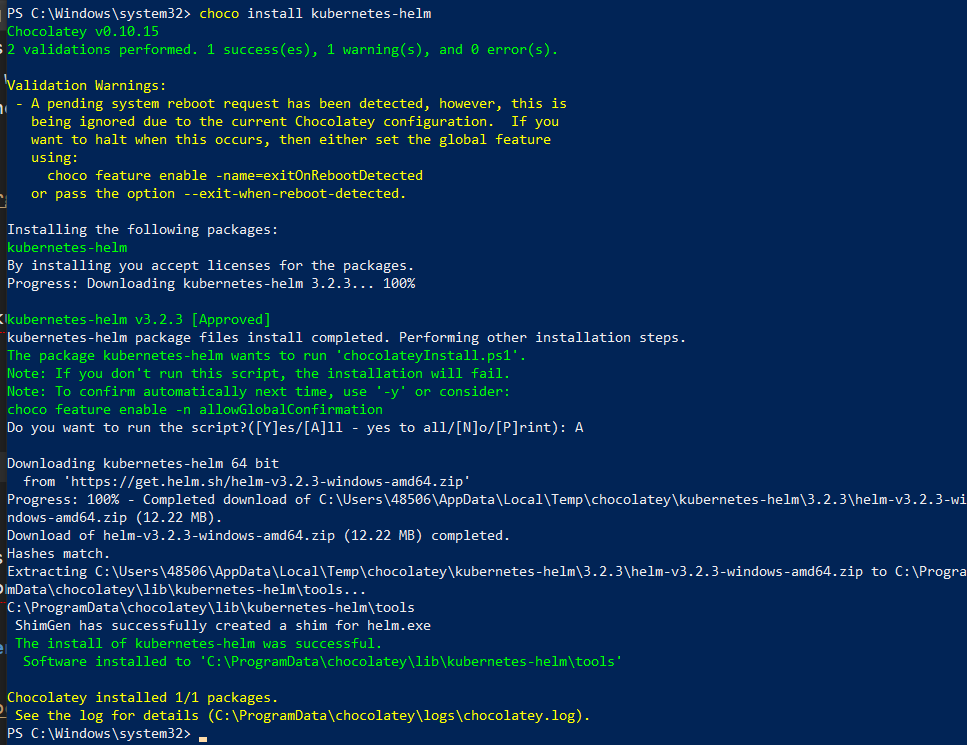

To check version execute:
```
helm version --short
```

>NOTE: helm connection string is configured in the same file that is used by *kubectl* command: %USERPROFILE%\.kube\config

By default helm tree is not configured to use any repository. If you want to install existing packages you have to add keys to repositories containing some charts.
To install official helm repository execute the following command:

```
helm repo add stable https://kubernetes-charts.storage.googleapis.com
```
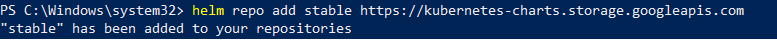

## install helm chart

Next we can install sample chart available in the official repository.

```
helm install demo-mysql stable/mysql
```
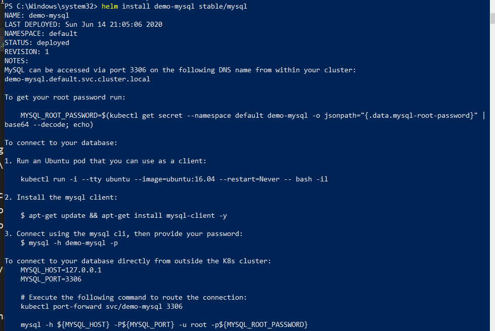
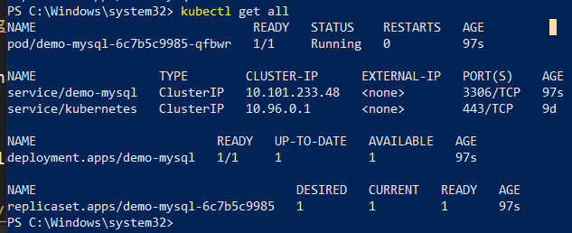

To get password execute command and next use some online page for base64 decode:
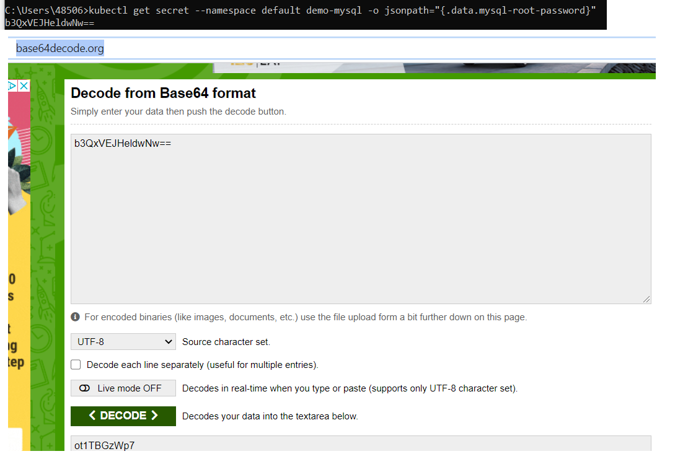
The password is **ot1TBGzWp7**.

Next install mysql client https://dev.mysql.com/downloads/workbench/ and connect to installed by helm mysql.

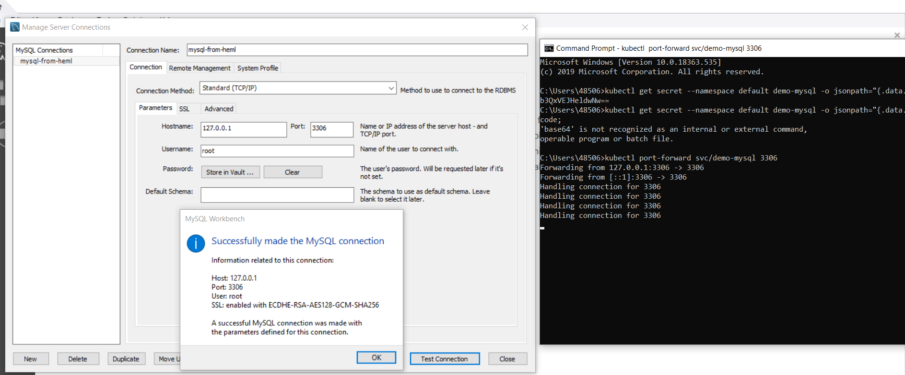
>NOTE: it was mandatory to run port forwarding to be able connect to the mysql!

## uninstall helm chart

```
helm uninstall demo-mysql
```

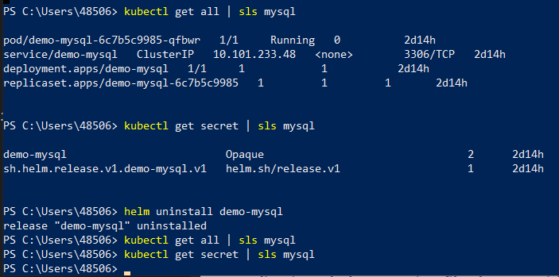

## helm variables

```
helm env
```

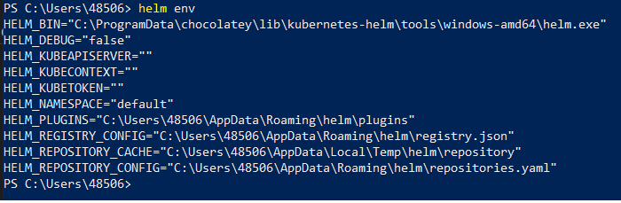

# building helm charts

https://helm.sh/docs/topics/charts/

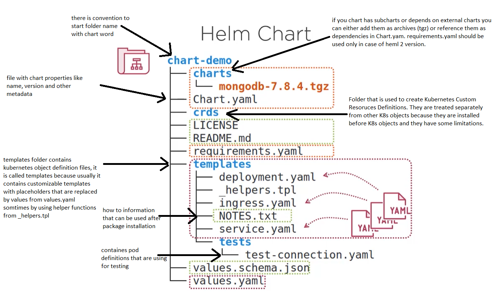


# helm release and release revision.
Helm supports release concept including release the same chart but with different K8s object names, for example: test, pre-prod, prod.   

In case we did a change only in single yaml file that we can update only this file and not do the new whole release - it is called **release revision**.

# basic commands
| Action| Command|
|----------|----------|
| Install a release | helm install [release] [chart] |
| Upgrade to a release revision| helm upgrade [release] [chart] |
| Rollback to a release revision | helm rollback [release] [revision] |
| Print release history | helm history [release] |
| Display release status | helm status [release] |
| Show details of a release | helm get all [release] |
| Uninstall a release | helm uninstall [release] |
| List releases | helm list |

# install, upgrade, rollback

## chart1

[chart1](charts/chart1/chart/guestbook)

>NOTE: template properties do not support dash -

We refer to local chart and not chart from official helm repository.

* K8s state before this exercise

```ps
PS D:\GitHub\kicaj29\Kubernetes\helm\charts\chart1\chart> kubectl get all
NAME                 TYPE        CLUSTER-IP   EXTERNAL-IP   PORT(S)   AGE
service/kubernetes   ClusterIP   10.96.0.1    <none>        443/TCP   67m
```

* Install
```ps
PS D:\GitHub\kicaj29\Kubernetes\helm\charts\chart1\chart> helm install demoguestbook guestbook
NAME: demoguestbook
LAST DEPLOYED: Thu Dec  8 12:16:34 2022
NAMESPACE: default
STATUS: deployed
REVISION: 1
TEST SUITE: None
```

* Next we can check created kubernetes objects
```ps
PS D:\GitHub\kicaj29\Kubernetes\helm\charts\chart1\chart> kubectl get all
NAME                                      READY   STATUS    RESTARTS   AGE
pod/frontend-deployment-c895dbb85-5ppt6   1/1     Running   0          5s

NAME                       TYPE        CLUSTER-IP       EXTERNAL-IP   PORT(S)        AGE
service/frontend-service   NodePort    10.106.166.212   <none>        80:30007/TCP   5s
service/kubernetes         ClusterIP   10.96.0.1        <none>        443/TCP        136m

NAME                                  READY   UP-TO-DATE   AVAILABLE   AGE
deployment.apps/frontend-deployment   1/1     1            1           5s

NAME                                            DESIRED   CURRENT   READY   AGE
replicaset.apps/frontend-deployment-c895dbb85   1         1         1       5s
```

* Next we can use the following command to see release details
```
helm get manifest demoguestbook
```

* Open in web browser http://localhost:30007/ to see the app.

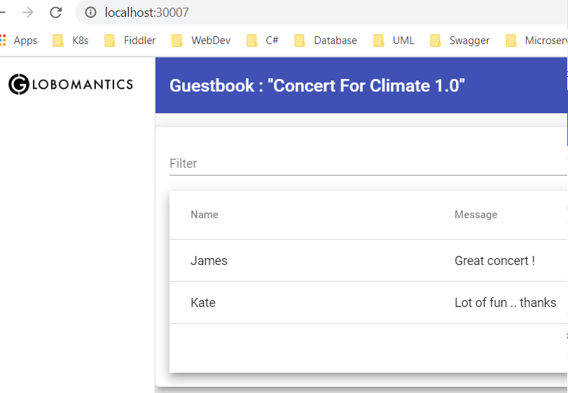

* Next uninstall (do not do it if want to upgrade to char2)
```
PS D:\GitHub\kicaj29\Kubernetes\helm\charts\chart1\chart> helm uninstall demoguestbook
release "demoguestbook" uninstalled
```

## chart2

[chart2](charts/chart2/chart/guestbook)

Here we deploy the same chart but with different application. The change was only in the application and not in the chart.
*appVersion* and *description* from *Chart.yaml* are set to 1.1 but *version* of the chart stays the same 0.1.0.   
In *frontend.yaml* we refer to new image *phico/frontend:1.1*. Previous version of chart has to installed in K8s before this step to have possibility to upgrade.

* Upgrade

```ps
PS D:\GitHub\kicaj29\Kubernetes\helm\charts\chart2\chart> helm upgrade demoguestbook guestbook
Release "demoguestbook" has been upgraded. Happy Helming!
NAME: demoguestbook
LAST DEPLOYED: Thu Dec  8 12:49:52 2022
NAMESPACE: default
STATUS: deployed
REVISION: 2
TEST SUITE: None
```

* Next we can check created kubernetes objects
**We can see that new replica set has been created and previous one is preserved.**
This is required to be able later do rollbacks (replica set contains pod definitions)!
```ps
NAME                                      READY   STATUS    RESTARTS   AGE
pod/frontend-deployment-cc8f88cdb-9x5lx   1/1     Running   0          6s

NAME                       TYPE        CLUSTER-IP       EXTERNAL-IP   PORT(S)        AGE
service/frontend-service   NodePort    10.106.166.212   <none>        80:30007/TCP   80s
service/kubernetes         ClusterIP   10.96.0.1        <none>        443/TCP        137m

NAME                                  READY   UP-TO-DATE   AVAILABLE   AGE
deployment.apps/frontend-deployment   1/1     1            1           80s

NAME                                            DESIRED   CURRENT   READY   AGE
replicaset.apps/frontend-deployment-c895dbb85   0         0         0       80s
replicaset.apps/frontend-deployment-cc8f88cdb   1         1         1       6s
```

* Rollback to revision 1 of the release

```
PS D:\GitHub\kicaj29\Kubernetes\helm\charts\chart2\chart> helm rollback demoguestbook 1
Rollback was a success! Happy Helming!
```

* Again check K8s objects

**We can see that replica set created during first deployment is again used**

```ps
PS D:\GitHub\kicaj29\Kubernetes\helm\charts\chart2\chart> kubectl get all
NAME                                      READY   STATUS    RESTARTS   AGE
pod/frontend-deployment-c895dbb85-zz8kk   1/1     Running   0          7s

NAME                       TYPE        CLUSTER-IP       EXTERNAL-IP   PORT(S)        AGE
service/frontend-service   NodePort    10.106.166.212   <none>        80:30007/TCP   2m24s
service/kubernetes         ClusterIP   10.96.0.1        <none>        443/TCP        138m

NAME                                  READY   UP-TO-DATE   AVAILABLE   AGE
deployment.apps/frontend-deployment   1/1     1            1           2m24s

NAME                                            DESIRED   CURRENT   READY   AGE
replicaset.apps/frontend-deployment-c895dbb85   1         1         1       2m24s
replicaset.apps/frontend-deployment-cc8f88cdb   0         0         0       70s
```

* History

```ps
PS D:\GitHub\kicaj29\Kubernetes\helm\charts\chart2\chart> helm history demoguestbook
REVISION        UPDATED                         STATUS          CHART           APP VERSION     DESCRIPTION     
1               Thu Dec  8 12:45:23 2022        superseded      guestbook-0.1.0 1.0             Install complete
2               Thu Dec  8 12:49:52 2022        superseded      guestbook-0.1.0 1.1             Upgrade complete
3               Thu Dec  8 12:52:14 2022        deployed        guestbook-0.1.0 1.0             Rollback to 1
```

## chart 3

Chart 3 contains classic example with front-end, back-end and database.

[chart3](charts/chart3/chart/guestbook)

chart 3 adds back-end and database.

*version* field in main *Chart.yaml* is updated to 1.1.0 because there are changes in infrastructure.

* Upgrade
```ps
PS D:\GitHub\kicaj29\Kubernetes\helm\charts\chart3\chart> helm upgrade demoguestbook guestbook
Release "demoguestbook" has been upgraded. Happy Helming!
NAME: demoguestbook
LAST DEPLOYED: Thu Dec  8 13:02:48 2022
NAMESPACE: default
STATUS: deployed
REVISION: 4
TEST SUITE: None
```

* History
```ps
S D:\GitHub\kicaj29\Kubernetes\helm\charts\chart3\chart> helm history demoguestbook
REVISION        UPDATED                         STATUS          CHART           APP VERSION     DESCRIPTION     
1               Thu Dec  8 12:45:23 2022        superseded      guestbook-0.1.0 1.0             Install complete
2               Thu Dec  8 12:49:52 2022        superseded      guestbook-0.1.0 1.1             Upgrade complete
3               Thu Dec  8 12:52:14 2022        superseded      guestbook-0.1.0 1.0             Rollback to 1   
4               Thu Dec  8 13:02:48 2022        deployed        guestbook-1.1.0 2.0             Upgrade complete
```

* Open the app
Use url: http://localhost:30007

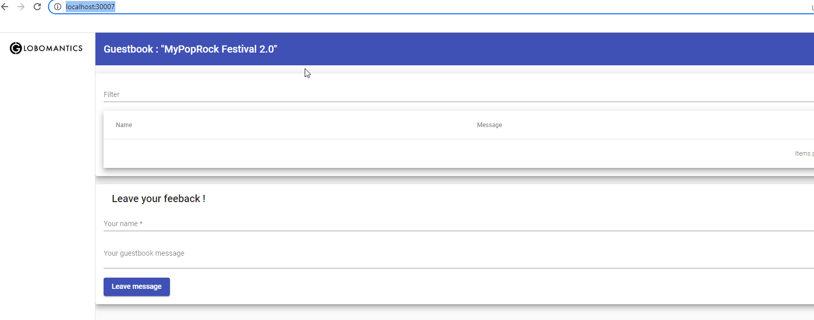

* Check all K8s objects

**Again can see that new replica set has been created.**
```
PS D:\GitHub\kicaj29\Kubernetes\helm\charts\chart3\chart> kubectl get all
NAME                                       READY   STATUS    RESTARTS      AGE
pod/backend-54b8499f6-vgk76                1/1     Running   1 (16s ago)   21s
pod/frontend-deployment-5956bbfc8f-wchg5   1/1     Running   0             21s
pod/mongodb-6564679459-d7wqx               1/1     Running   0             21s

NAME                       TYPE        CLUSTER-IP       EXTERNAL-IP   PORT(S)           AGE
service/backend            NodePort    10.106.196.223   <none>        80:31111/TCP      21s
service/frontend-service   NodePort    10.106.166.212   <none>        80:30007/TCP      3m15s
service/kubernetes         ClusterIP   10.96.0.1        <none>        443/TCP           139m
service/mongodb            NodePort    10.100.175.4     <none>        27017:31865/TCP   21s

NAME                                  READY   UP-TO-DATE   AVAILABLE   AGE
deployment.apps/backend               1/1     1            1           21s
deployment.apps/frontend-deployment   1/1     1            1           3m15s
deployment.apps/mongodb               1/1     1            1           21s

NAME                                             DESIRED   CURRENT   READY   AGE
replicaset.apps/backend-54b8499f6                1         1         1       21s
replicaset.apps/frontend-deployment-5956bbfc8f   1         1         1       21s
replicaset.apps/frontend-deployment-c895dbb85    0         0         0       3m15s
replicaset.apps/frontend-deployment-cc8f88cdb    0         0         0       2m1s
replicaset.apps/mongodb-6564679459               1         1         1       21s
```

* Adding data

Add some data in the web app and next send request to `http://localhost:31111/guestbook`.
Sample response: `[{"_id":"6391d4658ff56f16834870f5","name":"Jacek","message":"Placek"}]`


## chart 4 - INGRESS controller

>NOTE: before we start we have to uninstall previous release because upgrade is not possible.

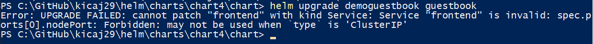

[chart4](charts/chart4/chart/guestbook)

First we have to install ingress controller
https://kubernetes.github.io/ingress-nginx/deploy/#using-helm
```
helm repo add ingress-nginx https://kubernetes.github.io/ingress-nginx
helm install release-ingress ingress-nginx/ingress-nginx
```

After this we can see that nginx server is running:

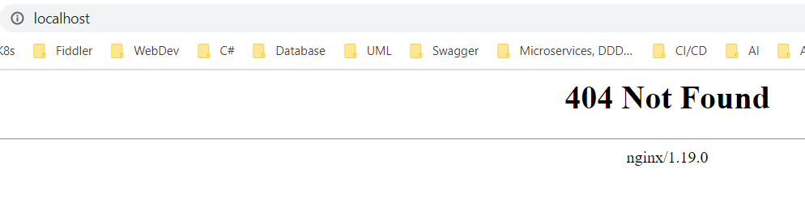

Next we can release a package that uses ingress controller.

```
helm install demoguestbook guestbook
```

After this we have to add entries to *C:\Windows\System32\drivers\etc\hosts*
to have mapping between DNS names and localhost address.

```txt
127.0.0.1 frontend.local
127.0.0.1 backend.local
```

This names are also used in [ingress.yaml](charts/chart4/chart/guestbook/charts/frontend/templates/ingress.yaml).

Finally we can open the UI in web browser:

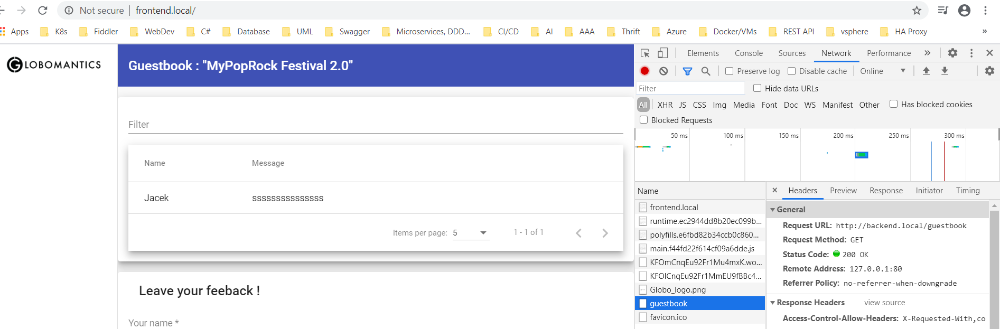


# Customizing charts with helm templates

One of the reason to use customizing charts is it have possibility to generate K8s object names based on a release name. For example: dev-fronted, test-frontend, preprod-frontend, prod-frontend.   
There is alternative option to install different releases in different namespaces or different clusters but well designed helm chart should support such function to be able install it always without any name conflicts.

Helm template engine uses **Go Template** engine https://golang.org/pkg/text/template/ .

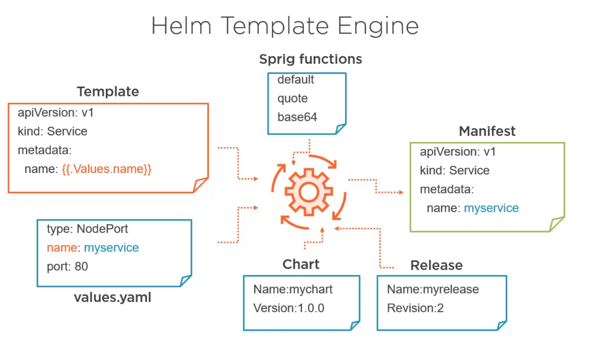

Use the following command to read generated manifest file:
```
helm get manifest [release name]
```

## Testing custom templates

### Static
```
helm template [chart]
```
- works without K8s cluster
- static release name

### Dynamic
```
helm install [release] [chart] --debug --dry-run
```
- real helm install but without commit
- can generate a release-name

## Data sources for values

- values.yaml
- other-file.yaml: ```helm install -f file```
- variables: ```helm install --set foo=bar```
- hierarchically organized
- chart data: ```name: {{.Chart.Name}})``` (first letter of property is upper case)
- release data: ```name: {{.Release.Name}}```, ```name: {{.Release.IsInstall}}``` etc.
- K8s data: ```annotations: K8s{{.Capabilities.KubeVersion}}```
- file data: ```annotations: data:{{.Files.Get conf.ini}}```
- template data: ```annotations: tpl:{{.Template.Name}}```

## Functions and pipelines

Some of basics:

| Function | Pipeline |
|----------|----------|
| default default_value value | value \| default default_value |
| quote value | value \| quote |
| upper value | value \| upper |
| trunc value 63| value \| trunc 63 |
| trimSuffix "-" value | value \| trimSuffix "-" |
| b64enc value | value \| b64enc |
| randAlphaNum 10 | value \| randAlphaNum 10 |
| toYaml value | value \| toYaml |
| printf format value ... | list value ... \| join "-" |

## Modifying scope using with

```helm
spec:
    {{with .Values.service}}
    type: {{.type}}
    ports:
        - port: {{.port}}
          targetPort: 80
    {{end}}
```

>NOTE: directive **with** causes adding not needed carriage returns.

## Controlling carriage returns, whitespaces, indent.

- use dash to remove not needed carriage returns.
```helm
spec:
    {{with .Values.service-}}
    type: {{.type}}
    ports:
        - port: {{.port}}
          targetPort: 80
    {{-end}}
```

- all indentations from the template are preserved. If needed it can be modified by the indentation function.

```helm
spec:
    type: ClusterIP
    ports:
        - port: 80
          targetPort: 80
    {{indent 6 .Values.tcp}}
```

- formatted output (printf)

```
apiVersion: v1
kind: Service
metadata:
    labels:
        app.kubernetes.io/name:{{- printf "%s-%s" .Release.Name .Values.service.name -}}
```

## Logical operators and functions

| Operator | Function | Example |
|----------|----------|---------|
| Equal to | eq | eq .Val1 .Val2        |
| Not equal to | ne | ne .Val1 .Val2        |
| Greater than | gt | gt .Val1 .Val2        |
| Lower than | lt | lt .Val1 .Val2        |
| Or | or | or .Val1 .Val2        |
| And | and | and .Val1 .Val2        |
| Not | not | not .Val1        |

## Flow control

* conditions
```
{{- if .Values.ingress.enabled}}
apiVersion: extensions/v1beta1
kind: ingress
metadata:
    labels:
        app.kuberenetes.io/name
{{- if .Values.service.name -}}
{{ .Values.service.name | trimSuffix "-"}}
{{- else -}}
{{ .Chart.Name }}
{{- end -}}
{{- end -}}
```
* loops

Scope in the loop is defined by type from the array. All fields are accessed as relative to the current scope.

```
spec:
{{- range .Values.ingress.hosts}}
    -host: {{ .hostname | quote }}
    http:
        paths:
        {{- range .paths}}
            - path: {{.path}}
              backend:
                serviceName: {{.service}}
                servicePort: http
        {{- end}}
{{- end}}
```
## Variables

Variables are needed when we want access some field that is not available in the current scope.

$ is called global variable. It refers to the build-in variable that allows to access root data.

```
spec:
{{- range $currentHost := .Values.ingress.hosts}}
    - host: {{.hostname | quote}}
        http:
            paths:
            {{- range .paths}}
            - path: {{.path}}-{{$currentHost.suffix}}
              backend:
                serviceName: {{$.Release.Name}}{{.service}}
                servicePort: http
            {{- end}}
{{- end}}
```

## Helper functions (sub-templates)

Names of sub-templates are global so it is good practice to add prefix with the name of the chart.

**_helpers.tpl**

```
{{- define "mychart.fullname" -}}
{{- if .Values.fullnameOverride -}}
{{- .Values.fullnameOverride | trunc 63 | trimSuffix "-" -}}
{{- else -}}
{{- printf "%s-%s" .Release.Name $name | trunc 63 | trimSuffix "-" -}}
{{- end -}}
{{- end -}}
```

Next we can call this function with its name and scope (dot for example if we want pass current scope).

```
metadata:
    labels:
        app.kubernetes.io/name: {{include "mychart.fullname" .}}
```

Helper files are stored in **templates** folder. This files are not used to generate manifest because files prefixed by '_' are not rendered as K8s objects.

>NOTE: if you want have some files that should be completely ignored by helm create file **.helmignore** place it in the root folder and add the files names to this file.

### Abstract charts - library

Abstract charts do not generate any manifest. They are only used by other charts.

Chart.yaml
```
apiVersion: v2
name: myLibrary
appVersion: "1.0"
description: A Helm library chart for Guestbook App
version: 1.2.1
type: library
```

## chart 5 - custom values

[chart5](charts/chart5-customizing-charts/chart/guestbook)

This chart show simple usage of custom values. It does not fully work because backend chart uses not working connection string to mongodb.
The connection string is not correct because not mongodb has dynamic name.

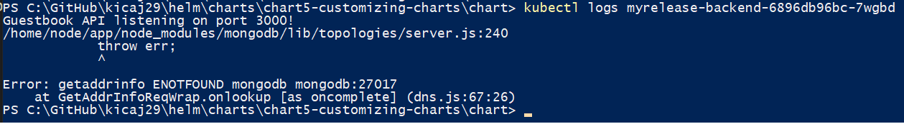

This problem is solved in chart 6.

## chart 6 - logic with building connection string to mongodb

[chart6](charts/chart6-customizing-charts-fixed-mongodb/chart/guestbook)

This chart solves problem that occurred in chart 5 - incorrect connection string to mongodb. 

## chart 7 - installing DEV and TEST environment

[chart7](charts/chart7-DEV-and-TEST-environment/chart/guestbook)

Some important points:
* This chart shows how to generate app URL based on release name.   
  [ingress.yaml](/charts/chart7-DEV-and-TEST-environment/chart/guestbook/templates/ingress.yaml) by setting host in this way: ```host: {{ $.Release.Name }}.{{ .host.domain }}```
* It contains one ingress definition.   
  [ingress.yaml](/charts/chart7-DEV-and-TEST-environment/chart/guestbook/templates/ingress.yaml) - if needed we can enable ingress.yaml for frontend and backend in [values.yaml](/charts/chart7-DEV-and-TEST-environment/chart/guestbook/values.yaml).
* This chart contains example how to [iterate through array](charts/chart7-DEV-and-TEST-environment/chart/guestbook/templates/ingress.yaml).
* It shows how to override values from values.yaml by parent chart (sections backend and frontend from [values.yaml](charts/chart7-DEV-and-TEST-environment/chart/guestbook/values.yaml))

>NOTE: the following example requires adding additional entries in *C:\Windows\System32\drivers\etc\hosts*   
```127.0.0.1 dev.frontend.local```   
```127.0.0.1 dev.backend.local```   
```127.0.0.1 test.frontend.local```   
```127.0.0.1 test.backend.local```

```ps
helm install dev guestbook --set frontend.config.guestbook_name=DEV
helm install test guestbook --set frontend.config.guestbook_name=TEST
```

Sample execution:
```
PS D:\GitHub\kicaj29\helm\charts\chart7-DEV-and-TEST-environment\chart> helm install dev guestbook --set frontend.config.guestbook_name=DEV
NAME: dev
LAST DEPLOYED: Wed Sep 23 15:10:40 2020
NAMESPACE: default
STATUS: deployed
REVISION: 1
TEST SUITE: None
NOTES:
Congratulations ! You installed guestbook chart sucessfully.
Release name is dev

You can access the Guestbook application at the following urls :
  http://dev.frontend.local
  http://dev.backend.local
Have fun !
PS D:\GitHub\kicaj29\helm\charts\chart7-DEV-and-TEST-environment\chart> helm install test guestbook --set frontend.config.guestbook_name=TEST
NAME: test
LAST DEPLOYED: Wed Sep 23 15:18:14 2020
NAMESPACE: default
STATUS: deployed
REVISION: 1
TEST SUITE: None
NOTES:
Congratulations ! You installed guestbook chart sucessfully.
Release name is test

You can access the Guestbook application at the following urls :
  http://test.frontend.local
  http://test.backend.local
Have fun !
PS D:\GitHub\kicaj29\helm\charts\chart7-DEV-and-TEST-environment\chart> kubectl get pods
NAME                                                       READY   STATUS    RESTARTS   AGE
dev-backend-78995fd9f5-8kqx9                               1/1     Running   2          9m48s
dev-database-86587b7845-v76w8                              1/1     Running   0          9m48s
dev-frontend-749bd48bcf-6n7xt                              1/1     Running   0          9m48s
release-ingress-ingress-nginx-controller-c6bb978f7-gwvxt   1/1     Running   0          6h1m
test-backend-5b7cbcd488-pl8pt                              1/1     Running   2          2m14s
test-database-69d589bc8-r8q7m                              1/1     Running   0          2m14s
test-frontend-869cfcd845-rn7mc                             1/1     Running   0          2m14s
```

>NOTE: if some pods will start crashing increase CPU and memory assigned to docker engine in docker desktop settings.

We can also experiment and enable ingress also for frontend and backend. Then frontend app  will be available from 2 DNS names:

```
PS D:\GitHub\kicaj29\helm\charts\chart7-DEV-and-TEST-environment\chart> helm install test1 guestbook --set frontend.config.guestbook_name=TEST1
NAME: test1
LAST DEPLOYED: Wed Sep 23 15:22:34 2020
NAMESPACE: default
STATUS: deployed
REVISION: 1
TEST SUITE: None
NOTES:
Congratulations ! You installed guestbook chart sucessfully.
Release name is test1

You can access the Guestbook application at the following urls :
  http://test1.frontend.local
  http://test1.backend.local
Have fun !
```

```
http://test1.frontend.local
http://frontend.local/
```
Address ```http://frontend.local/``` is not mentioned in 
[NOTES.txt](charts\chart7-DEV-and-TEST-environment\chart\guestbook\templates\NOTES.txt) that`s why it is not listed in the ```helm install``` output.

# Managing dependencies
## Packaging charts
There is dedicated command for this. It takes version from yaml file and appends it to the archive name.

```
helm package [chart_name]
```
## Publishing charts in helm repository

[Chartmuseum](https://github.com/helm/chartmuseum) is HTTP server that is dedicated helm repository.   

Helm repository also support signing charts:
```ps
helm package --sign
helm verify chart.tgz
helm install --verify
```

## Pulling charts from helm repository

* Add a repository

```
helm repo add ingress-nginx https://kubernetes.github.io/ingress-nginx
```

* List all repos `helm repo list`
```
NAME            URL
stable          https://charts.helm.sh/stable
ingress-nginx   https://kubernetes.github.io/ingress-nginx
```

* Pull from repo (it will create locally a file with the chart)
```
helm pull ingress-nginx/ingress-nginx --version 4.4.0
```

### Example how to package charts

[chart8-pack-publish](charts/chart8-pack-publish/chart/guestbook/dist)

```ps
PS C:\Windows\system32> move C:\GitHub\kicaj29\helm\charts\chart8-pack-publish\chart\guestbook\charts C:\GitHub\kicaj29\helm\charts\chart8-pack-publish\chart\guestbook\dist
PS C:\Windows\system32> move C:\GitHub\kicaj29\helm\charts\chart8-pack-publish\chart\guestbook\charts\* C:\GitHub\kicaj29\helm\charts\chart8-pack-publish\chart\guestbook\dist
PS C:\Windows\system32> cd C:\GitHub\kicaj29\helm\charts\chart8-pack-publish\chart\guestbook\dist
PS C:\GitHub\kicaj29\helm\charts\chart8-pack-publish\chart\guestbook\dist> ls


    Directory: C:\GitHub\kicaj29\helm\charts\chart8-pack-publish\chart\guestbook\dist


Mode                LastWriteTime         Length Name
----                -------------         ------ ----
d-----         7/6/2020   7:53 AM                backend
d-----         7/6/2020   7:53 AM                database
d-----         7/6/2020   7:53 AM                frontend


PS C:\GitHub\kicaj29\helm\charts\chart8-pack-publish\chart\guestbook\dist> helm package backend database frontend
Successfully packaged chart and saved it to: C:\GitHub\kicaj29\helm\charts\chart8-pack-publish\chart\guestbook\dist\backend-1.2.2.tgz
Successfully packaged chart and saved it to: C:\GitHub\kicaj29\helm\charts\chart8-pack-publish\chart\guestbook\dist\database-1.2.2.tgz
Successfully packaged chart and saved it to: C:\GitHub\kicaj29\helm\charts\chart8-pack-publish\chart\guestbook\dist\frontend-1.2.2.tgz
PS C:\GitHub\kicaj29\helm\charts\chart8-pack-publish\chart\guestbook\dist> helm repo index .
PS C:\GitHub\kicaj29\helm\charts\chart8-pack-publish\chart\guestbook\dist> ls


    Directory: C:\GitHub\kicaj29\helm\charts\chart8-pack-publish\chart\guestbook\dist


Mode                LastWriteTime         Length Name
----                -------------         ------ ----
d-----         7/6/2020   7:53 AM                backend
d-----         7/6/2020   7:53 AM                database
d-----         7/6/2020   7:53 AM                frontend
-a----         7/6/2020   7:57 AM           1256 backend-1.2.2.tgz
-a----         7/6/2020   7:57 AM           1221 database-1.2.2.tgz
-a----         7/6/2020   7:57 AM           1157 frontend-1.2.2.tgz
-a----         7/6/2020   7:58 AM           1068 index.yaml


PS C:\GitHub\kicaj29\helm\charts\chart8-pack-publish\chart\guestbook\dist>
```

### Example how to publish charts

First run locally https://chartmuseum.com/

```
PS C:\Users\48506> docker run --rm -it -p 8888:8080 -v C:/helmchartswindows:/charts -e DEBUG=true -e STORAGE=local -e STORAGE_LOCAL_ROOTDIR=/charts chartmuseum/chartmuseum:latest
2020-07-05T04:53:35.605Z        DEBUG   Fetching chart list from storage        {"repo": ""}
2020-07-05T04:53:35.647Z        DEBUG   No change detected between cache and storage    {"repo": ""}
2020-07-05T04:53:35.647Z        INFO    Starting ChartMuseum    {"port": 8080}
2020-07-05T04:53:58.448Z        DEBUG   [1] Incoming request: / {"reqID": "0f498614-dff3-41f7-9c17-5c08db577318"}
2020-07-05T04:53:58.449Z        INFO    [1] Request served      {"path": "/", "comment": "", "clientIP": "172.17.0.1", "method": "GET", "statusCode": 200, "latency":
```

Next place index.yaml and tgz files in dedicated folder:
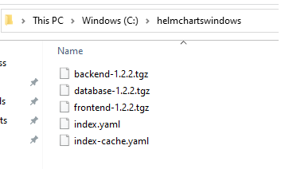

Next available charts can be viewed here:
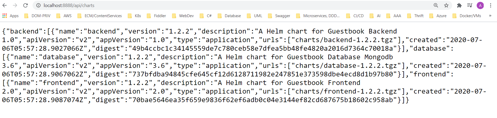

## Configuring helm client to work with repositories

Helm maintains a list of repositories. Sample execution:

```
PS C:\GitHub\kicaj29\helm> helm repo list
NAME            URL
stable          https://kubernetes-charts.storage.googleapis.com
ingress-nginx   https://kubernetes.github.io/ingress-nginx
```

To add repository execute the following command:
```
helm repo add [repo name] [address]
helm repo add myrepo http://myserver.org/charts
```
To remove repo from the client:
```
helm repo remove myrepo
```

By default after installation helm is not connected to any repository. Usually one of the first steps is to add official helm 3 repository:

```
helm repo add stable https://kubernetes-charts.storage.googleapis.com
```

# Tips and tricks
https://helm.sh/docs/chart_template_guide/named_templates/

* [sampleChart01](./charts/TipsAndTricks/sampleChart01) - this chart is about using **template**, **include**, **dot** and **_helpers.tpl**.

```
helm template -f .\sampleChart01\valuesTom.yaml  .\sampleChart01\
helm template -f .\sampleChart01\valuesBob.yaml  .\sampleChart01\
```
* [sampleChart02](./charts/TipsAndTricks/sampleChart02) - this chart is about dash in curly braces

"Helm’s template internally uses Golang template language. In Go template, dash is used in curly braces to skip white-space around it."
>NOTE: Be careful! Newlines are whitespace!

**{{-** indicates that whitespace should be chomped left whereas **-}}** means whitespace to the right should be consumed.

```
helm template -f .\sampleChart02\Values.yaml sampleChart02
```

The same result can be achieved in multiple ways:


To get result like this: 

```yaml
customer:
  labels:
    fullName: Bob McDonald
    country: USA
customer1:
  labels:
    fullName: Bob McDonald
    country: USA
```

the following templates can be used:

```yaml
{{ define "mychart.labels" -}}
  labels:
    fullName: {{ .Values.personal.name }} {{ .Values.personal.secondName }}
    country: {{ .Values.personal.country }}
{{- end }}
customer:
  {{ template "mychart.labels" . }}
customer1:
  {{ template "mychart.labels" . }}
```

```yaml
{{ define "mychart.labels" }}
  labels:
    fullName: {{ .Values.personal.name }} {{ .Values.personal.secondName }}
    country: {{ .Values.personal.country }}
{{ end }}
customer:
  {{- template "mychart.labels" . -}}
customer1:
  {{- template "mychart.labels" . }}
```

Be careful with using **dash** because incorrect usage causes that generated yaml is incorrect, for example this yaml will generated incorrect out yaml file:

```yaml
{{ define "mychart.labels" }}
  labels:
    fullName: {{ .Values.personal.name }} {{ .Values.personal.secondName }}
    country: {{ .Values.personal.country -}}
{{ end }}
customer:
  {{- template "mychart.labels" . -}}
customer1:
  {{- template "mychart.labels" . }}
```

```
PS D:\GitHub\kicaj29\Kubernetes\helm\charts\TipsAndTricks> helm template -f .\sampleChart02\Values.yaml sampleChart02
Error: YAML parse error on sampleChart01/templates/sample.yaml: error converting YAML to JSON: yaml: line 4: mapping values are not allowed in this context
```

* [sampleChart03](./charts/TipsAndTricks/sampleChart03) - this chart is about **default** key word


>NOTE: "This function allows you to specify a default value inside of the template, in case the value is omitted."
More here: https://helm.sh/docs/chart_template_guide/functions_and_pipelines/#using-the-default-function

```
PS D:\GitHub\kicaj29\Kubernetes\helm\charts\TipsAndTricks> helm template -f .\sampleChart03\values.yaml  .\sampleChart03\
---
# Source: sampleChart01/templates/sample.yaml
customer:
  labels:
    fullName: Bob McDonald
    country: NOT_DEFINED
customer1:
  labels:
    fullName: Bob McDonald
    country: NOT_DEFINED
```

* **trunc 63**

Sometimes in kubernetes some values can have max 63 chars because of this we use **trunc 63** function.
Example here: https://github.com/helm/charts/blob/master/stable/kiam/templates/_helpers.tpl#L29

* **trimSuffix**

```trimSuffix "-" "hello-"``` will return `"hello"`.

More here: https://helm.sh/docs/chart_template_guide/function_list/#trimsuffix

More here https://helm.sh/docs/chart_template_guide/control_structures/ and here https://www.w3spot.com/2020/08/purpose-of-dash-inside-curly-braces-helm-template.html

* [sampleChart04](./charts/TipsAndTricks/sampleChart04) - this chart is about **printf** function

```
helm template -f .\sampleChart04\values.yaml  .\sampleChart04\
```
**printf** can be used to concatenate\format a string values.

More here: https://helm.sh/docs/chart_template_guide/function_list/#printf

```
PS D:\GitHub\kicaj29\Kubernetes\helm\charts\TipsAndTricks> helm template -f .\sampleChart04\values.yaml  .\sampleChart04\
---
# Source: sampleChart04/templates/sample.yaml
customer: Bob-McDonald
anotherField: Bob-McDonald
```

# links
https://app.pluralsight.com/library/courses/kubernetes-packaging-applications-helm/exercise-files   
https://github.com/phcollignon/helm3   
https://www.youtube.com/watch?v=sHUSiM8jqbA (ingress controller installation)
https://github.com/helm/charts